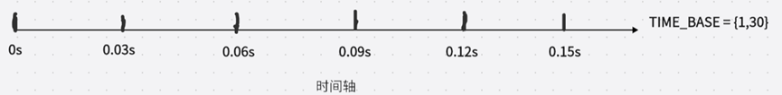
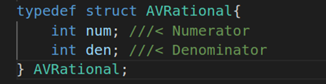
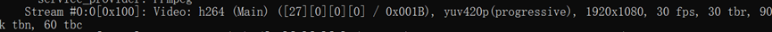
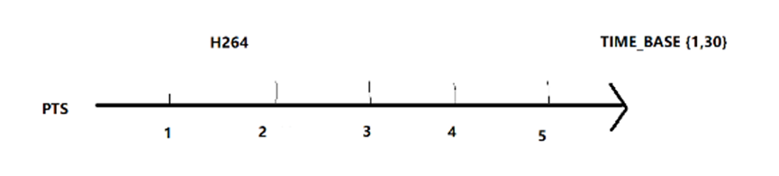
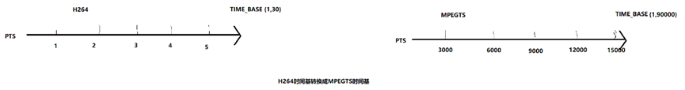
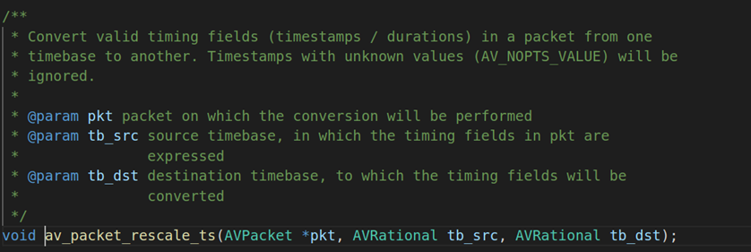
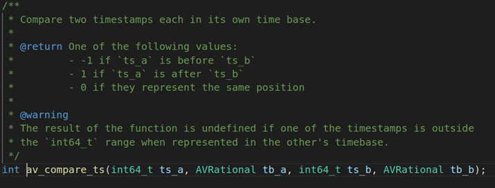
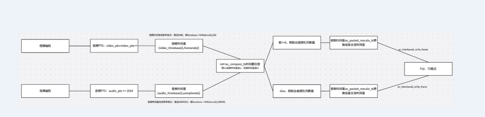

# FFMPEG时间概念的讲解

# 一． 本章节介绍：

本章节主要介绍FFMPEG的时间概念，包括时间基、时间戳、时间转换、时间比较等知识点。这些知识点对于我们了解推流至关重要，因为音视频合成本质上是各种时间转换的过程。

# 二． FFMPEG 时间基、 时间戳的讲解：

2.1. 时间基(time_base)：时间基也称之为时间基准，它代表的是每个刻度是多少秒。比方说：视频帧率是30FPS，那它的时间刻度是{1,30}。相当于1s内划分出30个等分，也就是每隔1/30秒后显示一帧视频数据。具体的如下图所示：

image.png

在FFMPEG中时间基准都是用AVRational结构体来表示：

image.png

num：它是numerator的缩小，代表的是分子
 den：它是denominator的缩小，代表的是分母

在视频时间基都是以帧率为单位，比方说50帧。FFMPEG就以AVRational video_timebase = {1, 50}来表示。

在音频时间基都是以采样率为单位，比方说音频采样率是48000HZ。FFMPEG就以AVRational audio_timebase = {1, 48000}来表示。

对于封装格式来说：flv 封装格式的 time_base 为{1,1000}，ts 封装格式的 time_base 为{1,90000}

image.png

从上图ffplay的信息我们可以看到有很多关于时间基的信息：

tbr：表示帧率，该帧率是一个基准，通常来说tbr和fps是一致的
 tbn：表示视频流timebase(时间基)，比方说：TS格式的数据timebase是90000，flv格式的视频流timebase为1000
 tbc：表示视频流codec timebase，这个值一般为帧率的两倍。比方说：帧率是30fps，则tbc是60

2.2. 时间戳(PTS、DTS)：

image.png

首先时间戳它指的是在时间轴里面占了多少个格子，时间戳的单位不是具体的秒数，而是时间刻度。只有当时间基和时间戳结合在一起的时候，才能够真正表达出来时间是多少。

比方说：
 有一把尺子pts = 30个刻度，time_base = {1,30} 每一个刻度是1/30厘米
 所以这把尺子的长度 = pts * time_base = 30 * 1/30 = 1厘米

PTS：全称是Presentation Time Stamp(显示时间戳)，它主要的作用是度量解码后的视频帧什么时候显示出来。

视频PTS计算：n为第n帧视频帧，timebase是{1，framerate}，fps是framerate
 pts = n *(( 1 / timebase) / fps):
 pts = pts++;
 举例子：n = 1, pts = 1
 n = 2, pts = 2
 n =3, pts = 3

音频PTS计算：n为第n帧音频帧，nb_samples指的是采样个数(AAC默认1024)，timebase是{1,samplerate}，samplerate是采样率

num_pkt = samplerate/nb_samples
 pts = n * ( ( 1/ timebase) / num_pkt)
 pts = pts+1024
 举例子：n = 1, pts = 1024
 n = 2, pts = 2048
 n = 3, pts = 3072

2.3. DTS：表示的是压缩解码的时间戳，在没有B帧的情况下PTS 等于 DTS。假设编码的里面引入了B帧，则还要计算B帧的时间。

没有B帧：dts = pts
 存在B帧：dts = pts + b_time

# 三． 时间转换的原理：

在FFMPEG中由于不同的复合流，时间基是不同的，比方说：ts的时间基time_base= {1,90000}，假设一个视频time_base = {1,30}，我们需要合成mpegts文件，它就需要把time_base = {1,30}占的格子转换成time_base = {1,90000}占的格子。

image.png

在FFMPEG中用以下的API进行时间基转换：

image.png

void av_packet_rescale_ts(AVPacket *pkt, AVRational tb_src, AVRational tb_dst);

第一个参数：AVPacket结构体指针
 第二个参数：源时间基
 第三个参数：目的时间基

上面这个api的用法是，把AVPacket的时间基tb_src转换成时间基tb_dst。下面我们用H264和AAC时间基TS转换的例子来说明这个转换时间基的用法：

视频H264时间基转换成MPEGTS时间基：  av_packet_rescale_ts
 **DST_VIDEO_PTS = VIDEO_PTS \* VIDEO_TIME_BASE / DST_TIME_BASE
 例src_pts=1：dst_pts=1*(1/30)/(1/90000)=3000
 H264 {1,30}                                              MPEGTS {1,90000}
 pts = 1                                                      pts = 3000
 pts = 2                                                      pts = 6000
 pts = 3                                                      pts = 9000
 pts = 4                                                     pts = 12000

音频AAC时间基转换成MPEGTS时间基：av_packet_rescale_ts
 **DST_AUDIO_PTS = AUDIO_PTS \* AUDIO_TIME_BASE / DST_TIME_BASE
 例src_pts=1024：dst_pts=1024\*(1/48000)*(1/90000)
 AAC {1,48000}                                           MPEGTS {1,90000}
 pts =1024                                               pts = 1920
 pts =2048                                               pts = 3840
 pts =3072                                               pts = 5760
 pts =4096                                               pts = 7680

从上述推导的结果可以看出来，如果使用av_packet_rescale_ts的API对视频时间基进行转换，实际上是使用DST_VIDEO_PTS = VIDEO_PTS * VIDEO_TIME_BASE / DST_TIME_BASE去计算推流的视频时间戳。

同理用av_packet_rescale_ts对音频时间基进行转换，实际上是使用DST_AUDIO_PTS = AUDIO_PTS * AUDIO_TIME_BASE / DST_TIME_BASE去计算我们真实推流的音频时间戳。

# 四． FFMPEG时间戳的比较：

image.png

int av_compare_ts(int64_t ts_a, AVRational tb_a, int64_t ts_b, AVRational tb_b)
 第一个参数：ts_a它指的是当前相对tb_a的时间戳
 第二个参数：ts_a相对应的时间基
 第三个参数：ts_b它指的是当前相对tb_a的时间戳
 第四个参数：ts_b相对应的时间基
 返回值判断：
 当ret == -1， ts_a的时间戳快过ts_b时间戳。
 当ret ==  1， ts_a的时间戳慢过ts_b时间戳。
 当ret ==  0， ts_a的时间戳等于ts_b时间戳

av_compare_ts它的主要作用是进行时间戳进行实时比较，它能够实时保证当前的时间戳是准确无误的。它不会出现时间戳混乱的情况，所谓混乱的情况就相当于：视频时间戳当成音频时间戳处理，音频时间戳当成视频时间戳处理。

下面这张图是编码视频、音频然后进行时间戳比较然后合成复合流的流程：

image.png

视频时间戳参考视频帧率进行比较、音频时间戳进行比较(这里我们默认tb_a时间基是视频时间基、tb_b时间基是音频时间基)。所以当比较的结果ret <= 0的时候，则要取出视频数据，否则就取出音频数据。取出视频数据后则利用av_packet_rescale_ts进行时间转换、同样取出音频数据后也要对其进行时间转换。音视频数据进行时间转换后，则用av_interleaved_write_frame对复合流进行写入操作。

作者：野唱
链接：https://www.jianshu.com/p/f66a6ddbb15f
来源：简书
著作权归作者所有。商业转载请联系作者获得授权，非商业转载请注明出处。