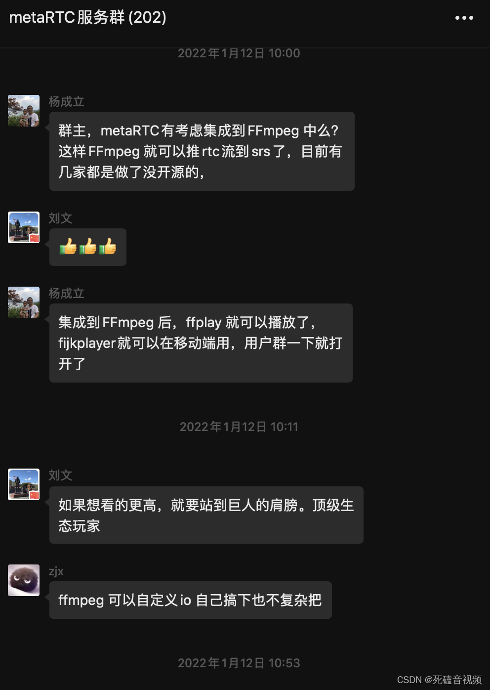
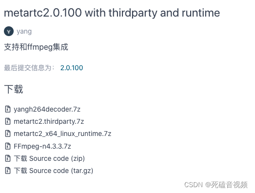
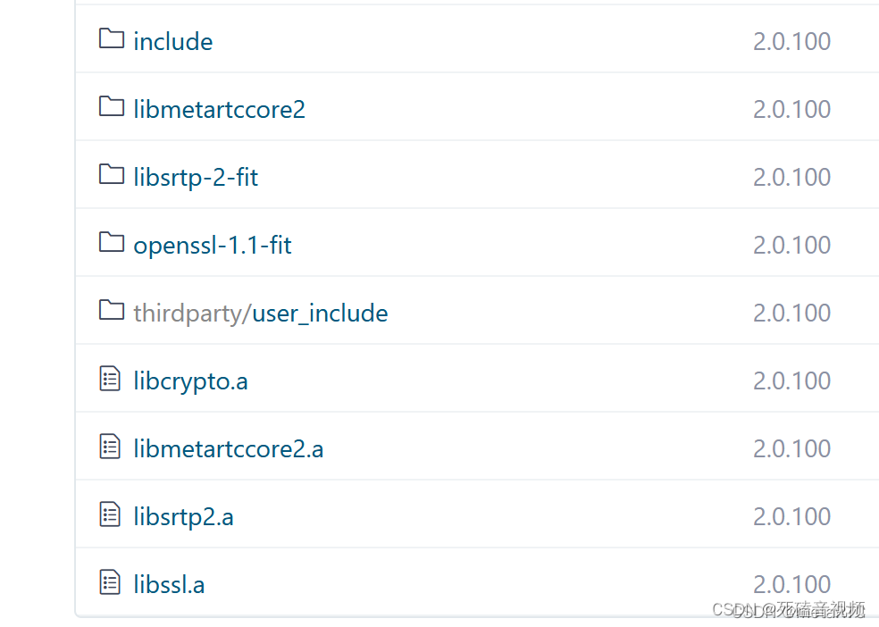
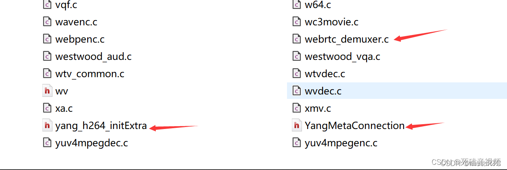

# FFmpeg实现拉WebRTC流，MetaRTC业界首个全开源方案来了

前言
最近MetaRTC微信群。杨成立大佬提了一个建议，MetaRTC集成FFmpeg中，这样FFmpeg就可以实现推拉WebRTC流，MetaRTC采取了大佬的建议，于2022-1-20实现了FFmpeg拉webRTC流进行播放。全开源的方案，没有二进制库和私有协议，全都是开源代码和公开的协议。

下面给大家介绍下使用方法。



下载源代码
[gitee快速下载通道](https://gitee.com/metartc/metaRTC/releases/2.0.100)
[github下载通道](https://github.com/metartc/metaRTC/releases/tag/2.0.100)
打开连接后内容如下：



ffmpeg-n4.3.3.7z为集成MetaRTC的FFmpeg
也可以直接clone，欢迎star和fork
```
git clone https://gitee.com/metartc/ffmpeg-metartc
git clone https://github.com/metartc/ffmpeg-metart
```
编译
[编译文章](https://blog.csdn.net/m0_56595685/article/details/122139482)
编译后将编译的二进制文件放到metartc2目录下，如图



然后执行
```
sh metaconfig.sh

make

sudo make install

ffplay webrtc://127.0.0.1/live/livestream
```
集成说明



新增文件
```
libavformat/webrtc_demuxer.c

libavformat/yang_h264_initExtra.h

libavformat/YangMetaConnection.h //metaRTC头文件
```
修改文件
```
libavformat/util.c

libavcodec/h264dec.c

修改部分有//add metartc注释
```
srs服务器
推荐Srs4.0，[下载编译参考](http://github.com/ossrs/srs#usage)

启动
```
    objs/srs -c conf/https.rtc.conf
```
可支持webrtc/rtmp/hls/srt/httpflv等直播。

下一步计划

下一步计划支持FFmpeg推Webrtc流

总结
刚发布。如果大家在使用过程中有什么问题，欢迎pr和issue。如有想入微信群的，可以加我好友，我拉人入群，超过200人，不能在使用微信二维码进群。

————————————————
版权声明：本文为CSDN博主「死磕音视频」的原创文章，遵循CC 4.0 BY-SA版权协议，转载请附上原文出处链接及本声明。
原文链接：https://blog.csdn.net/qq_28880087/article/details/122596595