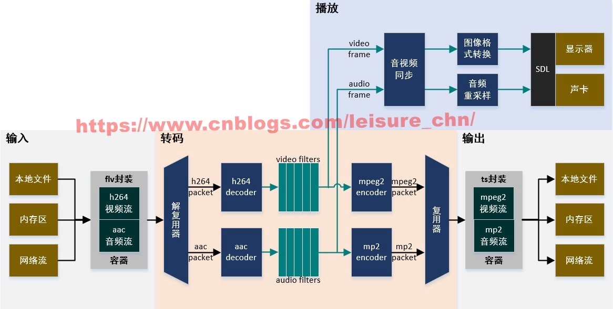

# FFmpeg编解码处理1-转码全流程简介 #

本文为作者原创，转载请注明出处：https://www.cnblogs.com/leisure_chn/p/10584901.html

FFmpeg编解码处理系列笔记：

- [0]. [FFmpeg时间戳详解](https://www.cnblogs.com/leisure_chn/p/10584910.html)
- [1]. [FFmpeg编解码处理1-转码全流程简介](https://www.cnblogs.com/leisure_chn/p/10584901.html)
- [2]. [FFmpeg编解码处理2-编解码API详解](https://www.cnblogs.com/leisure_chn/p/10584925.html)
- [3]. [FFmpeg编解码处理3-视频编码](https://www.cnblogs.com/leisure_chn/p/10584937.html)
- [4]. [FFmpeg编解码处理4-音频编码](https://www.cnblogs.com/leisure_chn/p/10584948.html)

基于 FFmpeg 4.1 版本。

## 1. 转码全流程简介 ##

看一下 FFmpeg 常规处理流程：


FFmpeg处理流程

大流程可以划分为输入、输出、转码、播放四大块。其中转码涉及比较多的处理环节，从图中可以看出，转码功能在整个功能图中占比很大。转码的核心功能在解码和编码两个部分，但在一个可用的示例程序中，编码解码与输入输出是难以分割的。解复用器为解码器提供输入，解码器会输出原始帧，对原始帧可进行各种复杂的滤镜处理，滤镜处理后的帧经编码器生成编码帧，多路流的编码帧经复用器输出到输出文件。

**1.1 解复用**

从输入文件中读取编码帧，判断流类型，根据流类型将编码帧送入视频解码器或音频解码器。

```
av_read_frame(ictx.fmt_ctx, &ipacket);
if (codec_type == AVMEDIA_TYPE_VIDEO) {
    transcode_video(&stream, &ipacket);
} else if (codec_type == AVMEDIA_TYPE_AUDIO) {
    transcode_audio(&stream, &ipacket);
}
else {
    av_interleaved_write_frame(octx.fmt_ctx, &ipacket);
}
```

**1.2 解码**

将视音频编码帧解码生成原始帧。后文详述。

**1.3 滤镜**

FFmpeg 提供多种多样的滤镜，用来处理原始帧数据。

本例中，为每个音频流/视频流使用空滤镜，即滤镜图中将 buffer 滤镜和 buffersink 滤镜直接相连。目的是：通过视频 buffersink 滤镜将视频流输出像素格式转换为编码器采用的像素格式；通过音频 abuffersink 滤镜将音频流输出声道布局转换为编码器采用的声道布局。为下一步的编码操作作好准备。如果不使用这种方法，则需要处理图像格式转换和音频重采样，从而确保进入编码器的帧是编码器支持的格式。

当然，例程可扩展，可以很容易的在 buffer 滤镜和 buffersink 滤镜中间插入其他功能滤镜，实现丰富的视音频处理功能。

滤镜的使用方法不是本实验关注的重点。详细用法可参考 "FFmpeg原始帧处理-滤镜API用法”

**1.4 编码**

将原始视音频帧编码生成编码帧。后文详述。

**1.5 复用**

将编码帧按不同流类型交织写入输出文件。

	av_interleaved_write_frame(octx.fmt_ctx, &ipacket);

## 2. 转码例程简介 ##

转码功能复杂，示例程序很难写得简短，这几篇笔记共用同一份示例代码。在 shell 中运行如下命令下载例程源码：

	svn checkout https://github.com/leichn/exercises/trunk/source/ffmpeg/ffmpeg_transcode

例程支持在命令行中指定视音频编码格式以及输出文件封装格式。如果编码格式指定为 "copy"，则输出流使用与输入流相同的编码格式。与 FFmpeg 命令不同的是，FFmpeg 命令指定编码器参数为 "copy" 时，将不会启动编解码过程，而仅启用转封装过程，整个过程很快执行完毕；本例程指定编码格式为 "copy" 时，则会使用相同的编码格式进行解码与编码，整个过程比较耗时。

例程验证方法：

	./transcode -i input.flv -c:v mpeg2video -c:a mp2 output.ts

和如下命令效果大致一样：

	ffmpeg -i input.flv -c:v mpeg2video -c:a mp2 output.ts

源代码文件说明：

```
Makefile
main.c          转复用转码功能
av_codec.c      编码解码功能
av_filter.c     滤镜处理
open_file.c     打开输入输出文件
```

转码的主流程主要在 main. c中 transcode_video()、transcode_audio() 和 transcode_audio_with_afifo() 三个函数中。当输入音频帧尺寸能被音频编码器接受时，使用 transcode_audio() 函数；否则，引入音频 FIFO，使每次从 FIFO 中取出的音频帧尺寸能被音频编码器接受，使用 transcode_audio_with_afifo() 函数实现此功能。这几个函数仅提供示意功能，演示音视频转码功能的实现方法，源码纠结、可读性差，暂无时间优化。

**2.1 视频转码流程**

视频转码函数 transcode_video()，其主要处理流程如下(已删除大量细节代码)：

```
static int transcode_video(const stream_ctx_t *sctx, AVPacket *ipacket)
{
    AVFrame *frame_dec = av_frame_alloc();
    AVFrame *frame_flt = av_frame_alloc();
    AVPacket opacket;

    // 一个视频packet只包含一个视频frame，但冲洗解码器时一个flush packet会取出
    // 多个frame出来，每次循环取处理一个frame
    while (1)   
    {
        // 1. 时间基转换，解码
        av_packet_rescale_ts(ipacket, sctx->i_stream->time_base, sctx->o_codec_ctx->time_base);
        ret = av_decode_frame(sctx->i_codec_ctx, ipacket, &new_packet, frame_dec);

        // 2. 滤镜处理
        ret = filtering_frame(sctx->flt_ctx, frame_dec, frame_flt);

        // 3. 编码
        // 3.1 设置帧类型
        frame_flt->pict_type = AV_PICTURE_TYPE_NONE;
        // 3.2 编码
        ret = av_encode_frame(sctx->o_codec_ctx, frame_flt, &opacket);
        // 3.3 更新编码帧中流序号
        opacket.stream_index = sctx->stream_idx;
        // 3.4 时间基转换，AVPacket.pts和AVPacket.dts的单位是AVStream.time_base，不同的封装格式其
        //     AVStream.time_base不同所以输出文件中，每个packet需要根据输出封装格式重新计算pts和dts
        av_packet_rescale_ts(&opacket, sctx->o_codec_ctx->time_base, sctx->o_stream->time_base);

        // 4. 将编码后的packet写入输出媒体文件
        ret = av_interleaved_write_frame(sctx->o_fmt_ctx, &opacket);
        av_packet_unref(&opacket);
    }

    return ret;
}
```

**2.2 音频转码流程**

音频转码函数 transcode_audio()，其主要处理流程如下(已删除大量细节代码)：

```
static int transcode_audio_with_afifo(const stream_ctx_t *sctx, AVPacket *ipacket)
{
    AVFrame *frame_dec = av_frame_alloc();
    AVFrame *frame_flt = av_frame_alloc();
    AVFrame *frame_enc = NULL;
    AVPacket opacket;
    int enc_frame_size = sctx->o_codec_ctx->frame_size;
    AVAudioFifo* p_fifo = sctx->aud_fifo;
    static int s_pts = 0;
    
    while (1)   // 处理一个packet，一个音频packet可能包含多个音频frame，循环每次处理一个frame
    {
        // 1. 时间基转换，解码
        av_packet_rescale_ts(ipacket, sctx->i_stream->time_base, sctx->o_codec_ctx->time_base);
        ret = av_decode_frame(sctx->i_codec_ctx, ipacket, &new_packet, frame_dec);

        // 2. 滤镜处理
        ret = filtering_frame(sctx->flt_ctx, frame_dec, frame_flt);

        // 3. 使用音频fifo，从而保证每次送入编码器的音频帧尺寸满足编码器要求
        // 3.1 将音频帧写入fifo，音频帧尺寸是解码格式中音频帧尺寸
        if (!dec_finished)
        {
            uint8_t** new_data = frame_flt->extended_data;  // 本帧中多个声道音频数据
            int new_size = frame_flt->nb_samples;           // 本帧中单个声道的采样点数
            
            // FIFO中可读数据小于编码器帧尺寸，则继续往FIFO中写数据
            ret = write_frame_to_audio_fifo(p_fifo, new_data, new_size);
        }

        // 3.2 从fifo中取出音频帧，音频帧尺寸是编码格式中音频帧尺寸
        // FIFO中可读数据大于编码器帧尺寸，则从FIFO中读走数据进行处理
        while ((av_audio_fifo_size(p_fifo) >= enc_frame_size) || dec_finished)
        {
            // 从FIFO中读取数据，编码，写入输出文件
            ret = read_frame_from_audio_fifo(p_fifo, sctx->o_codec_ctx, &frame_enc);

            // 4. fifo中读取的音频帧没有时间戳信息，重新生成pts
            frame_enc->pts = s_pts;
            s_pts += ret;

flush_encoder:
            // 5. 编码
            ret = av_encode_frame(sctx->o_codec_ctx, frame_enc, &opacket);

            // 5.1 更新编码帧中流序号，并进行时间基转换
            //     AVPacket.pts和AVPacket.dts的单位是AVStream.time_base，不同的封装格式其AVStream.time_base不同
            //     所以输出文件中，每个packet需要根据输出封装格式重新计算pts和dts
            opacket.stream_index = sctx->stream_idx;
            av_packet_rescale_ts(&opacket, sctx->o_codec_ctx->time_base, sctx->o_stream->time_base);

            // 6. 将编码后的packet写入输出媒体文件
            ret = av_interleaved_write_frame(sctx->o_fmt_ctx, &opacket);
        }

        if (finished)
        {
            break;
        }
    }

    return ret;
}
```

**2.3 转码过程中的时间戳处理**

在封装格式处理例程中，不深入理解时间戳也没有关系。但在编解码处理例程中，时间戳处理是很重要的一个细节，必须要搞清楚。

容器(文件层)中的时间基(AVStream.time_base)与编解码器上下文(视频层)里的时间基(AVCodecContex.time_base)不一样，解码编码过程中需要进行时间基转换。

视频按帧进行播放，所以原始视频帧时间基为 1/framerate。视频解码前需要处理输入 AVPacket 中各时间参数，将输入容器中的时间基转换为 1/framerate 时间基；视频编码后再处理输出 AVPacket 中各时间参数，将 1/framerate 时间基转换为输出容器中的时间基。

音频按采样点进行播放，所以原始音频帧时间为 1/sample_rate。音频解码前需要处理输入 AVPacket 中各时间参数，将输入容器中的时间基转换为 1/sample_rate 时间基；音频编码后再处理输出 AVPacket 中各时间参数，将 1/sample_rate 时间基转换为输出容器中的时间基。如果引入音频 FIFO，从 FIFO 从读出的音频帧时间戳信息会丢失，需要使用 1/sample_rate 时间基重新为每一个音频帧生成 pts，然后再送入编码器。

解码前的时间基转换：

	av_packet_rescale_ts(ipacket, sctx->i_stream->time_base, sctx->o_codec_ctx->time_base);

编码后的时间基转换：

	av_packet_rescale_ts(&opacket, sctx->o_codec_ctx->time_base, sctx->o_stream->time_base);

关于时间基与时间戳的详细内容可参考 "[FFmpeg时间戳详解](https://www.cnblogs.com/leisure_chn/p/10584910.html)"。编解码过程主要关注音视频帧的 pts，用户可不关注 dts，详细说明可参考 "[FFmpeg编解码处理3-编解码API详解](https://www.cnblogs.com/leisure_chn/p/10584925.html)"。

## 3. 编译与验证 ##

在 shell 中运行如下命令下载例程源码：

	svn checkout https://github.com/leichn/exercises/trunk/source/ffmpeg/ffmpeg_transcode

在源码目录执行 make 命令，生成 transcode 可执行文件

下载测试文件(右键另存为)：[tnmil2.flv](./ffmpeg/tnmil2.flv)

使用 ffprobe 看一下文件格式：

```
think@opensuse> ffprobe tnmil2.flv 
ffprobe version 4.1 Copyright (c) 2007-2018 the FFmpeg developers
Input #0, flv, from 'tnmil2.flv':
  Metadata:
    encoder         : Lavf58.20.100
  Duration: 00:00:13.68, start: 0.057000, bitrate: 474 kb/s
    Stream #0:0: Video: h264 (High), yuv420p(progressive), 784x480, 25 fps, 25 tbr, 1k tbn, 50 tbc
    Stream #0:1: Audio: aac (LC), 44100 Hz, stereo, fltp, 128 kb/s
```

使用输入文件中的编码格式和封装格式生成输出文件

	./transcode -i tnmil2.flv -c:v copy -c:a copy tnmil2o.flv

指定编码格式和封装格式生成输出文件

	./transcode -i tnmil2.flv -c:v mpeg2video -c:a mp2 tnmil2.ts

## 7. 参考资料 ##

- [1]. [FFmpeg关于nb_smples,frame_size以及profile的解释，](https://blog.csdn.net/zhuweigangzwg/article/details/53335941)https://blog.csdn.net/zhuweigangzwg/article/details/53335941
- [2]. [What does the output of ffmpeg mean? tbr tbn tbc etc?](http://ffmpeg-users.933282.n4.nabble.com/What-does-the-output-of-ffmpeg-mean-tbr-tbn-tbc-etc-td941538.html)
- [3]. [视频编解码基础概念](https://www.cnblogs.com/leisure_chn/p/10285829.html), https://www.cnblogs.com/leisure_chn/p/10285829.html
- [4]. [对ffmpeg的时间戳的理解笔记](https://blog.csdn.net/topsluo/article/details/76239136), https://blog.csdn.net/topsluo/article/details/76239136
- [6]. [ffmpeg中的时间戳与时间基](http://www.imooc.com/article/91381), http://www.imooc.com/article/91381
- [6]. [ffmpeg编解码中涉及到的pts详解](http://www.52ffmpeg.com/article/353.html), http://www.52ffmpeg.com/article/353.html
- [7]. [音视频录入的pts和dts问题](https://blog.csdn.net/zhouyongku/article/details/38510747), https://blog.csdn.net/zhouyongku/article/details/38510747

## 8. 修改记录 ##

2019-03-23 V1.0 初稿