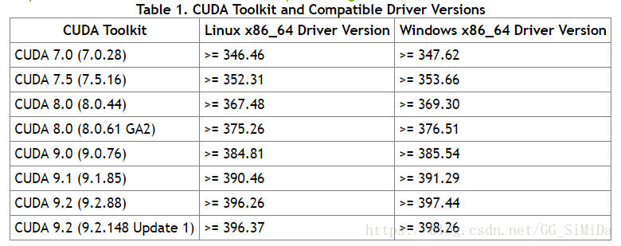

# FFmpeg编译with NVIDIA硬件加速 #

- FFmpeg编译with NVIDIA硬件加速
- FFmpeg编译with NVIDIA硬件加速
- 安装NVIDIA显卡驱动
- 安装CUDA
- 安装CUDNN
- 安装NVIDIA VIDEO CODEC SDK
- 编译FFmpeg
- 参考资料

## 安装NVIDIA显卡驱动 ##

**查看显卡型号**

    lspci | grep VGA
    nvidia-smi

windows下可以在设备管理器中查看显示适配器

**下载对应显卡型号驱动**

https://www.nvidia.com/Download/index.aspx

**卸载旧的驱动**

```
sudo apt-get purge nvidia*

//禁用linux内核自带nouveau nvidia驱动

editor /etc/modprobe.d/blacklist-nouveau.conf

//在文件blacklist-nouveau.conf中添加以下内容：
blacklist nouveau
options nouveau modeset=0

// 更新初始化
update-initramfs -u

//修改后需要重启系统。确认下Nouveau是否已经被禁用，使用命令：
lsmod | grep nouveau
```

**安装驱动**

```
service lightdm stop
./NVIDIA-Linux-x86_64-375.26.run
service lightdm start

// 安装完成并重启后确认下驱动是否工作正常
cat /proc/driver/nvidia/version
nvidia-smi

// 解码库
sudo ld -lnvcuvid
// 编码库
sudo ld -lnvidia_encode
```

## 安装CUDA ##

https://docs.nvidia.com/cuda/cuda-toolkit-release-notes/index.html上有NVIDIA驱动和CUDA版本的兼容性



https://developer.nvidia.com/cuda-toolkit-archive上可下载对应版本CUDA

安装完成后，在/usr/local/cuda目录下会生成include头文件和lib64库文件

    // nvcc是CUDA编译器
    $ nvcc -V

## 安装CUDNN ##

https://developer.nvidia.com/rdp/cudnn-archive

## 安装NVIDIA VIDEO CODEC SDK ##

https://developer.nvidia.com/video-codec-sdk-archive

    // 编译sample
    cd Sample
    make

## 编译FFmpeg ##

```
// 安装yasm
sudo apt-get install yasm

// NVIDIA VIDEO CODEC SDK headers
git clone https://git.videolan.org/git/ffmpeg/nv-codec-headers.git
make
sudo make install

git clone https://git.ffmpeg.org/ffmpeg.git
./configure --enable-cuda --enable-cuvid --enable-nvenc --enable-nonfree --enable-libnpp --extra-cflags=-I/usr/local/cuda/include --extra-ldflags=-L/usr/local/cuda/lib64
make
sudo make install

// 查看硬解码器
ffmpeg -codecs | grep cuvid

// 查看硬编码器
ffmpeg -codecs | grep nvenc
```

此外FFmpeg采用linux c编写，只提供了Makefile的生成方式，在Windows下编译需要先安装MinGW+MSYS环境

## 参考资料 ##

- [NVIDIA VIDEO CODEC SDK](https://developer.nvidia.com/nvidia-video-codec-sdk)
- [FFmpeg uses Video Codec SDK](https://developer.nvidia.com/ffmpeg)
- [FFmpeg再学习 – 硬件加速编解码](https://blog.csdn.net/qq_29350001/article/details/75144665)

最后附上[百度网盘NVIDIA 驱动、CUDA、CUDNN分享地址](https://pan.baidu.com/s/1TLEBog2z2N18gEAULjpXJA)

————————————————

版权声明：本文为CSDN博主「ithewei」的原创文章，遵循CC 4.0 BY-SA版权协议，转载请附上原文出处链接及本声明。

原文链接：https://blog.csdn.net/GG_SiMiDa/article/details/81303876