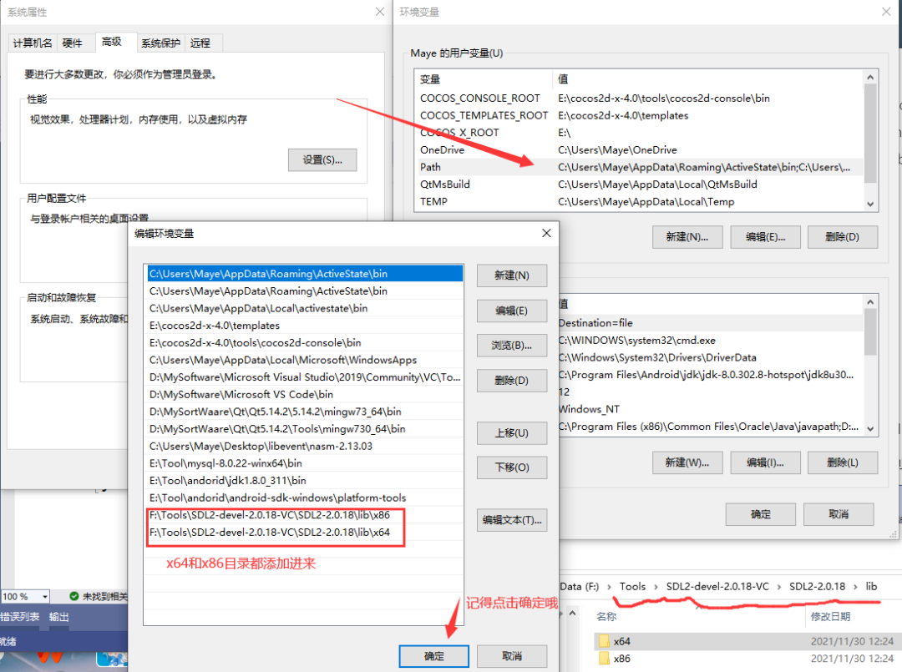

# SDL 下载与配置，用Visual Studio使用SDL库 #

## 安装SDL2 ##

1.点击[SDL2 核心库下载](
https://libsdl.org/download-2.0.php)下载SDL2库，如下图根据编译器选择不同版本(Visual Studo系列选择第一个)。


下载出来会有一个压缩包，放到一个合适的目录(记住这个目录哦，经常要用的)，解压。


进入解压后的目录，如下图：

- docs：文档目录，只不过都是英文的
- include：头文件目录，编程需要的
- lib：库目录(静态库和动态库都有)


给环境变量添加库目录，让程序运行的时候能够找到动态库。PS：配置好了记得重启Vs



## 在Visual Studio中使用SDL ##

创建一个空项目，如下图：


进入菜单栏的项目->属性->VC++ 目录，配置包含目录和库目录(详见下图)，注意库目录的版本和你的项目版本要一直哦(图中两个三角形标记的位置，我这是x64的)。


不要离开，还有静态库需要配置，进入链接器->输入->点击附加依赖项->填入SDL2.lib和SDLmain2.lib，然后确定就好


最后加入如下代码，Ctrl+F5运行

```
 #include<SDL.h>
 
 int main(int argc,char*argv[])
{
 //初始化SDL
 if (SDL_Init(SDL_INIT_VIDEO) <0)
 {
 SDL_Log("can not init SDL:%s", SDL_GetError());
 return -1;
 }
 
 return 0;
 }
```


如果能出现黑窗口并且，没有任何错误提示，那么就恭喜你啦，SDL配置完成~(不过麻烦的是每次创建新项目和在x86、x64之间切换时，都要进行配置~后面将讲解更方便的方法)！