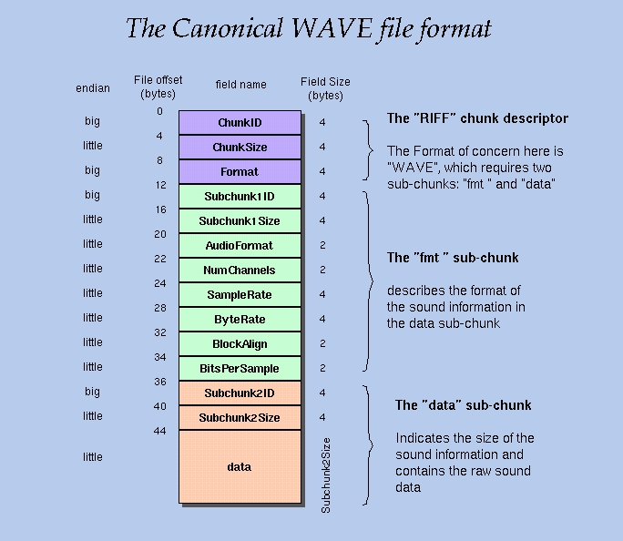
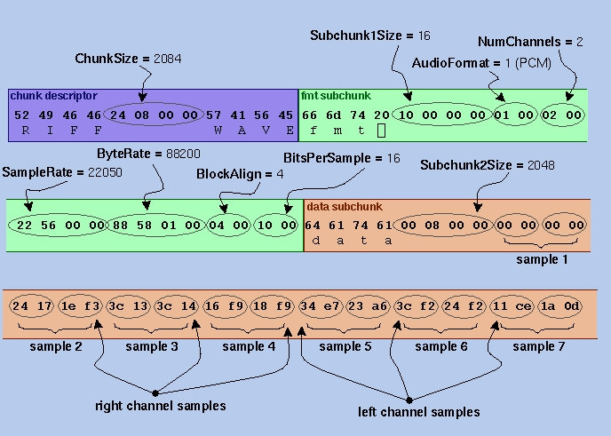

## [WAV与PCM](https://www.cnblogs.com/8335IT/p/8524815.html)

转：

1、PCM格式介绍： 
PCM(Pulse Code Modulation)也被称为 脉码编码调制。PCM中的声音数据没有被压缩，如果是单声道的文件，采样数据按时间的先后顺序依次存入。(它的基本组织单位是BYTE(8bit)或WORD(16bit)) 
[参考文献](http://blog.csdn.net/ownwell/article/details/8114121/)http://blog.csdn.net/ownwell/article/details/8114121/ 
2、WAV格式 
（1）格式介绍： 
WAVE文件格式是Microsoft的RIFF规范的一个子集，用于存储多媒体文件。WAVE文件通常只是一个具有单个“WAVE”块的RIFF文件，该块由两个子块（”fmt”子数据块和”data”子数据块）组成。 
如下图所示： 


```undefined
（2）每个字段的的含义介绍：
   typedef struct{
       char          ChunkID[4];//内容为"RIFF"
       unsigned long ChunkSize;//存储文件的字节数（不包含ChunkID和ChunkSize这8个字节）
       char          Format[4];//内容为"WAVE"
   }WAVE_HEADER;

   typedef struct{
        char          Subchunk1ID[4];//内容为"fmt"
        unsigned long  Subchunk1Size;//存储该子块的字节数（不含前面的Subchunk1ID和Subchunk1Size这8个字节）
        unsigned short AudioFormat;//存储音频文件的编码格式，例如若为PCM则其存储值为1，若为其他非PCM格式的则有一定的压缩。
        unsigned short NumChannels;//通道数，单通道(Mono)值为1，双通道(Stereo)值为2，等等
        unsigned long  SampleRate;//采样率，如8k，44.1k等
        unsigned long  ByteRate;//每秒存储的bit数，其值=SampleRate * NumChannels * BitsPerSample/8
        unsigned short BlockAlign;//块对齐大小，其值=NumChannels * BitsPerSample/8
        unsigned short BitsPerSample;//每个采样点的bit数，一般为8,16,32等。
   }WAVE_FMT;
   typedef struct{
        char          Subchunk2ID[4];//内容为“data”
        unsigned long Subchunk2Size;//内容为接下来的正式的数据部分的字节数，其值=NumSamples * NumChannels * BitsPerSample/8
   }WAVE_DATA;
```

(3)一个WAVE例子 
这里是一个WAVE文件的开头72字节，字节显示为十六进制数字： 
52 49 46 46 24 08 00 00 57 41 56 45 66 6d 74 20 10 00 00 00 01 00 02 00 
22 56 00 00 88 58 01 00 04 00 10 00 64 61 74 61 00 08 00 00 00 00 00 00 
24 17 1e f3 3c 13 3c 14 16 f9 18 f9 34 e7 23 a6 3c f2 24 f2 11 ce 1a 0d 
字段解析： 
 
[参考文献1](http://soundfile.sapp.org/doc/WaveFormat/)http://soundfile.sapp.org/doc/WaveFormat/ 
[参考文献2](http://www.lightlink.com/tjweber/StripWav/Canon.html)http://www.lightlink.com/tjweber/StripWav/Canon.html 
[参考文献3](http://www.topherlee.com/software/pcm-tut-wavformat.html)http://www.topherlee.com/software/pcm-tut-wavformat.html

3、用C语言实现PCM转WAVE

```cpp
#include <stdio.h>
#include <string.h>

/**
 * Convert PCM16LE raw data to WAVE format
 * @param pcmpath       Input PCM file.
 * @param channels      Channel number of PCM file.
 * @param sample_rate   Sample rate of PCM file.
 * @param wavepath      Output WAVE file.
 */
int simplest_pcm16le_to_wave(const char *pcmpath, int channels, int sample_rate, const char *wavepath)
{
    typedef struct WAVE_HEADER{
        char    fccID[4];       //内容为""RIFF
        unsigned long dwSize;   //最后填写，WAVE格式音频的大小
        char    fccType[4];     //内容为"WAVE"
    }WAVE_HEADER;

    typedef struct WAVE_FMT{
        char    fccID[4];          //内容为"fmt "
        unsigned long  dwSize;     //内容为WAVE_FMT占的字节数，为16
        unsigned short wFormatTag; //如果为PCM，改值为 1
        unsigned short wChannels;  //通道数，单通道=1，双通道=2
        unsigned long  dwSamplesPerSec;//采用频率
        unsigned long  dwAvgBytesPerSec;/* ==dwSamplesPerSec*wChannels*uiBitsPerSample/8 */
        unsigned short wBlockAlign;//==wChannels*uiBitsPerSample/8
        unsigned short uiBitsPerSample;//每个采样点的bit数，8bits=8, 16bits=16
    }WAVE_FMT;

    typedef struct WAVE_DATA{
        char    fccID[4];       //内容为"data"
        unsigned long dwSize;   //==NumSamples*wChannels*uiBitsPerSample/8
    }WAVE_DATA;

    if(channels==2 || sample_rate==0)
    {
        channels = 2;
        sample_rate = 44100;
    }
    int bits = 16;

    WAVE_HEADER pcmHEADER;
    WAVE_FMT    pcmFMT;
    WAVE_DATA   pcmDATA;

    unsigned short m_pcmData;
    FILE *fp, *fpout;

    fp = fopen(pcmpath, "rb+");
    if(fp==NULL)
    {
        printf("Open pcm file error.\n");
        return -1;
    }
    fpout = fopen(wavepath, "wb+");
    if(fpout==NULL)
    {
        printf("Create wav file error.\n");
        return -1;
    }

    /* WAVE_HEADER */
    memcpy(pcmHEADER.fccID, "RIFF", strlen("RIFF"));
    memcpy(pcmHEADER.fccType, "WAVE", strlen("WAVE"));
    fseek(fpout, sizeof(WAVE_HEADER), 1);   //1=SEEK_CUR
    /* WAVE_FMT */
    memcpy(pcmFMT.fccID, "fmt ", strlen("fmt "));
    pcmFMT.dwSize = 16;
    pcmFMT.wFormatTag = 1;
    pcmFMT.wChannels = 2;
    pcmFMT.dwSamplesPerSec = sample_rate;
    pcmFMT.uiBitsPerSample = bits;
    /* ==dwSamplesPerSec*wChannels*uiBitsPerSample/8 */
    **pcmFMT.dwAvgBytesPerSec = pcmFMT.dwSamplesPerSec*pcmFMT.wChannels*pcmFMT.uiBitsPerSample/8;**
    /* ==wChannels*uiBitsPerSample/8 */
    **pcmFMT.wBlockAlign = pcmFMT.wChannels*pcmFMT.uiBitsPerSample/8;**


    fwrite(&pcmFMT, sizeof(WAVE_FMT), 1, fpout);

    /* WAVE_DATA */
    memcpy(pcmDATA.fccID, "data", strlen("data"));
    pcmDATA.dwSize = 0;
    fseek(fpout, sizeof(WAVE_DATA), SEEK_CUR);

    fread(&m_pcmData, sizeof(unsigned short), 1, fp);
    while(!feof(fp))
    {
        pcmDATA.dwSize += 2;
        fwrite(&m_pcmData, sizeof(unsigned short), 1, fpout);
        fread(&m_pcmData, sizeof(unsigned short), 1, fp);
    }

    /*pcmHEADER.dwSize = 44 + pcmDATA.dwSize;*/
    //修改时间：2018年1月5日
    pcmHEADER.dwSize = 36 + pcmDATA.dwSize;

    rewind(fpout);
    fwrite(&pcmHEADER, sizeof(WAVE_HEADER), 1, fpout);
    fseek(fpout, sizeof(WAVE_FMT), SEEK_CUR);
    fwrite(&pcmDATA, sizeof(WAVE_DATA), 1, fpout);

    fclose(fp);
    fclose(fpout);

    return 0;
}

int main()
{
    simplest_pcm16le_to_wave("NocturneNo2inEflat_44.1k_s16le.pcm", 2, 44100, "output_nocture.wav");

    return 0;
}
```

 

结果如图所示： 


[参考文献](http://blog.csdn.net/leixiaohua1020/article/details/50534316)http://blog.csdn.net/leixiaohua1020/article/details/50534316 
2017年10月26日 星期四 修改

```avrasm
原74行代码：
**pcmFMT.dwAvgBytesPerSec = pcmFMT.dwSamplesPerSec*pcmFMT.wChannels*pcmFMT.uiBitsPerSample/8;**
改为
pcmFMT.dwAvgBytesPerSec = pcmFMT.dwSamplesPerSec*pcmFMT.wChannels*pcmFMT.uiBitsPerSample/8;
```

 

```avrasm
原76行：
**pcmFMT.wBlockAlign = pcmFMT.wChannels*pcmFMT.uiBitsPerSample/8;**
改为：
pcmFMT.wBlockAlign = pcmFMT.wChannels*pcmFMT.uiBitsPerSample/8;
```

分类: [理论](https://www.cnblogs.com/8335IT/category/873104.html)