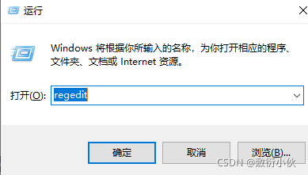
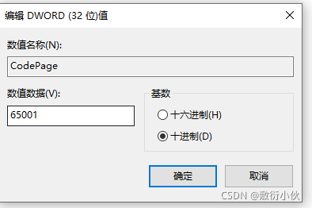

# cmd控制台永久修改中文编码936为65001的办法

cmd输入中文正常，输出中文乱码

查看中文编码

打开cmd控制台 输入chcp

- 65001 是UTF-8
- 936 是 GBK

**解决办法：**

最根本的修改方法为修改注册表的内容

运行

按照索引找到

    计算机\HKEY_CURRENT_USER\Console%SystemRoot%_system32_cmd.exe

在这个项下新建一个如图所示的65001的数值

注意是10进制的65001 DWORD的32位值

————————————————

版权声明：本文为CSDN博主「敷衍小伙」的原创文章，遵循CC 4.0 BY-SA版权协议，转载请附上原文出处链接及本声明。

原文链接：https://blog.csdn.net/weixin_45680043/article/details/120986184
