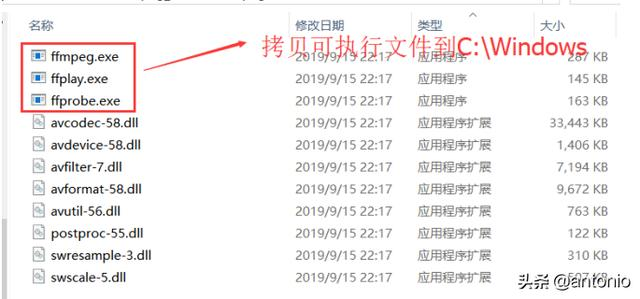

# ffmpeg builds by zeranoe_手把手搭建FFmpeg的Windows环境 #

1.简述

在Windows平台，搭建FFmpeg开发环境，能够帮助我们做各种开发的测试，如推流，拉流，滤镜等。

2.下载源码

(1)登陆FFMPEG官网

官网地址:http://ffmpeg.org/

下载4.2.1版本源码地址：https://ffmpeg.org/releases/ffmpeg-4.2.1.tar.bz2

下载4.2.1编译好的文件：https://ffmpeg.zeranoe.com/builds/

官网截图如下:

找到适合的源码和编译好的文件。

32位下载地址：

Shared：包含FFMPEG的dll库文件。

地址:https://ffmpeg.zeranoe.com/builds/win32/shared/ffmpeg-4.2.1-win32-shared.zip

Static：包含了FFMPEG的官方文档。

地址：https://ffmpeg.zeranoe.com/builds/win32/static/ffmpeg-4.2.1-win32-static.zip

Dev：包含FFMPEG的lib文件/头文件，以及example范例。

地址：https://ffmpeg.zeranoe.com/builds/win32/dev/ffmpeg-4.2.1-win32-dev.zip

注意：这里以32位版本为例子，其它版本也类似。

3.FFmpeg命令行环境搭建

解压:ffmpeg-4.2.1-win32-shared.zip

(1)拷贝ffmpeg-4.2.1-win32-sharedbin目录的执行文件到C:Windows

(2)拷贝ffmpeg-4.2.1-win32-sharedbin目录的动态库到C:WindowsSysWOW64

WoW64 (Windows On Windows64 [1] )是一个Windows操作系统的子系统，被设计用来处理许多在32-bit Windows和64-bit Windows之间的不同的问题，使得可以在64-bit Windows中运行32-bit程序。

(3)打开cmd命令行窗口，输入ffmpeg -version。如果出现如下界面，证明测试成功。

4.FFmpeg与QT环境搭建

(1)QT安装

QT官网：https://www.qt.io/

这里以QT 5.10.1版本为例子进行下载。以下2个地址，2选一即可。

下载地址：http://download.qt.io/official_releases/qt/5.10/5.10.1/

直接选择下载地址：http://iso.mirrors.ustc.edu.cn/qtproject/archive/qt/5.10/5.10.1/qt-opensource-windows-x86-5.10.1.exe

选择如下版本：

下载后，准备安装。

按照安装向导一步步Next(或下一步)。

可以选择自定义路径或使用默认也可以。

勾选如下插件，如果怕漏选，可以全选(可能安装时间会长点，更占用硬盘空间)。

同意许可证。

等待安装结束

5.测试FFmpeg与QT使用

(1)创建QT工程

新建工程

选择Non-Qt Project。根据需求选择C++还是C工程。

填写项目名称以及路径，如下所示就创建了一个叫xxx(名字自定义)的工程。

选择编译器

注意：需要使用C时则选择，“Plain C++ Application”

到此步骤结束，就可以创建 一个最基本的工程。

(2)添加FFmpeg库

将从FFmpeg网站上下载下来的ffmpeg-4.2.1-win32-dev拷贝到ffmpeg-version目录下。如下界面：

在ffmpeg-version.pro里面添加ffmpeg头文件和库文件路径，按照如下代码添加：

注意：LIBS的多行引用一定要记得带斜杠，否则后续的引用无效。

修改main.c文件

使用FFmpeg库，能否生效。

执行程序

如果能够显示如下打印，证明搭建成功。

到此步骤结束，Windows QT+FFMPEG的开发环境就搭建完毕了。

本篇文章就分析到这里，欢迎大家关注欢迎关注，点赞，转发，收藏，分享，评论区讨论。

后面关于项目知识，后期会更新。欢迎关注微信公众号"记录世界 from antonio"。

相关资源：Windows编译ffmpeg步骤_ffmpegwindows编译,windows编译ffmpeg-编...