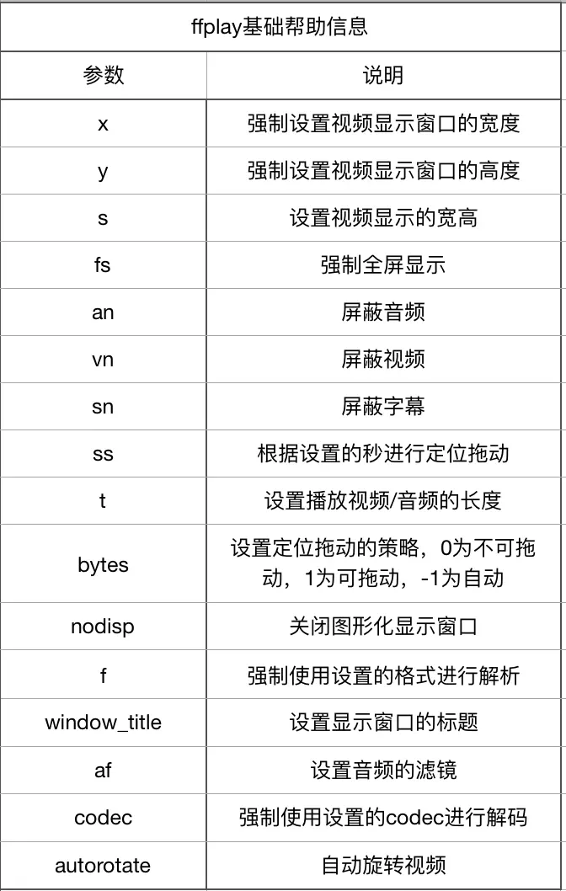
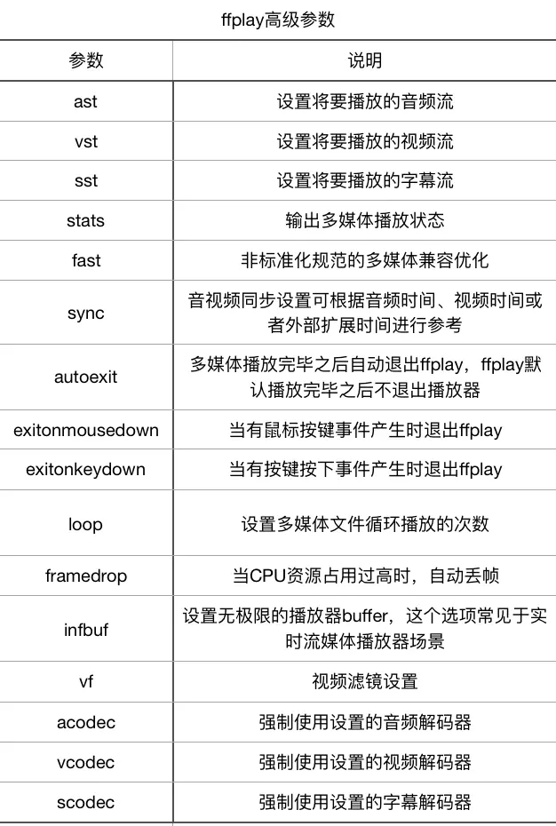
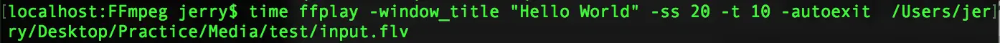
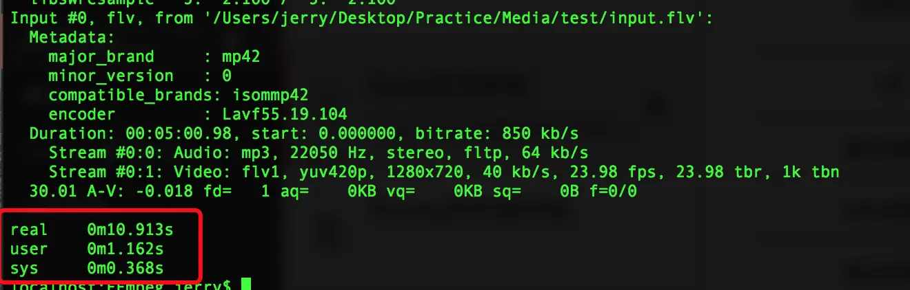

# ffplay常用参数

ffplay不仅仅是播放器，同时也是测试ffmpeg的codec引擎、format引擎，以及filter引擎的工具，并且还可以进行可视化的媒体参数分析，通过ffplay --help进行参数查看。

基本命令：

如果希望从视频的第30秒开始播放，播放10秒钟的文件，则可以使用如下的命令：

ffplay -ss 30 -t 10 input.mp4

如果希望视频播放时播放器的窗口显示标题为自定义的标题，则可以使用如下命令：

ffplay -window_title "Hello World" input.mp4

打开网络直播流，使用如下命令：

ffplay -window_title "播放测试" rtmp://202.69.69.180:443/webcast/bshdlive-pc

高级参数

例如：从20秒播放一个视频，播放时长为10秒钟，播放完成后自动退出ffplay，播放器的窗口标题为“Hello World”,为了确认播放时长正确，可以通过系统命令time查看命令运行时长：

该命令执行完毕后输出如下：

从输出的内容分析来看，实际消耗时间为10.913秒，用户在空间消耗1.162秒。

作者：i玉米炖排骨
链接：https://www.jianshu.com/p/a7f070326bd3
来源：简书
著作权归作者所有。商业转载请联系作者获得授权，非商业转载请注明出处。