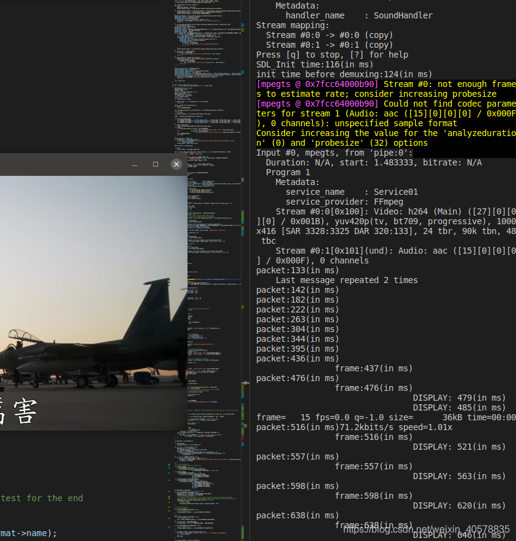
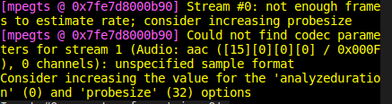

# ffplay延时分析：用pipe从本机按帧率将媒体文件用ffmpeg输送到ffplay播放

平台：ubuntu20.04LTS + VS Code

 

`ffmpeg -re -i ../test.mp4 -codec copy -f mpegts pipe:1|./ffplay -i pipe:0 -probesize 32 -analyzeduration 0 -sync ext`

参数介绍：

-re: 按帧率读取视频

-codec copy : 输出视频的codec和输入文件相同

-f :使用pipe传输的媒体格式为mpegts

pipe:1 代表stdout，即将媒体文件写入内存

pipe:0 代表stdin，读取内存，通过ffplay进行播放

-probesize -analyzeduration: 引用"Also setting -probesize and -analyzeduration to low values may help your stream start up more quickly (it uses these to scan for "streams" in certain muxers, like ts, where some can appears "later", and also to estimate the duration, which, for live streams, the latter you don't need anyway). This should be unneeded by dshow input."

-sync ext 音视频同步到外部时钟

观察上面的运行结果

SDL Init time: 116(in ms) 即SDL初始化时间是116ms（应尽量将这部分延时排除）

init time before demuxing: 124(in ms) 解复用操作前的总耗时是124ms

后半部分的log显示了按时间顺序解复用线程读取一个packet；解码线程读取一个frame；最终图片显示DISPLAY的时间。

 

ffplay采用多线程，解复用，解码和显示是三个不同的线程，在此例中，按帧率读取视频文件，相当于直播流的场景，从第一个packet读取到第一帧显示有479-142=337ms的延迟，且这部分延迟的大部分来源是不断读取packet（大约12个）进入队列引起。

另外，为了降低延时，-probesize 32是必须的，否则，显示第一帧图像之前会有30多个packet的预存，带来的延时高达5s !

————————————————

版权声明：本文为CSDN博主「weixin_40578835」的原创文章，遵循CC 4.0 BY-SA版权协议，转载请附上原文出处链接及本声明。

原文链接：https://blog.csdn.net/weixin_40578835/article/details/107237878