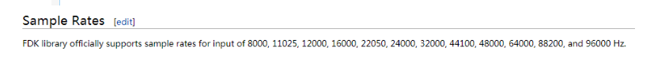
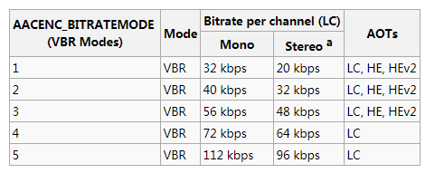
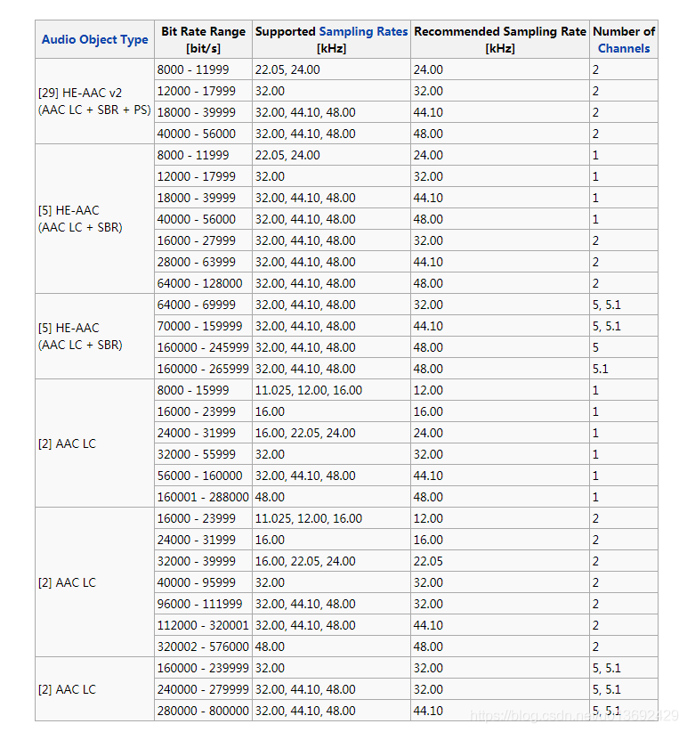

# libfdk_aac介绍 #

原因：由于需要对比aac编码和libfdk_aac编码后音频质量,故在此简单介绍一下libfdk_aac.

 

**音频简单介绍：**

音频的主要几个参数为采样率，通道个数，通道类型，样本类型，码率等.我们的耳朵听到的频率间隔为20-20KHZ，我们的发声频率为100-3KHZ左右,所以可以看出如果只是单纯的采集发声频率可以使用8KHZ就可以,采样率必须是输入信号最高频率的2倍以上，这样才会最大可能的保存信号信息.故我们的听到的样本的采样率一般都为44.1KHZ及以上.

音频的存储格式有wmv,mp3,m4a,mp4,wma,avi等.既然有存储那么就会涉及到编码方式，编码又分为有损压缩和无损压缩，有损压缩主要有AAC，MP3,WMA，MP3Pro等,无损压缩主要有FLAC，ALAC等.目前有损压缩一般使用的是mp3和aac，AAC又可以扩展为AAC-LC和AAC-HE-V1，AAC-HE-V2等.

AAC:Advanced Audio Coding(高级音频编码)主要为了替代mp3编码, 定义在MPEG-4的第三部分.对于音频使用.m4a扩展名存储.FFmpeg目前支持AAC-LC编码和HE-AAC（V1/V2）编码.而HE-AAC的实现是在libfdk_aac模块中.

 

**FDK_AAC介绍:**

可以理解为当前最高质量的AAC编码.编码模式分为CBR和VBR.

采样率支持：

样本类型：可以看出只支持16bit pcm输入.

CBR模式:

设置目标码率，当样本之间差异较小时，可以通过该方法更好地控制文件大小，设置每个通道为64kbps.立体声为128kbps,以此类推。使用参数-b

转换音频文件到AAC保存为m4a

ffmpeg -i input.wav -c:a libfdk_aac -b:a 128k output.m4a

VBR模式：

指定目标质量，而不是码率，质量从1到5由低到高.使用参数-vbr,vbr模式下大致给出了每个通道对应的码率，从下图可以看出HE和HEV2适用于低码率.

关于不同的编码类型对应的采样率和码率如下,可以看出HE-AAC-V2只适用于双声道.而高码率下则还是AAC-LC优势更明显.

上图中SBR：spectral Band Replication(频段复制),简单来说就是之前的编码方式会存在保存低频信号而损失高频信号，而通过SBR技术实现了低频和高频分开编码,故可以减少音频损失.PS：parametric stereo(参数立体声）由于双声道时会存在相似性，故可以通过一些参数来记录差异，从而减少保存数据量.

 

总结:在音频编码时一般通用为mp3或者aac,而由于iphone中的播放器对.m4a文件的完全支持,故在iphone中大多数使用到了aac编码,而由于ffmpeg自带的aac编码效果不够理想.故需要使用fdk-aac进行编码.而fdk-aac包含AAC-LC和HE-AAC,但是HE-AAC又和硬件支持绑定严重，故HE-AAC存在缺陷.

————————————————

版权声明：本文为CSDN博主「qw_stone」的原创文章，遵循CC 4.0 BY-SA

版权协议，转载请附上原文出处链接及本声明。

原文链接：https://blog.csdn.net/u013692429/article/details/99680818