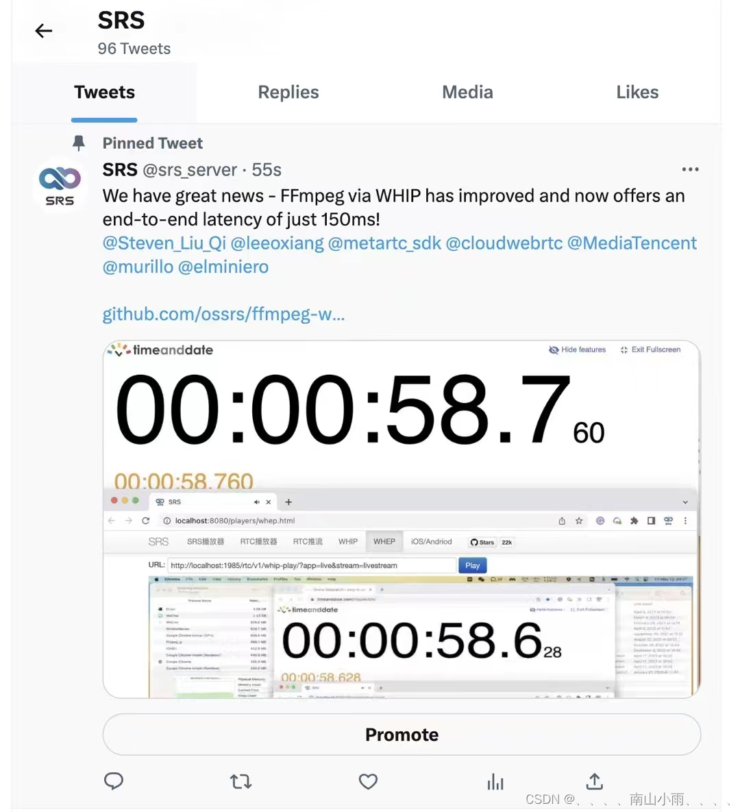
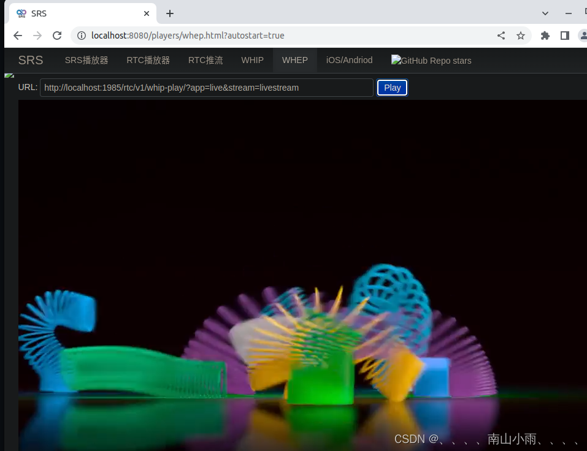

# ubuntu22.10 ffmpeg-webrtc推拉流srs环境搭建


- 一、编译ffmpeg-webrtc
- 二、openss，opus，x264配置
- 三、编译srs
- 四、测试
- 4.1推流端
- 4.2拉流端
- 五、交互与sdp

最近看到杨大佬发的动态，尝鲜体验一下。




一、编译ffmpeg-webrtc
ffmpeg-webrtc官网：https://github.com/ossrs/ffmpeg-webrtc
拉取ffmpeg-webrtc代码：
```
git clone -b feature/rtc-muxer https://github.com/winlinvip/ffmpeg-webrtc.git
```
这里配置需要openssl，opus，x264见下
```
./configure --enable-muxer=rtc --enable-openssl --enable-version3 --enable-libx264 --enable-gpl --enable-libopus

make -j10
```
二、openss，opus，x264配置
配置openssl
```
sudo apt update
sudo apt install build-essential checkinstall zlib1g-dev
wget https://www.openssl.org/source/openssl-3.0.7.tar.gz
tar -xf openssl-3.0.7.tar.gz
cd openssl-3.0.7
```
```
./config --prefix=/usr/ --openssldir=/usr/ shared zlib
make
make test
make install
cd /etc/ld.so.conf.d/
nano openssl-3.0.7.conf
```
编译ffmpeg-webrtc会报错openss < 3.0其实详细查看日志，发现没有找到openssl，这样配置官方的ffmpeg就已经能找到了，这里需要特别配置一下：
把/usr/lib64/pkgconfig/的三个libcrypto.pc libssl.pc openssl.pc这三个文件拷贝到/usr/lib/pkgconfig/下，
```
sudo cp /usr/lib64/pkgconfig/* /usr/lib/pkgconfig/
```
```
pkg-config update
sudo ldconfig
```
参考：https://www.yundongfang.com/Yun224517.html

编译x264，获取网站
http://www.videolan.org/developers/x264.html
在ubuntu22.10下直接apt-get install x264安装的库，ffmpeg-webrtc找不到，这里下载源码安装发现可以。
打开下载的x264源码，执行
```
./configure --enable-shared --enable-static --disable-asm 
make
make install
```
安装opus
```
sudo apt-get install libopus-dev
```
三、编译srs
拉取srs代码：
srs，版本要求SRS version 5.0.153 or higher, or 6.0.43 or higher。
```
https://github.com/ossrs/srs
```
编译srs后运行：
```
./objs/srs -c conf/rtc2rtmp.conf
```
四、测试
运行：
ffmpeg_g -re -i ~/git/srs/trunk/doc/source.flv -vcodec libx264 -profile:v baseline -r 25 -g 50 -acodec libopus -ar 48000 -ac 2 -f rtc “http://localhost:1985/rtc/v1/whip/?app=live&stream=livestream”
以上输入文件是srs包里的测试文件。
也可以使用自己的文件，注意必须是x264库，opens编码，baseline模式，且不能只含视频不含音频，也要主要像素格式，baseline支持的像素格式有限。
4.1推流端：
```
ffmpeg -re -i westlife.mp4 -vcodec libx264 -pix_fmt yuv420p -profile:v baseline -r 25 -g 50 -acodec libopus -ar 48000 -ac 2 -f rtc "http://localhost:1985/rtc/v1/whip/?app=live&stream=livestream"
```
其中推流端也可以用网页的WHIP，但这里测试的是ffmpeg-webrtc。
4.2拉流端：
经测试ffmpeg-webrtc的ffplay并不能拉取WHIP流，应该是这部分代码还没完善。受条件限制，后面再测延时，先挖个坑把。
http://localhost:8080/players/whep.html?autostart=true



五、交互与sdp
看一下ffmpeg推流端与srs的交互过程：
```
[rtc @ 0x55816580bec0] WHIP: Init ice_arq_max=5, ice_arq_timeout=30, dtls_arq_max=5, dtls_arq_timeout=50 pkt_size=1500
[rtc @ 0x55816580bec0] WHIP: SDP offer=1048B, answer=1040B, ufrag=ods0t720, pwd=32B, transport=udp://192.168.100.245:8000
[rtc @ 0x55816580bec0] WHIP: ICE STUN ok, url=udp://192.168.100.245:8000, username=ods0t720:c2bf2fab, req=80B, res=-11B, arq=5
[rtc @ 0x55816580bec0] WHIP: DTLS handshake done=1, arq=0, srtp_material=60B
[rtc @ 0x55816580bec0] WHIP: SRTP setup done, suite=AES_CM_128_HMAC_SHA1_80, key=30B
[rtc @ 0x55816580bec0] WHIP: Create RTP muxer OK, buffer_size=4096, max_packet_size=1484
Output #0, rtc, to 'http://localhost:1985/rtc/v1/whip/?app=live&stream=livestream':
```
ffmpeg推流端与srs的sdp交互：
```
[rtc @ 0x5615e784dec0] WHIP: Init ice_arq_max=5, ice_arq_timeout=30, dtls_arq_max=5, dtls_arq_timeout=50 pkt_size=1500
[rtc @ 0x5615e784dec0] Failed to request url=http://localhost:1985/rtc/v1/whip/?app=live&stream=livestream, offer: v=0
o=FFmpeg 4489045141692799359 2 IN IP4 127.0.0.1
s=FFmpegPublishSession
t=0 0
a=group:BUNDLE 0 1
a=extmap-allow-mixed
a=msid-semantic: WMS
m=audio 9 UDP/TLS/RTP/SAVPF 111
c=IN IP4 0.0.0.0
a=ice-ufrag:1ac08523
a=ice-pwd:fb55f4f4d99d240fa65c2adfec5e7c24
a=fingerprint:sha-256 84:67:F7:27:AE:00:74:71:AA:EF:42:E1:B8:85:78:C9:6D:02:CB:F8:83:07:79:1F:4F:79:F8:1B:0A:5F:7C:C7
a=setup:active
a=mid:0
a=sendonly
a=msid:FFmpeg audio
a=rtcp-mux
a=rtpmap:111 opus/48000/2
a=ssrc:492341693 cname:FFmpeg
a=ssrc:492341693 msid:FFmpeg audio
m=video 9 UDP/TLS/RTP/SAVPF 106
c=IN IP4 0.0.0.0
a=ice-ufrag:1ac08523
a=ice-pwd:fb55f4f4d99d240fa65c2adfec5e7c24
a=fingerprint:sha-256 84:67:F7:27:AE:00:74:71:AA:EF:42:E1:B8:85:78:C9:6D:02:CB:F8:83:07:79:1F:4F:79:F8:1B:0A:5F:7C:C7
a=setup:active
a=mid:1
a=sendonly
a=msid:FFmpeg video
a=rtcp-mux
a=rtcp-rsize
a=rtpmap:106 H264/90000
a=fmtp:106 level-asymmetry-allowed=1;packetization-mode=1;profile-level-id=42001e
a=ssrc:2806541432 cname:FFmpeg
a=ssrc:2806541432 msid:FFmpeg video
```

————————————————
版权声明：本文为CSDN博主「、、、、南山小雨、、、、」的原创文章，遵循CC 4.0 BY-SA版权协议，转载请附上原文出处链接及本声明。
原文链接：https://blog.csdn.net/weixin_43466192/article/details/130660488