# vs2019编译ffmpeg源码为静态库动态库【完整步骤、亲测可行】

  ffmpeg大概从两年前版本开始，不再提供编译好的lib，dll，需要开发者自己编译，在linux下编译ffmpeg可能相对简单，windows稍微复杂点，很多文章介绍使用msys2编译，但是绝大多数都是无法正确编译出lib, 而且也只是加上了x264, 然而ffmpeg支持的依赖库很多，用命令行，一个命令写错就编译失败了，本篇博客介绍如何使用vs2019编译最新的ffmpeg源码，可以编译为

[ **令狐掌门**](javascript:;) · 2021-11-27 21:14:42


### 目录

- [1、ffmpeg代码clone](https://devpress.csdn.net/gitcode/6405a8f7986c660f3cf912a1.html?spm=1001.2101.3001.6650.2&utm_medium=distribute.pc_relevant.none-task-blog-2~default~BlogCommendFromBaidu~activity-2-121581878-blog-124239535.pc_relevant_vip_default&depth_1-utm_source=distribute.pc_relevant.none-task-blog-2~default~BlogCommendFromBaidu~activity-2-121581878-blog-124239535.pc_relevant_vip_default&utm_relevant_index=3#1ffmpegclone_19?login=from_csdn)
- [2、ffmpeg依赖库下载](https://devpress.csdn.net/gitcode/6405a8f7986c660f3cf912a1.html?spm=1001.2101.3001.6650.2&utm_medium=distribute.pc_relevant.none-task-blog-2~default~BlogCommendFromBaidu~activity-2-121581878-blog-124239535.pc_relevant_vip_default&depth_1-utm_source=distribute.pc_relevant.none-task-blog-2~default~BlogCommendFromBaidu~activity-2-121581878-blog-124239535.pc_relevant_vip_default&utm_relevant_index=3#2ffmpeg_40?login=from_csdn)
- [3、其它文件下载](https://devpress.csdn.net/gitcode/6405a8f7986c660f3cf912a1.html?spm=1001.2101.3001.6650.2&utm_medium=distribute.pc_relevant.none-task-blog-2~default~BlogCommendFromBaidu~activity-2-121581878-blog-124239535.pc_relevant_vip_default&depth_1-utm_source=distribute.pc_relevant.none-task-blog-2~default~BlogCommendFromBaidu~activity-2-121581878-blog-124239535.pc_relevant_vip_default&utm_relevant_index=3#3_48?login=from_csdn)
- - [(1)opengl头文件](https://devpress.csdn.net/gitcode/6405a8f7986c660f3cf912a1.html?spm=1001.2101.3001.6650.2&utm_medium=distribute.pc_relevant.none-task-blog-2~default~BlogCommendFromBaidu~activity-2-121581878-blog-124239535.pc_relevant_vip_default&depth_1-utm_source=distribute.pc_relevant.none-task-blog-2~default~BlogCommendFromBaidu~activity-2-121581878-blog-124239535.pc_relevant_vip_default&utm_relevant_index=3#1opengl_50?login=from_csdn)
  - [(2)EGL头文件](https://devpress.csdn.net/gitcode/6405a8f7986c660f3cf912a1.html?spm=1001.2101.3001.6650.2&utm_medium=distribute.pc_relevant.none-task-blog-2~default~BlogCommendFromBaidu~activity-2-121581878-blog-124239535.pc_relevant_vip_default&depth_1-utm_source=distribute.pc_relevant.none-task-blog-2~default~BlogCommendFromBaidu~activity-2-121581878-blog-124239535.pc_relevant_vip_default&utm_relevant_index=3#2EGL_59?login=from_csdn)
  - [(3)nv-codec 头文件](https://devpress.csdn.net/gitcode/6405a8f7986c660f3cf912a1.html?spm=1001.2101.3001.6650.2&utm_medium=distribute.pc_relevant.none-task-blog-2~default~BlogCommendFromBaidu~activity-2-121581878-blog-124239535.pc_relevant_vip_default&depth_1-utm_source=distribute.pc_relevant.none-task-blog-2~default~BlogCommendFromBaidu~activity-2-121581878-blog-124239535.pc_relevant_vip_default&utm_relevant_index=3#3nvcodec__69?login=from_csdn)
  - [(4)AMF 头文件](https://devpress.csdn.net/gitcode/6405a8f7986c660f3cf912a1.html?spm=1001.2101.3001.6650.2&utm_medium=distribute.pc_relevant.none-task-blog-2~default~BlogCommendFromBaidu~activity-2-121581878-blog-124239535.pc_relevant_vip_default&depth_1-utm_source=distribute.pc_relevant.none-task-blog-2~default~BlogCommendFromBaidu~activity-2-121581878-blog-124239535.pc_relevant_vip_default&utm_relevant_index=3#4AMF__77?login=from_csdn)
- [4、配置NASM、YASM](https://devpress.csdn.net/gitcode/6405a8f7986c660f3cf912a1.html?spm=1001.2101.3001.6650.2&utm_medium=distribute.pc_relevant.none-task-blog-2~default~BlogCommendFromBaidu~activity-2-121581878-blog-124239535.pc_relevant_vip_default&depth_1-utm_source=distribute.pc_relevant.none-task-blog-2~default~BlogCommendFromBaidu~activity-2-121581878-blog-124239535.pc_relevant_vip_default&utm_relevant_index=3#4NASMYASM_87?login=from_csdn)
- - [NASM下载地址：](https://devpress.csdn.net/gitcode/6405a8f7986c660f3cf912a1.html?spm=1001.2101.3001.6650.2&utm_medium=distribute.pc_relevant.none-task-blog-2~default~BlogCommendFromBaidu~activity-2-121581878-blog-124239535.pc_relevant_vip_default&depth_1-utm_source=distribute.pc_relevant.none-task-blog-2~default~BlogCommendFromBaidu~activity-2-121581878-blog-124239535.pc_relevant_vip_default&utm_relevant_index=3#NASM_88?login=from_csdn)
  - [YASM下载地址：](https://devpress.csdn.net/gitcode/6405a8f7986c660f3cf912a1.html?spm=1001.2101.3001.6650.2&utm_medium=distribute.pc_relevant.none-task-blog-2~default~BlogCommendFromBaidu~activity-2-121581878-blog-124239535.pc_relevant_vip_default&depth_1-utm_source=distribute.pc_relevant.none-task-blog-2~default~BlogCommendFromBaidu~activity-2-121581878-blog-124239535.pc_relevant_vip_default&utm_relevant_index=3#YASM_93?login=from_csdn)
- [5、开始编译ffmpeg](https://devpress.csdn.net/gitcode/6405a8f7986c660f3cf912a1.html?spm=1001.2101.3001.6650.2&utm_medium=distribute.pc_relevant.none-task-blog-2~default~BlogCommendFromBaidu~activity-2-121581878-blog-124239535.pc_relevant_vip_default&depth_1-utm_source=distribute.pc_relevant.none-task-blog-2~default~BlogCommendFromBaidu~activity-2-121581878-blog-124239535.pc_relevant_vip_default&utm_relevant_index=3#5ffmpeg_103?login=from_csdn)
- [6、创建项目验证ffmpeg lib](https://devpress.csdn.net/gitcode/6405a8f7986c660f3cf912a1.html?spm=1001.2101.3001.6650.2&utm_medium=distribute.pc_relevant.none-task-blog-2~default~BlogCommendFromBaidu~activity-2-121581878-blog-124239535.pc_relevant_vip_default&depth_1-utm_source=distribute.pc_relevant.none-task-blog-2~default~BlogCommendFromBaidu~activity-2-121581878-blog-124239535.pc_relevant_vip_default&utm_relevant_index=3#6ffmpeg_lib_120?login=from_csdn)
- [7、哪些项目用到了ffmpeg](https://devpress.csdn.net/gitcode/6405a8f7986c660f3cf912a1.html?spm=1001.2101.3001.6650.2&utm_medium=distribute.pc_relevant.none-task-blog-2~default~BlogCommendFromBaidu~activity-2-121581878-blog-124239535.pc_relevant_vip_default&depth_1-utm_source=distribute.pc_relevant.none-task-blog-2~default~BlogCommendFromBaidu~activity-2-121581878-blog-124239535.pc_relevant_vip_default&utm_relevant_index=3#7ffmpeg_160?login=from_csdn)


------

  ffmpeg大概从两年前版本开始，不再提供编译好的lib，dll，需要开发者自己编译，在linux下编译ffmpeg可能相对简单，windows稍微复杂点，很多文章介绍使用msys2编译，但是绝大多数都是无法正确编译出lib, 而且也只是加上了x264, 然而ffmpeg支持的依赖库很多，用命令行，一个命令写错就编译失败了，本篇博客介绍如何使用vs2019编译最新的ffmpeg源码，可以编译为静态库、动态库，支持x64和win32版本，例如下面是我的vs2019 编译结果：
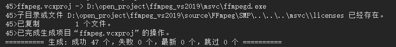
lib库路径
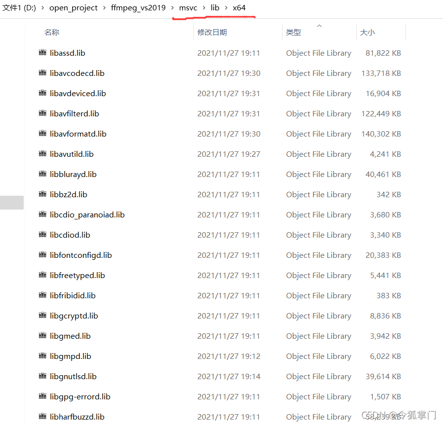

  我的编译方式不是网上的那种windows linux环境编译，之前我也是参照那种方式编译，结果要么编译的是.a库，vs2019链接失败， 要么就是编译成.dll, 由于项目里需要使用ffmpeg静态链接，因为用不到ffmpeg的所有API, 编译静态库后，自己再封装一个dll使用，这样安装包会小很多，相信大家在很多软件里也看到了libffmpeg.dll这种文件， 这就是自己封装的dll, 不是ffmpeg原始库。
  由于ffmpeg的依赖库太多，用msys64这种方式编译，如果少参数，可能就编译不全，大部分的fmpeg windows编译教程一大堆错误，根本无法编译，而且由于msys64的linux环境和windows visual studio环境差异大，c/c++编译器还会冲突，还需要改link.exe等文件的名字等操作，比较复杂，而且编译时还有各种乱七八糟的错误，耗时费力。
  本篇采用github的开源项目ShiftMediaProject来编译，开发环境Win11 64bit、VS2019，测试了多台电脑后，全部一次通过，没有任何错误。
  很多人评论源码无法下载完全，导致无法编译成功，下面提供ffmpeg vs2019工程全部代码。

  链接：[https://pan.baidu.com/s/1l8An7FJiuTvLuyM9ccz3wQ](https://pan.baidu.com/s/1l8An7FJiuTvLuyM9ccz3wQ?login=from_csdn)
  提取码：7kqi

  代码下载之后，按照下面第4步进行编译即可。如果有可靠的网络环境，可以自己手动下载，具体步骤如下：

# 1、ffmpeg代码clone

  在clone代码之前，创建代码目录，例如创建ffmpeg_vs2019目录，在该目录里再创建两个目录，msvc，source，为什么要这样创建，这是项目作者的建议，照着做就可以。

```livecodeserver
*OutputDir is the "Output Directory" specified in the project properties. 
The default value of OutputDir is "..\..\msvc" relative to the FFmpeg source directory. An example of the expected 
directory structure is:
    -  msvc          (OutputDir)
    -> source
        - FFmpeg
        - ..Any other libraries source code..
```

  进入source目录，打开git bash克隆代码
  项目地址：https://github.com/ShiftMediaProject/FFmpeg
  代码克隆

```awk
git clone https://github.com/ShiftMediaProject/FFmpeg.git
```

  clone完毕大概355M，如果网络环境不好，可能会clone failed。

# 2、ffmpeg依赖库下载

  ffmpeg clone结束后，在ffmpeg_vs2019\source\FFmpeg\SMP目录有个readme.txt介绍了如何编译配置整个项目，比如需要x264、265、vpx等开源，可以手动去[ShiftMediaProject](https://github.com/ShiftMediaProject?login=from_csdn)里clone, 或者运行脚本clone, 建议使用脚本clone，比较节省时间，方法如下：
  在路径 ffmpeg_vs2019\source\FFmpeg\SMP 里打开git bash, 执行
./project_get_dependencies.bat
  如下图
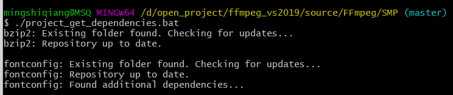
  如果网路不好，第一次可能clone失败，可以继续执行该命令。

# 3、其它文件下载

  先在ffmpeg_vs2019/msvc里创建include目录，include里创建gl、AMF这两个目录，待会儿需要存放opengl、egl、nv-codec、AMF的头文件。

## (1)opengl头文件

  opengl仓库 https://github.com/KhronosGroup/OpenGL-Registry
  代码克隆：

```awk
git clone https://github.com/KhronosGroup/OpenGL-Registry.git
```

  找到OpenGL-Registry\api\GL里的glext.h 和 wglext.h放到目录：ffmpeg_vs2019\msvc\include\gl

## (2)EGL头文件

  EGL仓库 https://github.com/KhronosGroup/EGL-Registry
  代码克隆：

```awk
git clone https://github.com/KhronosGroup/EGL-Registry.git
```

  找到EGL-Registry\api\KHR，复制KHR目录到ffmpeg_vs2019\msvc\include

## (3)nv-codec 头文件

```awk
git clone https://github.com/FFmpeg/nv-codec-headers.git
```

  将nv-codec-headers\include里的ffnvcodec目录复制到ffmpeg_vs2019\msvc\include

## (4)AMF 头文件

  AMP仓库 https://github.com/GPUOpen-LibrariesAndSDKs/AMF
  clone代码

```awk
git clone https://github.com/GPUOpen-LibrariesAndSDKs/AMF.git
```

  将AMF\amf\public\include里的两个文件夹复制到ffmpeg_vs2019\msvc\include\AMF

# 4、配置NASM、YASM

## NASM下载地址：

  [https://github.com/ShiftMediaProject/VSNASM/releases/tag/0.7](https://github.com/ShiftMediaProject/VSNASM/releases/tag/0.7?login=from_csdn)
  如下图
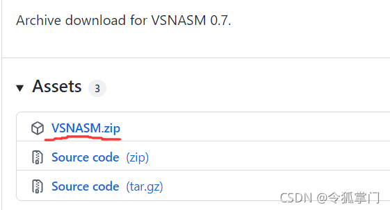

## YASM下载地址：

  [https://github.com/ShiftMediaProject/VSYASM/releases](https://github.com/ShiftMediaProject/VSYASM/releases?login=from_csdn)

  将下载的VSNASM和VSYASM解压后放到
ffmpeg_vs2019\msvc目录。
  找到vs2019的命令行工具，
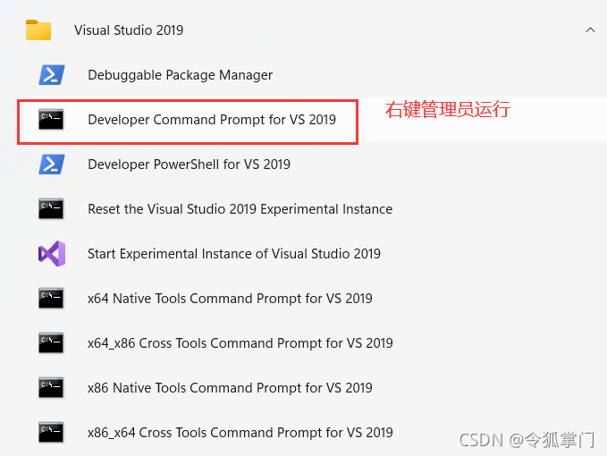

**右键用管理员模式运行**，cd到相应的路径，执行安装脚本，如下图
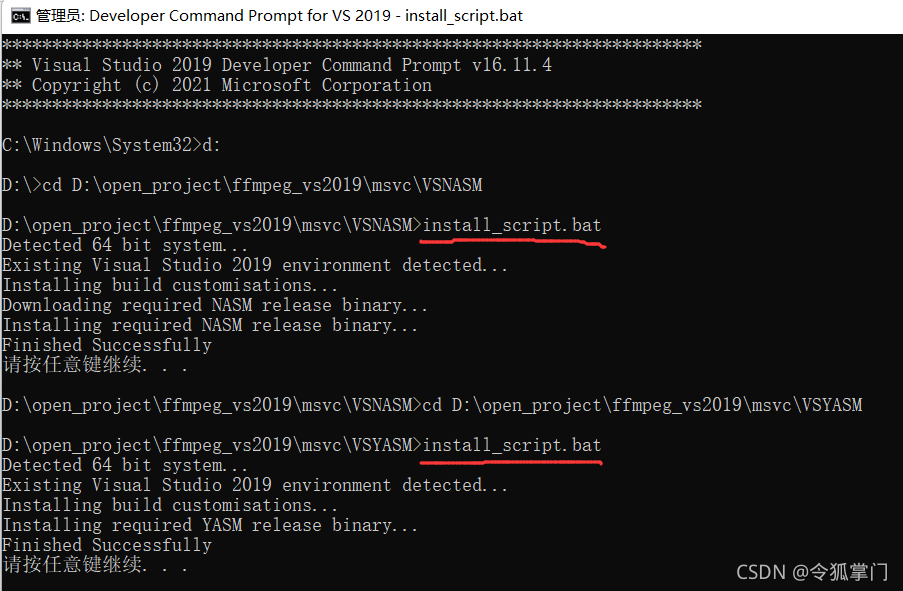

# 5、开始编译ffmpeg

  做好以上步骤后，用vs2019打开SMP目录的ffmpeg_deps.sln，一个47个项目，该工程对静态库、动态库、win32、x64都做了配置，很方便，如下图：
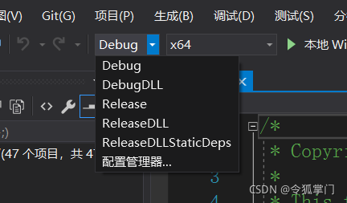

  例如我想编译x64版本的lib，不要dll，选择Debug x64，F7编译，19：11开始编译，19：30编译结束，大概20分钟，这只是Debug版本，编译Release估计还要20分钟, 例如我的生成结果：

  lib库路径

  以上生成的是debug lib，该项目对debug生成的文件加了后缀d, release的没有，比较好区分，可以看到libavformatd.lib有137M大小，在使用的不需要dll, 链接lib即可。
  如何使用这些lib呢，需要头文件，头文件目录如下：
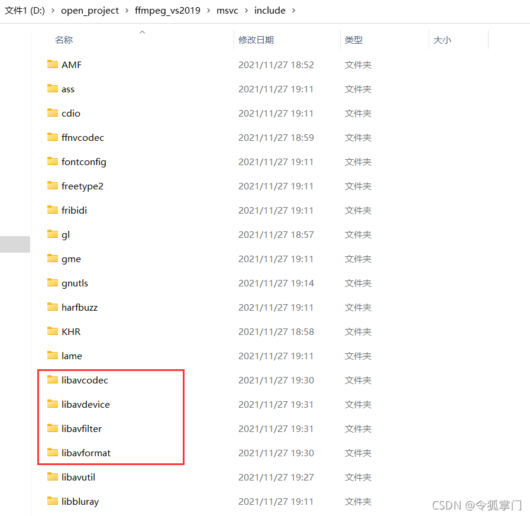
  可以将上面路径的lib、include直接拷贝走，当作sdk.

  生成的ffmpeg.exe在如下目录
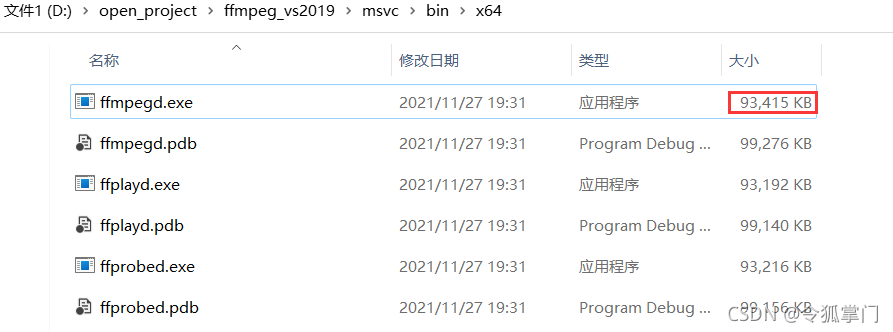
  可以看到ffmpegd.exe有90多M, 这种是静态编译的结果，使用时不需要依赖dll.

# 6、创建项目验证ffmpeg lib

  有了include、lib，创建vs2019 c++控制台项目，配置好include、lib, 就可以写代码了，例如获取ffmpeg代码版本：

```cpp
/*

ffmpeg lib 测试程序

*/

#include <iostream>

extern "C"
{
#include "libavformat/avformat.h"
}

#ifdef _DEBUG
#pragma comment(lib, "libavformatd.lib")
#pragma comment(lib, "libavutild.lib")
#else
#pragma comment(lib, "libavformat.lib")
#pragma comment(lib, "libavutil.lib")
#endif

using namespace std;

int main()
{
    cout << av_version_info() << endl;

    return 0;
}
```

运行结果
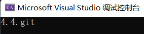

  如果想调试ffmpeg代码，把pdb文件带上，放到lib所在的目录就可以跟踪到ffmpeg源码了，如下图：
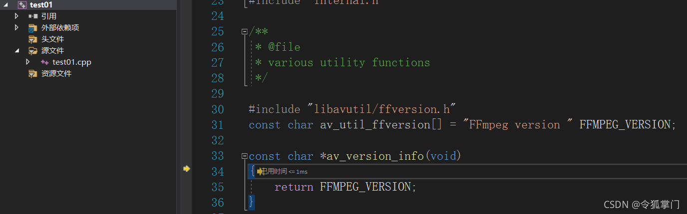

# 7、哪些项目用到了ffmpeg

  除了使用lib开发，也可以用dll, 修改编译选项位DebugDLL/ReleasdDLL即可，FFmpeg是开源项目，国内大部分的软件都进入了FFmpeg耻辱柱，没办法，音视频仅此一个伟大的集大成开源项目，很多软件都是编译ffmpeg lib后，自己封装dll，例如：

  腾讯会议
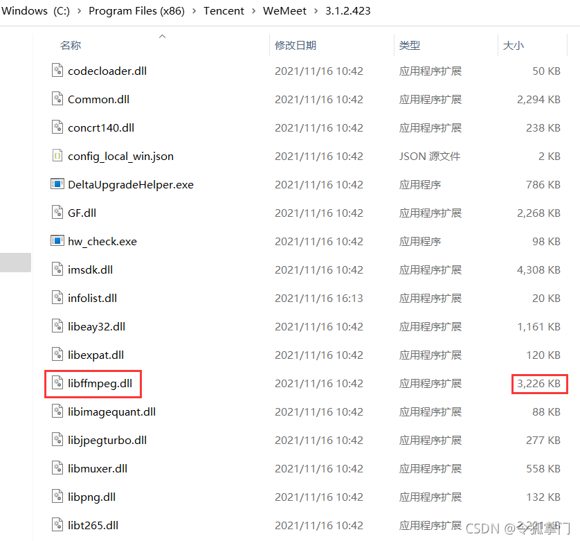

  迅雷
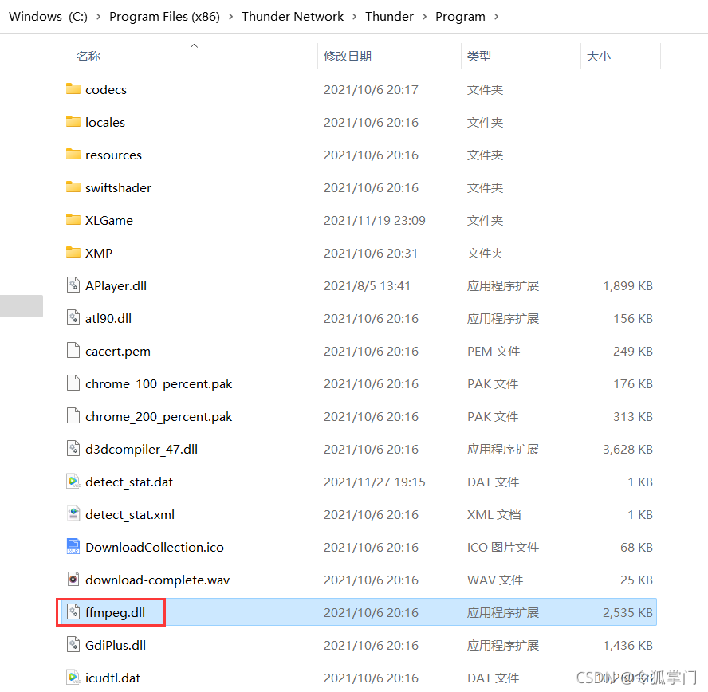

  也不是专指这两个项目，99%的音视频项目应该都会用到ffmpeg, 例如视频客户端优酷、爱奇艺、腾讯视频，格式工厂、QQ、微信、钉钉等。

  当然在开发时，如果需要265，vpx的支持也是可以的，在开发时带上相应的lib即可，如下图：
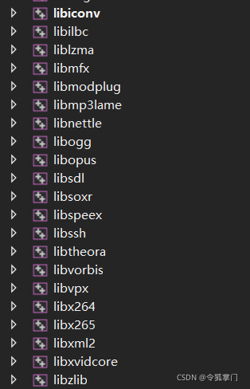