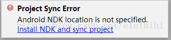

# 【FFmpeg笔记】02-使用Android Studio编写第一个FFmpeg程序


Android开发
25 篇文章0 订阅
订阅专栏

```
1、创建一个NDK工程
2、安装CMake
3、配置NDK
4、导入ffmpeg编译结果
5、编写构建脚本
6、编写代码
7、编译程序
8、错误问题及解决方法
  1）ffmpeg函数不能被识别
  2）error:undefined reference to 'av_log' 错误：
  3）posix_memalign 错误
  4）出现”UINT64_C“等错误
9、运行效果
```

所需材料

1、android studio 2.3

2、android-ndk-r13

3、ffmpeg编译结果（include,libs）

本文实例中需要使用到上次编译的ffmpeg头文件和静态库，如果没有的话，请参看上一篇文章。

本文使用Android Studio 2.3 来开发，主要是考虑到 Android Studio 对 NDK 开发已经支持得很好了。

Android Sutdio 既可以支持ndk-build构建，又支持新的CMake构建，而且代码提示、单步调试等功能也大大提高了开发效率。

## 1、创建一个NDK工程 ##

打开Android Studio，新建一个工程，勾选“Include C++support”，使工程支持C++开发。如下图：


下一步，


下一步，


下一步，


C++编译选项采用默认的就可以了，以后可以在“build.gradle”里面进行更改。


完成工程的创建。

## 2、安装CMake ##

新建工程后，出现如下错误，原因是：新版本的Android Studio默认使用CMake进行构建，与以往使用mk和ndk-build不一样，需要下载CMake工具才行。


点击上面的链接“Install CMake and sync project”，自动下载所需的组件。


完成成后，点击“Finish”即可。

## 3、配置NDK ##

NDK没配置好的话，会提示下面的错误：



使用CMake构建C++程序的话，需要使用NDK>=12r，如果没有的话，请自行百度搜索下载。

打开工程中的“local.properties”文件，追加一行代码“ndk.dir=NDK的目录”，如下所示：


sync一下，即可解决NDK编译环境的问题。

## 4、导入ffmpeg编译结果 ##

将前面编译的ffmpeg结果拷贝到工程目录中，路径“app/src/main/cpp/ffmpeg”，结构如下图所示：


其中“native-lib.cpp”是这个IDE自动生成的源文件，“CMakeLists.txt”是这个IED自动生成的构建脚本文件。

## 5、编写构建脚本 ##

由于我们采用的是CMake构建，对应需要编写的构建脚本是“CMakeList.txt”，位于"<project>/app/"目录下。（Android Studio也支持使用原来的*.mk构建）

```
# For more information about using CMake with Android Studio, read the

# documentation: https://d.android.com/studio/projects/add-native-code.html

# Sets the minimum version of CMake required to build the native library.

cmake_minimum_required(VERSION 3.4.1)

# Creates and names a library, sets it as either STATIC

# or SHARED, and provides the relative paths to its source code.

# You can define multiple libraries, and CMake builds them for you.

# Gradle automatically packages shared libraries with your APK.

add_library( # Sets the name of the library.
             native-lib

             # Sets the library as a shared library.
             SHARED
    
             # Provides a relative path to your source file(s).
             src/main/cpp/native-lib.cpp )

#增加头文件搜索目录
include_directories(src/main/cpp/ffmpeg/include/)

# Searches for a specified prebuilt library and stores the path as a

# variable. Because CMake includes system libraries in the search path by

# default, you only need to specify the name of the public NDK library

# you want to add. CMake verifies that the library exists before

# completing its build.

find_library( # Sets the name of the path variable.
              log-lib

              # Specifies the name of the NDK library that
              # you want CMake to locate.
              log )

# Specifies libraries CMake should link to your target library. You

# can link multiple libraries, such as libraries you define in this

# build script, prebuilt third-party libraries, or system libraries.

target_link_libraries( # Specifies the target library.
                       native-lib

                       #增加ffmpeg库，注意顺序（具体看lib/pkgconfig的依赖关系）
                       ${CMAKE_SOURCE_DIR}/src/main/cpp/ffmpeg/lib/libavfilter.a
                       ${CMAKE_SOURCE_DIR}/src/main/cpp/ffmpeg/lib/libavformat.a
                       ${CMAKE_SOURCE_DIR}/src/main/cpp/ffmpeg/lib/libavcodec.a
                       ${CMAKE_SOURCE_DIR}/src/main/cpp/ffmpeg/lib/libswresample.a
                       ${CMAKE_SOURCE_DIR}/src/main/cpp/ffmpeg/lib/libswscale.a
                       ${CMAKE_SOURCE_DIR}/src/main/cpp/ffmpeg/lib/libavutil.a
    
                       #增加ffmpeg所需要的依赖库
                       -lm -lz 
    
                       # Links the target library to the log library
                       # included in the NDK.
                       ${log-lib}
                       )
```

上面带有中文注释的语句是需要新增的，主要包括：

- 指定ffmpeg头文件的搜索路径；
- 将ffmpeg的静态库添加到构建中。

比较坑的一点时，一定要使用准确的依赖顺序才行，否则会报错。这个依赖关系可以在“ffmpeg/lib/pkgconfig”中找到。

## 6、编写代码 ##

任何事情都需要从最简单的开始，这里我们就尝试调用ffmpeg的"avcodec_configuration()"方法来构建时的信息。

打开“native-lib.cpp”文件，修改为：

```
#include <jni.h>
#include "libavcodec/avcodec.h"
extern "C"
JNIEXPORT jstring JNICALL
Java_cn_bassy_ffmpeg01_MainActivity_stringFromJNI(JNIEnv* env, jobject /* this */) {
    return env->NewStringUTF(avcodec_configuration());
}
```

Android Studio 有代码提示功能，鼠标放在“”函数上面，可以看到相关注释。


如果没有显示，请进入Settings配置，如下图所示。


## 7、编译程序 ##

编译程序很简单，Android Studio已经集成了NDK开发，只需要点击“Run App”就可以了。


当然，肯定还会有很多错误的，所以下面给出了常见错误及解决方法。 

## 8、错误问题及解决方法 ##

> 注意，编译ffmpeg时所指定的Android Platform版本，与使用ffmpeg时指定的minSdkVersion有很大的关系，大部分错误都是因为minSdkVersion大于编译ffmpeg时指定的Android Platform版本所导致的！！

**1）ffmpeg函数不能被识别**

编译是出现" undefined reference to 'avcodec_register_all()"和“Error:(15) undefined reference to 'avcodec_configuration()”，错误如下：

```
Error:(15) undefined reference to 'avcodec_register_all()'
Error:(15) undefined reference to 'avcodec_configuration()'
```

这是因为ffmpeg是一个纯C语言编写的库，使用C++调用C代码时候，需要使用“extern "C"”包围头文件“avcodec.h”和相关代码，如下：

```
#include <jni.h>
#include <string>

#ifdef __cplusplus
extern "C" {
#endif

#include "libavcodec/avcodec.h"

JNIEXPORT jstring JNICALL
Java_cn_bassy_ffmpeg01_MainActivity_stringFromJNI(JNIEnv* env, jobject /* this */) {
    return env->NewStringUTF(avcodec_configuration());
}

#ifdef __cplusplus
};
#endif
```

其它类似的错误，都应该将ffmpeg的头文件使用“extern "C"”包围。

**2）error:undefined reference to 'av_log' 错误：**

出现如下错误：

```
Error:error: undefined reference to 'av_log'
Error:error: undefined reference to 'av_log'
Error:error: undefined reference to 'av_log'
Error:error: undefined reference to 'av_log'
Error:error: undefined reference to 'av_get_bytes_per_sample'
Error:error: undefined reference to 'av_crc'
Error:error: undefined reference to 'av_crc'
Error:error: undefined reference to 'av_crc'
```

这是因为依赖顺序不对，正确的依赖顺序是（具体请看ffmpeg/lib/pkgconfig目录内容）：

```
target_link_libraries( # Specifies the target library.
                       native-lib
                       #增加ffmpeg库，注意顺序（具体看lib/pkgconfig的依赖关系）
                       ${CMAKE_SOURCE_DIR}/src/main/cpp/ffmpeg/lib/libavfilter.a
                       ${CMAKE_SOURCE_DIR}/src/main/cpp/ffmpeg/lib/libavformat.a
                       ${CMAKE_SOURCE_DIR}/src/main/cpp/ffmpeg/lib/libavcodec.a
                       ${CMAKE_SOURCE_DIR}/src/main/cpp/ffmpeg/lib/libswresample.a
                       ${CMAKE_SOURCE_DIR}/src/main/cpp/ffmpeg/lib/libswscale.a
                       ${CMAKE_SOURCE_DIR}/src/main/cpp/ffmpeg/lib/libavutil.a
                       #增加ffmpeg所需要的依赖库
                       -lm -lz 
                       # Links the target library to the log library
                       # included in the NDK.
                       ${log-lib}
                       )
```

**3）posix_memalign 错误**

出现“undefined reference to 'posix_memalign'”错误。

这是由于Android原来是不支持posix的，直到android-16才提供posix支持，所以，需要通过APP_PLATFORM指定版本为“android-16”及以上。

直接修改gradle文件，指定“minSdkVersion 16”，如：

```
defaultConfig {
        applicationId "cn.bassy.ffmpeg01"
        minSdkVersion 16
        targetSdkVersion 25
        versionCode 1
        versionName "1.0"
    }
```

如果使用ndk-build命令的话，需要修改Application.mk文件，通过APP_PLATFORM指定Android版本，如下：

```
APP_STL := gnustl_static
APP_PLATFORM := android-17
APP_ABI := armeabi
```

**4）出现”UINT64_C“等错误**

出现以下错误：

```
libavutil/common.h:30:2: error: missing -D__STDC_CONSTANT_MACROS
libavutil/common.h:205:28: error: use of undeclared identifier 'UINT64_C'
```

解决方法，打开“ffmpeg\include\libavutil\common.h”追加以下内容：

```
#ifdef __cplusplus
#define __STDC_CONSTANT_MACROS
#ifdef _STDINT_H
#undef _STDINT_H
#endif

# include "stdint.h"

#endif

#ifndef INT64_C
#define INT64_C(c) (c ## LL)
#define UINT64_C(c) (c ## ULL)
#endif
```

## 9、运行效果 ##

运行成功之后，会看到下面的结果。


恭喜，你的第一个ffmpeg程序已经成功跑起来！~~

————————————————

版权声明：本文为CSDN博主「又吹风_Bassy」的原创文章，遵循CC 4.0 BY-SA版权协议，转载请附上原文出处链接及本声明。

原文链接：https://blog.csdn.net/eieihihi/article/details/74153201
