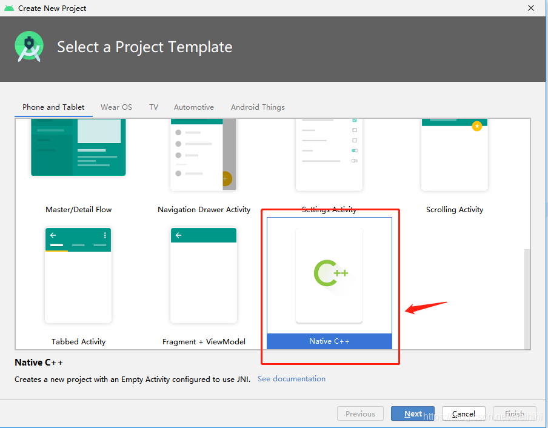
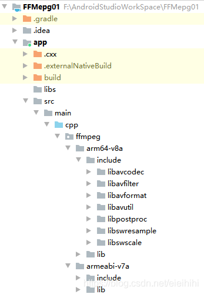
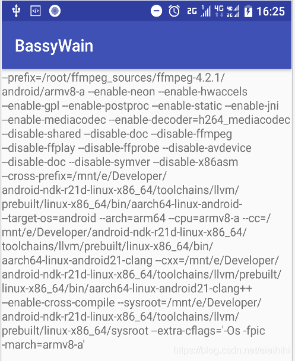

# 【FFmpeg笔记】03-Win10编译ffmpeg4.2.1(For Android)


Table of Contents

一、安装适用于 linux 的 Windows 子系统

二、下载 Android NDK

三、准备 ffmpeg 源文件

3.1 下载 ffmpeg

四、编写编译脚本

4.1 编写脚本

4.2 开始编译

五、导入 Android 目录使用

5.1 创建 C++ 工程

5.2 修改 build.gradle

5.3 将 ffmpeg 编译结果导入工程

5.4 修改 CMakeLists.txt

5.5 编写代码

6、常见错误

6.1 mmap64 问题

6.2 armv7和armv8问题

6.3 undefined reference to `avcodec_configuration()'

6.4 undefined reference to `avcodec_configuration()'

6.5 其它一些错误

N年前写了一篇ffmpeg编译的笔记，那时候的ffmpeg是3.x，现在ffmpeg已经出到4.3版本，今天就用 Windows 10 的 WSL 编译 ffmpeg 4.2.1 版本，这次就使用 WSL 进行编译，速度非常快，只需要1分多钟。当然这和硬件性能升级也有很大关系。

所需工具：
- 1、Windows 10
- 2、适用于 linux 的 Windows 子系统
- 3、ffmpeg-4.2.1
- 4、android-ndk-r21d-linux-x86_64 （注意是linux版本，不是windows版本）
- 5、Android Studio 4.0
- 6、com.android.tools.build:gradle:4.0.0
- 7、gradle-6.1.1-all

## 一、安装适用于 linux 的 Windows 子系统 ##

参考另一篇文章：《无需虚拟机，简单几步即可实现在Windows下搭建Linux开发环境》

安装完成之后，就可以在 cmd 下进入到 linux shell 了。

如果没有安装 make、gcc 的话，需要提前安装：

    sudo apt-get install make
    sudo apt-get install gcc

如果下载慢的话，建议将 apt-get源为国内镜像源，参考《ubuntu修改apt-get源为国内镜像源》

## 二、下载 Android NDK ##

我用NDK版本是：android-ndk-r21d-linux-x86_64 。注意是 linux 版本，不是 windows 版本

下载地址：https://dl.google.com/android/repository/android-ndk-r21d-linux-x86_64.zip

建议拷贝下载地址，使用迅雷等P2P软件下载，下载完成后，直接解压即可。

## 三、准备 ffmpeg 源文件 ##

**3.1 下载 ffmpeg**

ffmpeg release 列表： https://ffmpeg.org/releases/ ，本文所用版本：ffmpeg-4.2.1

打开 cmd 命令窗口，然后按顺序执行以下操作：

```
# 1. 进入 linux 终端

C:\Users\Administrator>bash
root@BASSY-PC:/mnt/c/Users/Administrator# cd ~
root@BASSY-PC:~#

# 2. 创建目录-存放ffmpeg源码

root@BASSY-PC:~# mkdir ~/ffmpeg_sources

# 3. 进入目录

root@BASSY-PC:~# cd ~/ffmpeg_sources

# 4. 下载ffmpeg源码

root@BASSY-PC:~/ffmpeg_sources# wget -O ffmpeg-4.2.1.tar.gz https://ffmpeg.org/releases/ffmpeg-4.2.1.tar.gz
--2020-07-02 11:44:16--  https://ffmpeg.org/releases/ffmpeg-4.2.1.tar.gz
Resolving ffmpeg.org (ffmpeg.org)... 79.124.17.100
Connecting to ffmpeg.org (ffmpeg.org)|79.124.17.100|:443... connected.
HTTP request sent, awaiting response... 200 OK
Length: 13670499 (13M) [application/x-gzip]
Saving to: ‘ffmpeg-4.2.1.tar.gz’

ffmpeg-4.2.1.tar.gz       45%[==============>                   ]   5.95M   405KB/s    eta 22s

# 5. 下载完成后，进行解压文件

root@BASSY-PC:~/ffmpeg_sources# tar zxvf ffmpeg-4.2.1.tar.gz
root@BASSY-PC:~/ffmpeg_sources# ll
total 13376
drwxrwxrwx 1 root root     4096 Jul  2 11:07 ./
drwx------ 1 root root     4096 Jul  2 11:00 ../
drwx------ 1 1000 1000     4096 Aug  6  2019 ffmpeg-4.2.1/
-rw-rw-rw- 1 root root 13667216 Aug  6  2019 ffmpeg-4.2.1.tar.gz

# 7. 进入源码目录

root@BASSY-PC:~/ffmpeg_sources# cd ffmpeg-4.2.1/
root@BASSY-PC:~/ffmpeg_sources/ffmpeg-4.2.1#
```

## 四、编写编译脚本 ##

**4.1 编写脚本**

在 ~/ffmpeg_sources/ffmpeg-4.2.1/ 目录下，创建一个 build_android.sh 的文件，并添加可执行权限，如下：

```
root@BASSY-PC:~/ffmpeg_sources/ffmpeg-4.2.1# touch build_android.sh
root@BASSY-PC:~/ffmpeg_sources/ffmpeg-4.2.1# sudo chmod +x build_android.sh
root@BASSY-PC:~/ffmpeg_sources/ffmpeg-4.2.1# ll build_android.sh
-rwxrwxrwx 1 root root 0 Jul  2 11:23 build_android.sh*
```

使用 vim 编辑器打开：

	root@BASSY-PC:~/ffmpeg_sources/ffmpeg-4.2.1# vim build_android.sh

按字母 i 进入编辑模式，然后粘贴以下脚本，把NDK修改为你的地址：

```
#!/bin/bash
make clean

export NDK=/mnt/e/Developer/android-ndk-r21d-linux-x86_64

TOOLCHAIN=$NDK/toolchains/llvm/prebuilt/linux-x86_64
API=21

function build_android
{
./configure \
    --prefix=$PREFIX \
    --enable-neon \
    --enable-hwaccels \
    --enable-gpl \
    --enable-postproc \
    --enable-static \
    --enable-jni \
    --enable-mediacodec \
    --enable-decoder=h264_mediacodec \
    --disable-shared \
    --disable-doc \
    --disable-ffmpeg \
    --disable-ffplay \
    --disable-ffprobe \
    --disable-avdevice \
    --disable-doc \
    --disable-symver \
    --disable-x86asm \
    --disable-armv5te \
    --disable-armv6 \
    --disable-armv6t2 \
    --cross-prefix=$CROSS_PREFIX \
    --target-os=android \
    --arch=$ARCH \
    --cpu=$CPU \
    --cc=$CC \
    --cxx=$CXX \
    --enable-cross-compile \
    --sysroot=$SYSROOT \
    --extra-cflags="-Os -fpic $OPTIMIZE_CFLAGS"

make clean
make -j16
make install
}

ARCH=arm
CPU=armv7-a
PREFIX=$(pwd)/android/$CPU
SYSROOT=$TOOLCHAIN/sysroot
CC=$TOOLCHAIN/bin/armv7a-linux-androideabi$API-clang
CXX=$TOOLCHAIN/bin/armv7a-linux-androideabi$API-clang++
CROSS_PREFIX=$TOOLCHAIN/bin/arm-linux-androideabi-
OPTIMIZE_CFLAGS=" -mfloat-abi=softfp -mfpu=vfp -marm -march=$CPU"
build_android

ARCH=arm64
CPU=armv8-a
PREFIX=$(pwd)/android/$CPU
SYSROOT=$TOOLCHAIN/sysroot
CC=$TOOLCHAIN/bin/aarch64-linux-android$API-clang
CXX=$TOOLCHAIN/bin/aarch64-linux-android$API-clang++
CROSS_PREFIX=$TOOLCHAIN/bin/aarch64-linux-android-
OPTIMIZE_CFLAGS="-march=$CPU"
build_android
```

然后 按 Esc 键退出编辑模式并进入命令模式，输入 :wq 保存并退出。
说明：

- NDK：使用 适用于 linux 的 windows 子系统 的话，访问其它盘符的方法是 /mnt/e/ ，其中 e 表示 E 盘，其它类似；
- TOOLTHAIN：我们用的是 NDK-21 ，使用 clang 编译器，不再使用 gcc 编译器了。clang 编译器位于 ndk/toolchains/llvm/prebuilt/linux-x86_64 目录下；
- ARCH 和 CPU：指定 CPU 架构模式；
- PREFIX ：指定编译输出目录；
- SYSROOT：指定NDK的库和头文件所在的根目录，在编译过程中需要用到。对于是NDK-21，它所在目录是 toolchains\llvm\prebuilt\linux-x86_64\sysroot\ 。打开该目录就会发现，里面放了我们熟知的 jni.h、strings.h、stdlib.h、stdio.h、GLES2、GLES3等头文件和相关的库；
- CC：指定 clang 所在目录；
- CXX：指定 clang++ 所在目录；
- CROSS_PREFIX：指定交叉编译的工具的前缀，例如：aarch64-linux-android-ld、aarch64-linux-android-nm、aarch64-linux-android-objcopy等，它们都是有固定前缀的。这是就把这个前缀和路径拼接在一起即可。需要注意不同CPU构架的前缀是不一样的。你打开该目录看一下就知道了；
- OPTIMIZE_CFLAGS：指定一些编译器的配置；
- API：因为 NDK-21 最低要求是 API-21 （Android.5.0），所以在引入到Android工程中使用的时候，minSdkVersion 必须与这里的 API 保持一致，不然会有很多问题。
- 注意 make -j16 的 -j 参数（也可以是 --jobs），用于指定编译线程，它可以提高编译速度，一般是CPU核心数的2倍，我的CPU是8核心，所以写了16。如果不写的话，编译时长大概为10多分钟，加上 -j16 之后，大约是1分钟。

上述脚本一般一定要仔细检查，特别是路径必须确认是准确的，CPU和ARCH也必须确认是无误的。这可以减少很多编译问题。

**4.2 开始编译**

此时执行上述脚本，开始编译。

	root@BASSY-PC:~/ffmpeg_sources/ffmpeg-4.2.1# sudo ./build_android.sh

可能会出现以下错误：

```
./android_config.sh: line 36: --enable-shared: command not found
Makefile:2: ffbuild/config.mak: No such file or directory
Makefile:40: /tools/Makefile: No such file or directory
Makefile:41: /ffbuild/common.mak: No such file or directory
Makefile:91: /libavutil/Makefile: No such file or directory
Makefile:91: /ffbuild/library.mak: No such file or directory
Makefile:93: /fftools/Makefile: No such file or directory
Makefile:94: /doc/Makefile: No such file or directory
Makefile:95: /doc/examples/Makefile: No such file or directo
```

解决方法：

执行以下命令生成 config.mak 文件

	root@BASSY-PC:~/ffmpeg_sources/ffmpeg-4.2.1# sudo ./configure --disable-x86asm
重新执行脚本，如果环境搭建没有问题、脚本也没有问题，就会有以下输出：

```
...
...
...
INSTALL libavutil/tx.h
INSTALL libavutil/lzo.h
INSTALL libavutil/avconfig.h
INSTALL libavutil/ffversion.h
INSTALL libavutil/libavutil.pc
root@BASSY-PC:~/ffmpeg_sources/ffmpeg-4.2.1#
```

编译输出就在 ./android 目录下，如下所示：

```
root@BASSY-PC:~/ffmpeg_sources/ffmpeg-4.2.1# ll android
total 0
drwxr-xr-x 1 root root 4096 Jul  2 15:55 ./
drwx------ 1 1000 1000 4096 Jul  2 16:02 ../
drwxr-xr-x 1 root root 4096 Jul  2 15:53 armv7-a/
drwxr-xr-x 1 root root 4096 Jul  2 15:55 armv8-a/
root@BASSY-PC:~/ffmpeg_sources/ffmpeg-4.2.1# ll android/armv7-a/
total 0
drwxr-xr-x 1 root root 4096 Jul  2 15:53 ./
drwxr-xr-x 1 root root 4096 Jul  2 15:55 ../
drwxr-xr-x 1 root root 4096 Jul  2 15:53 include/
drwxr-xr-x 1 root root 4096 Jul  2 15:53 lib/
drwxr-xr-x 1 root root 4096 Jul  2 15:53 share/
root@BASSY-PC:~/ffmpeg_sources/ffmpeg-4.2.1#
```

说明：

- include：是头文件所在目录；
- lib ：是静态库(.a)文件所在目录；
- share ：是 examples 所在目录；

## 五、导入 Android 目录使用 ##

**5.1 创建 C++ 工程**

使用 Android Studio 向导创建 C++ 工程，如下：



**5.2 修改 build.gradle**

修改 app 模块下的 build.gradle 文件，如下：

```
apply plugin: 'com.android.application'

android {
    compileSdkVersion 28
    buildToolsVersion "28.0.3"
    defaultConfig {
        applicationId "cn.bassy.ffmepg01"
        minSdkVersion 18
        targetSdkVersion 28
        versionCode 1
        versionName "1.0"
        externalNativeBuild {
            cmake {
                cppFlags "-std=c++11" //加上
                abiFilters "armeabi-v7a","arm64-v8a" //加上
            }
        }
    }
    externalNativeBuild {
        cmake {
            path "CMakeLists.txt" //指定CMakeLists.txt文件路径
        }
    }
    buildTypes {
        release {
            minifyEnabled false
            proguardFiles getDefaultProguardFile('proguard-android.txt'), 'proguard-rules.pro'
        }
    }
}

dependencies {
    api fileTree(dir: 'libs', include: ['*.jar'])
    api 'androidx.appcompat:appcompat:1.1.0'
    api 'androidx.constraintlayout:constraintlayout:1.1.3'
}
```

**5.3 将 ffmpeg 编译结果导入工程**

直接把 ./android/ 下的 armv7-a 目录 和 armv8-a 目录 拷贝到 Android 工程下的 app/src/main/cpp/ffmpeg 目录下，并进行重命名，如下：



重命名为 arm64-v8a 和 armeabi-v7a 有利于我们后续根据不同的编译配置依赖不同的目录。

**5.4 修改 CMakeLists.txt**

将 ffmpeg的头文件和静态库添加到构建中，如下：

```
cmake_minimum_required(VERSION 3.4.1)

include_directories( ${CMAKE_CURRENT_LIST_DIR}/src/main/cpp/ffmpeg/${CMAKE_ANDROID_ARCH_ABI}/include)

add_library(native-lib SHARED src/main/cpp/native-lib.cpp)

find_library(log-lib log)

target_link_libraries( # Specifies the target library.
                       native-lib

                       #增加ffmpeg库，注意顺序（具体看lib/pkgconfig的依赖关系）
                       ${CMAKE_SOURCE_DIR}/src/main/cpp/ffmpeg/${CMAKE_ANDROID_ARCH_ABI}/lib/libavfilter.a
                       ${CMAKE_SOURCE_DIR}/src/main/cpp/ffmpeg/${CMAKE_ANDROID_ARCH_ABI}/lib/libavformat.a
                       ${CMAKE_SOURCE_DIR}/src/main/cpp/ffmpeg/${CMAKE_ANDROID_ARCH_ABI}/lib/libavcodec.a
                       ${CMAKE_SOURCE_DIR}/src/main/cpp/ffmpeg/${CMAKE_ANDROID_ARCH_ABI}/lib/libswresample.a
                       ${CMAKE_SOURCE_DIR}/src/main/cpp/ffmpeg/${CMAKE_ANDROID_ARCH_ABI}/lib/libswscale.a
                       ${CMAKE_SOURCE_DIR}/src/main/cpp/ffmpeg/${CMAKE_ANDROID_ARCH_ABI}/lib/libavutil.a
    
                       #增加ffmpeg所需要的依赖库
                       -lm -lz
    
                       # Links the target library to the log library
                       # included in the NDK.
                       ${log-lib}
                       )
```

这里使用了系统变量 CMAKE_ANDROID_ARCH_ABI 

- 当为 armv7-a 架构是，它的值是 armeabi-v7a ;
- 当为 armv8-a 架构是，它的值是 arm64-v8a ;
- 这样就刚好和目录对应上了

**5.5 编写代码**

activity_main.xml 布局：

```
<?xml version="1.0" encoding="utf-8"?>

<RelativeLayout xmlns:android="http://schemas.android.com/apk/res/android"
    android:layout_width="match_parent"
    android:layout_height="match_parent">

    <TextView
        android:id="@+id/sample_text"
        android:layout_width="wrap_content"
        android:layout_height="wrap_content" />

</RelativeLayout>
```

MainActivity.java 代码：

```
public class MainActivity extends AppCompatActivity {

    static {
        System.loadLibrary("native-lib");
    }
    
    @Override
    protected void onCreate(Bundle savedInstanceState) {
        super.onCreate(savedInstanceState);
        setContentView(R.layout.activity_main);
    
        TextView tv = findViewById(R.id.sample_text);
        tv.setText(getFFmpegConfiguration());
    }
    
    public native String getFFmpegConfiguration();

}
```

native-lib.cpp 代码：

```
#include <jni.h>

#ifdef __cplusplus
extern "C"
{
#endif

//ffmpeg 的头文件需要使用 extern "C" {} 包围
#include <libavcodec/avcodec.h>

JNIEXPORT jstring JNICALL
Java_cn_bassy_ffmepg01_MainActivity_getFFmpegConfiguration(JNIEnv *env, jobject job1) {
    return env->NewStringUTF(avcodec_configuration());
}

#ifdef __cplusplus
}
#endif
```

运行效果：



## 6、常见错误 ##

**6.1 mmap64 问题**

编译的时候出现错误，具体如下：

libavcodec/v4l2_buffers.c:0: error: undefined reference to 'mmap64'

**解决方法：**

这是因为编译 ffmpeg 的时候 API=21，但是在导入工程中使用的时候，minSdkVersion 与 不是 21。解决方法是把 minSdkVersion 设置为 build_android.sh 中定义的 API 的值即可。

**6.2 armv7和armv8问题**

如果编译 ffmpeg 的是 armeabi-v7a，但是导入工程的时候是 arm64-v8a，就会导致以下错误：

```
Build command failed.
Error while executing process E:\Developer\android-sdk\cmake\3.10.2.4988404\bin\ninja.exe with arguments {-C F:\AndroidStudioWorkSpace\FFMepg01\app\.cxx\cmake\debug\arm64-v8a native-lib}
ninja: Entering directory `F:\AndroidStudioWorkSpace\FFMepg01\app\.cxx\cmake\debug\arm64-v8a'
[1/2] Building CXX object CMakeFiles/native-lib.dir/src/main/cpp/native-lib.cpp.o
../../../../src/main/cpp/native-lib.cpp:23:5: warning: 'av_register_all' is deprecated [-Wdeprecated-declarations]
....
                                                ^
2 warnings generated.
[2/2] Linking CXX shared library ..\..\..\..\build\intermediates\cmake\debug\obj\arm64-v8a\libnative-lib.so
FAILED: ../../../../build/intermediates/cmake/debug/obj/arm64-v8a/libnative-lib.so 
cmd.exe /C "cd . && E:\Developer\android-ndk-r21d\toolchains\llvm\prebuilt\windows-x86_64\bin\clang++.exe --target=aarch64-none-linux-android21 --gcc-toolchain=E:/Developer/android-ndk-r21d/toolchains/llvm/prebuilt/windows-x86_64 --sysroot=E:/Developer/android-ndk-r21d/toolchains/llvm/prebuilt/windows-x86_64/sysroot -fPIC -g -DANDROID -fdata-sections -ffunction-sections -funwind-tables -fstack-protector-strong -no-canonical-prefixes -D_FORTIFY_SOURCE=2 -Wformat -Werror=format-security  -std=c++11 -O0  -Wl,--exclude-libs,libgcc.a -Wl,--exclude-libs,libgcc_real.a -Wl,--exclude-libs,libatomic.a -static-libstdc++ -Wl,--build-id -Wl,--fatal-warnings -Wl,--no-undefined -Qunused-arguments -shared -Wl,-soname,libnative-lib.so -o ..\..\..\..\build\intermediates\cmake\debug\obj\arm64-v8a\libnative-lib.so CMakeFiles/native-lib.dir/src/main/cpp/native-lib.cpp.o  ../../../../src/main/cpp/ffmpeg/lib/libavfilter.a ../../../../src/main/cpp/ffmpeg/lib/libavformat.a ../../../../src/main/cpp/ffmpeg/lib/libavcodec.a ../../../../src/main/cpp/ffmpeg/lib/libswresample.a ../../../../src/main/cpp/ffmpeg/lib/libswscale.a ../../../../src/main/cpp/ffmpeg/lib/libavutil.a -lm -lz -llog -latomic -lm && cd ."
../../../../src/main/cpp/ffmpeg/lib/libavformat.a: error adding symbols: File in wrong format
clang++: error: linker command failed with exit code 1 (use -v to see invocation)
ninja: build stopped: subcommand failed.
```

**解决方法：**

Android工程用的是什么CPU构架，那么就对应用什么CPU架构的 ffmpeg，

例如：

build.gradle 中配置了 armeabi-v7a：

```
externalNativeBuild {
    cmake {
        cppFlags "-std=c++11"
        abiFilters "armeabi-v7a"
    }
}
```

那么 build_android.sh 中的配置应该是：

```
ARCH=arm
CPU=armv7-a
PREFIX=$(pwd)/android/$CPU
SYSROOT=$TOOLCHAIN/sysroot
CC=$TOOLCHAIN/bin/armv7a-linux-androideabi$API-clang
CXX=$TOOLCHAIN/bin/armv7a-linux-androideabi$API-clang++
CROSS_PREFIX=$TOOLCHAIN/bin/arm-linux-androideabi-
OPTIMIZE_CFLAGS=" -mfloat-abi=softfp -mfpu=vfp -marm -march=$CPU"
build_android
```

arm64-v8a 同理。

也可以把 v7和v8都导入到工程中，通过 CMakeLists.txt 脚本动态控制。

**6.3 undefined reference to `avcodec_configuration()'**

因为 ffmpeg 采用了 c 语言编写，为了解决 c 和 c++ 混编问题，需要使用 extern "C" {} 包围，如果没有的话，会报以下错误：

```
Build command failed.
Error while executing process E:\Developer\android-sdk\cmake\3.10.2.4988404\bin\ninja.exe with arguments {-C F:\AndroidStudioWorkSpace\FFMepg01\app\.cxx\cmake\debug\arm64-v8a native-lib}
ninja: Entering directory `F:\AndroidStudioWorkSpace\FFMepg01\app\.cxx\cmake\debug\arm64-v8a'
[1/2] Building CXX object CMakeFiles/native-lib.dir/src/main/cpp/native-lib.cpp.o
[2/2] Linking CXX shared library ..\..\..\..\build\intermediates\cmake\debug\obj\arm64-v8a\libnative-lib.so
FAILED: ../../../../build/intermediates/cmake/debug/obj/arm64-v8a/libnative-lib.so 
cmd.exe /C "cd . && E:\Developer\android-ndk-r21d\toolchains\llvm\prebuilt\windows-x86_64\bin\clang++.exe --target=aarch64-none-linux-android21 --gcc-toolchain=E:/Developer/android-ndk-r21d/toolchains/llvm/prebuilt/windows-x86_64 --sysroot=E:/Developer/android-ndk-r21d/toolchains/llvm/prebuilt/windows-x86_64/sysroot -fPIC -g -DANDROID -fdata-sections -ffunction-sections -funwind-tables -fstack-protector-strong -no-canonical-prefixes -D_FORTIFY_SOURCE=2 -Wformat -Werror=format-security  -std=c++11 -O0  -Wl,--exclude-libs,libgcc.a -Wl,--exclude-libs,libgcc_real.a -Wl,--exclude-libs,libatomic.a -static-libstdc++ -Wl,--build-id -Wl,--fatal-warnings -Wl,--no-undefined -Qunused-arguments -shared -Wl,-soname,libnative-lib.so -o ..\..\..\..\build\intermediates\cmake\debug\obj\arm64-v8a\libnative-lib.so CMakeFiles/native-lib.dir/src/main/cpp/native-lib.cpp.o  ../../../../src/main/cpp/ffmpeg/arm64-v8a/lib/libavfilter.a ../../../../src/main/cpp/ffmpeg/arm64-v8a/lib/libavformat.a ../../../../src/main/cpp/ffmpeg/arm64-v8a/lib/libavcodec.a ../../../../src/main/cpp/ffmpeg/arm64-v8a/lib/libswresample.a ../../../../src/main/cpp/ffmpeg/arm64-v8a/lib/libswscale.a ../../../../src/main/cpp/ffmpeg/arm64-v8a/lib/libavutil.a -lm -lz -llog -latomic -lm && cd ."
CMakeFiles/native-lib.dir/src/main/cpp/native-lib.cpp.o: In function `Java_cn_bassy_ffmepg01_MainActivity_getFFmpegConfiguration':
F:\AndroidStudioWorkSpace\FFMepg01\app\.cxx\cmake\debug\arm64-v8a/../../../../src/main/cpp/native-lib.cpp:14: undefined reference to `avcodec_configuration()'
clang++: error: linker command failed with exit code 1 (use -v to see invocation)
ninja: build stopped: subcommand failed.
```

**解决方法：**

```
#ifdef __cplusplus
extern "C"
{
#endif

//ffmpeg 的头文件需要使用 extern "C" {} 包围
#include <libavcodec/avcodec.h>

JNIEXPORT jstring JNICALL
Java_cn_bassy_ffmepg01_MainActivity_getFFmpegConfiguration(JNIEnv *env, jobject job1) {
    return env->NewStringUTF(avcodec_configuration());
}

#ifdef __cplusplus
}
#endif
```

**6.4 undefined reference to `avcodec_configuration()'**

出现这种问题的另一种原因是，静态库 .a 有问题，例如用了 x86 架构的静态库。

可以通过 linux 的 nm 命令查看是否是 arm 架构：

	nm -a android/armv7-a/lib/libavcodec.a | grep "arm"

如果没有输出，则表示不是 arm 架构，如果有输出 arm 相关的符号，那就没问题

**6.5 其它一些错误**

可能会出现莫名其妙的错误，一般是由于 NDK 版本引起的，解决方法，最好是编译的 ffmpeg 和使用 ffmpeg 的 NDK 的版本保持一致。

————————————————

版权声明：本文为CSDN博主「又吹风_Bassy」的原创文章，遵循CC 4.0 BY-SA版权协议，转载请附上原文出处链接及本声明。

原文链接：https://blog.csdn.net/eieihihi/article/details/107125578
