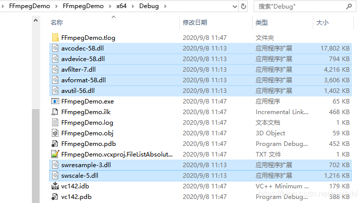

# 【FFmpeg笔记】04-Win10编译ffmpeg4.2.1(For Windows)

Table of Contents

一、安装和配置msys2

1、下载msys2

2、下载编译工具

二、编译配置

三、编译

四、遇到问题

五、使用 vs2019 开发ffmpeg项目

1、创建C++项目

2、添加include目录

3、添加lib目录和相关的lib文件

4、编写测试代码

5、复制相关 dll 到可执行文件当中

6、完成

六、使用 VS 开发的好处

上次在 Win10 下编译了 Android 版 FFmpeg（《13、Win10编译ffmpeg4.2.1(For Android)》）

这一次我们在 Win10 下编译 Windows 版本 FFmpeg，并且采用 Visual Studio 2019 来开发，这样查看源码和调试都比较方便。

PS：虽然 Android Studio 4.0 已经很强大了，但是C++调试功能还是比不上 VS。

所需工具：
- 1、Windows 10
- 2、ffmpeg-4.2.1
- 3、msys2
- 4、Visual Studio 2019

ffmpeg 下载地址： https://ffmpeg.org/releases/ ，本文所用版本：ffmpeg-4.2.1 。

## 一、安装和配置msys2 ##

**1、下载msys2**

采用msys2环境来编译，下载地址：http://www.msys2.org 。


下载后，解压在任意目录即可：


为了方便操作，把 "mys2_shell.cmd" 所在目录添加到系统环境变量当中。

**2、下载编译工具**

下载编译工具之前，先把源改为中科大的源，这样国内下载比较快一点。

目标文件为"msys64\etc\pacman.d\mirrorlist.msys"，将内容改为：

```
## 

## MSYS2 repository mirrorlist

## 

## Primary

## msys2.org

Server = http://mirrors.ustc.edu.cn/msys2/msys/$arch/
Server = http://repo.msys2.org/msys/$arch
Server = http://downloads.sourceforge.net/project/msys2/REPOS/MSYS2/$arch
Server = http://www2.futureware.at/~nickoe/msys2-mirror/msys/$arch/
```

然后保存。

接着双击"msys2_shell.cmd"文件，打开 shell 窗口，在 shell 中输入下面命令：

	pacman -S make gcc diffutils yasm pkg-config

根据提示下载相关编译工具即可。

## 二、编译配置 ##

使用记事本或Notepad++打开 msys2 安装目录下的 "msys2_shell.cmd" 文件，

将里面的 "rem set MSYS2_PATH_TYPE=inherit" 改成 "set MSYS2_PATH_TYPE=inherit"，

然后点击保存。

## 三、编译 ##

点击电脑的开始菜单，依次找到 "Visual Studio 2019" -> "x64 Native Tools Command Prompt For VS 2019）"（x86编译出来的库是32位，x64编译出来的是64位的）。


在弹出的窗口中，输入"mys2_shell.cmd"。

```
**********************************************************************

** Visual Studio 2019 Developer Command Prompt v16.6.5
** Copyright (c) 2020 Microsoft Corporation

**********************************************************************

[vcvarsall.bat] Environment initialized for: 'x64'

C:\Program Files (x86)\Microsoft Visual Studio\2019\Community>msys2_shell.cmd
```

此时会打开一个新的窗口，如下图所示：


使用 "where cl" 和 "where link" 检查编译工具是否配置正常。

然后就可以 cd  到 ffmpeg 源码目录进行编译了，编译命令如下：

```
./configure  --toolchain=msvc  --enable-shared --prefix=windows
make -j12
make install
```

- make -j12 ：采用12线程进行编译；
- make install：编译成功后，把编译产物（dll, header,doc等）放到 windows 目录下。

编译成功后，如下所示：


- bin ：该目录存放了 dll 和 lib 文件，例如：avcodec.lib、avcodec-58.dll
- include：该目录存放了头文件，例如：libavcodec/avcodec.h
- lib：该目录存放了 pkgconfig 文件
- share：该目录存放了一些示例代码，例如：muxing.c

## 四、遇到问题 ##

编译会遇到很多问题，与msvc编译器有关，如下：

```
fftools/cmdutils.c(210): warning C4090: “函数”: 不同的“const”限定符
fftools/cmdutils.c(221): warning C4267: “初始化”: 从“size_t”转换到“int”，可能丢失数据
fftools/cmdutils.c(569): warning C4090: “函数”: 不同的“const”限定符
fftools/cmdutils.c(572): warning C4090: “函数”: 不同的“const”限定符
fftools/cmdutils.c(576): warning C4090: “函数”: 不同的“const”限定符
fftools/cmdutils.c(584): warning C4090: “函数”: 不同的“const”限定符
fftools/cmdutils.c(611): warning C4090: “函数”: 不同的“const”限定符
fftools/cmdutils.c(1134): warning C4996: 'avresample_version': 被声明为已否决
fftools/cmdutils.c(1149): error C2065: “slib”: 未声明的标识符
fftools/cmdutils.c(1149): error C2296: “%”: 非法，左操作数包含“char [138]”类型
fftools/cmdutils.c(1149): error C2059: 语法错误:“数字上的错误后缀”
fftools/cmdutils.c(1149): error C2059: 语法错误:“%”
fftools/cmdutils.c(1149): error C2017: 非法的转义序列
fftools/cmdutils.c(1149): error C2001: 常量中有换行符
fftools/cmdutils.c(1180): error C2143: 语法错误: 缺少“)”(在“*”的前面)
fftools/cmdutils.c(1180): error C2143: 语法错误: 缺少“{”(在“*”的前面)
fftools/cmdutils.c(1180): error C2059: 语法错误:“)”
fftools/cmdutils.c(1181): error C2054: 在“options”之后应输入“(”
fftools/cmdutils.c(1282): error C2143: 语法错误: 缺少“)”(在“*”的前面)
fftools/cmdutils.c(1282): error C2143: 语法错误: 缺少“{”(在“*”的前面)
fftools/cmdutils.c(1282): error C2059: 语法错误:“)”
fftools/cmdutils.c(1283): error C2054: 在“avclass”之后应输入“(”
fftools/cmdutils.c(1292): error C2143: 语法错误: 缺少“;”(在“*”的前面)
fftools/cmdutils.c(1292): error C2100: 非法的间接寻址
fftools/cmdutils.c(1292): warning C4047: “=”:“int”与“void *”的间接级别不同
fftools/cmdutils.c(1294): error C2143: 语法错误: 缺少“;”(在“*”的前面)
fftools/cmdutils.c(1294): error C2100: 非法的间接寻址
```

还有：

ffmpeg-4.2.1/config.h(1):warning C4828: 文件包含偏移 0x185 处开始的字符，该字符在当前源字符集中无效(代码页 65001)

**1、问题出现的原因：**

这是因为我们在调用 "./configure  --toolchain=msvc  --enable-shared --prefix=windows" 命令的时候， 会在 "ffmpeg-4.2.1/config.h"文件出现中文字符，如下：


**2、解决方法**

解决方法是把这个中文字符删除掉，然后重新执行 "make -j12"即可。

## 五、使用 vs2019 开发ffmpeg项目 ##

**1、创建C++项目**


**2、添加include目录**

右击项目，选择"属性"，打开项目属性页，按下图所示，添加 ffmpeg 的 include 目录。


**3、添加lib目录和相关的lib文件**

右击项目，选择"属性"，打开项目属性页，按下图所示，添加 ffmpeg 的 lib 目录。


接着，在按下图添加静态库文件：


静态库文件包括：

```
avcodec.lib
avdevice.lib
avfilter.lib
avformat.lib
avutil.lib
swresample.lib
swscale.lib
```

**4、编写测试代码**

如下：

```
// FFmpegDemo.cpp : 此文件包含 "main" 函数。程序执行将在此处开始并结束。
//

#include <iostream>
extern "C" {
#include <libavcodec/avcodec.h>
}

int main()
{
    std::cout << "Hello World!\n";

    std::cout << avcodec_configuration() << std::endl;

}
```

此时运行起来还会报错，因为动态库不在可执行文件下。

**5、复制相关 dll 到可执行文件当中**

如下图所示：



**6、完成**

此时，重新运行就没问题了。


## 六、使用 VS 开发的好处 ##

使用 visual studio 开发的好处是，可以调试跟踪FFmpeg源码，如下图所示：


从上图可以看出，我们可以在调试过程中 step into 到 avformat_open_input() 函数，看到函数的具体实现（这在 Android Studio 中是做不到的）。

通过查看  avformat_open_input() 函数的实现，我们可以知道，当参数 **ps 为 NULL 时，内部会自动调用 avformat_alloc_context() 分配一个对象。

也就是说，我们在调用  avformat_open_input() 函数时， 参数 **ps 可以为 NULL ，也可以提前 alloc。

————————————————

版权声明：本文为CSDN博主「又吹风_Bassy」的原创文章，遵循CC 4.0 BY-SA版权协议，转载请附上原文出处链接及本声明。

原文链接：https://blog.csdn.net/eieihihi/article/details/108485122
