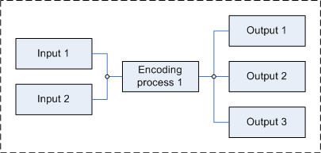

# 【ffmpeg命令】ffmpeg ffplay udp推拉流-单播-组播-广播


## 文章目录 ##

- 前言
- UDP 单播推拉流
- UDP 组播推拉流
- udp组播地址
- UDP 广播推拉流
- FFmpeg 推多路流
- FFmpeg 推流参数注释
- 测试网络MTU大小
- FFplay 参数注释
- 总结

## 前言 ##

ffmepg 支持非常丰富的推流命令，简单介绍一下使用 ffmpeg 和 ffplay 在局域网使用 udp协议推拉流。

## UDP 单播推拉流 ##

**udp 单播推流**

	ffmpeg.exe -re -stream_loop -1 -i .\JFLA.mp4 -vcodec copy -pkt_size 1300 -f h264 "udp://192.168.22.83:10189"

**udp 单播拉流**

	ffplay.exe -f h264 "udp://192.168.22.83:10189" -fflags nobuffer -nofind_stream_info


## UDP 组播推拉流 ##

udp组播地址
组播地址范围 224.0.0.0 – 239.255.255.255
224.0.0.0–224.0.0.255 本地保留，给知名协议使用，ttl=1。其中224.0.0.1是本网所有主机接收，224.0.0.2是本网所有路由器接收。

**udp 组播推流**

	ffmpeg.exe -re -stream_loop -1 -i .\JFLA.mp4 -vcodec copy -pkt_size 1300 -f h264 "udp://239.0.0.1:54546?buffer_size=0&localaddr=192.168.22.119" 

**udp 组播拉流**

	ffplay.exe -f h264 "udp://239.0.0.1:54546" -fflags nobuffer -nofind_stream_info


## UDP 广播推拉流 ##

**udp 广播推流**

	ffmpeg.exe -re -stream_loop -1 -i .\JFLA.mp4 -vcodec copy -pkt_size 1300 -f h264 "udp://192.168.22.255:10189"

**udp拉流**

	ffplay.exe -f h264 "udp://192.168.22.119:10189" -fflags nobuffer -nofind_stream_info

## FFmpeg 推多路流 ##

- 参考文档： https://trac.ffmpeg.org/wiki/Creating%20multiple%20outputs#Duplicateoutputs
- 参考文档： https://ffmpeg.org/ffmpeg-formats.html#tee

FFmpeg 编码一路流推 N路流。



**ffmpeg 推三路 udp流 使用 h264 格式**

	ffmpeg.exe -re -stream_loop -1 -i .\JFLA.mp4 -vcodec copy -an -f tee -map 0:v -map 0:a "[f=h264]udp://192.168.22.71:10189|[f=h264]udp://192.168.22.20:10189|[f=h264]udp://192.168.22.70:10189|[f=h264]udp://192.168.22.129:10189"

## FFmpeg 推流参数注释 ##

参考FFmpeg doc ：http://ffmpeg.org/ffmpeg-all.html

善用 Ctrl + F 全局搜索

```
-re  # 按照原始帧率读取输入 Read input at native frame rate. This is equivalent to setting -readrate 1

-stream_loop # 设置推流循环次数，-1 表示无限循环

-pkt_size # Set the size in bytes of UDP packets 某些电脑的最大 MTU 不是1500 需要指定 udp包的大小，如果发送udp包大于MTU，会丢包

-f  # 指定推流format 

-vcodec # 设置视频编码格式，copy表示不重新编码 
```

## 测试网络MTU大小 ##

```
# -f             在数据包中设置“不分段”标记(仅适用于 IPv4)

# -l size        发送缓冲区大小

ping -f -l 1472 192.168.22.80
```

## FFplay 参数注释 ##

参考 FFplay Doc : http://ffmpeg.org/ffplay-all.html
善用 Ctrl + F 全局搜索

```
-fflags nobuffer # 低延迟拉流必备参数 Reduce the latency introduced by buffering during initial input streams analysis 

-find_stream_info   # 开启码流格式探测 默认是开启的
-nofind_stream_info # 关闭码流格式探测 提升首帧打开时间

-x width # Force displayed width.

-y height # Force displayed height.

-fs # Start in fullscreen mode.

-an # Disable audio.

-vn # Disable video.
```

## 总结 ##

某些设备测试局域网 udp推流需要关闭防火墙，否则收不到 udp的包导致无法拉流。

感谢您的阅读。

若有帮助幸甚。

FFmpeg 官方文档：http://ffmpeg.org/documentation.html

————————————————

版权声明：本文为CSDN博主「ArchieFu」的原创文章，遵循CC 4.0 BY-SA版权协议，转载请附上原文出处链接及本声明。

原文链接：https://blog.csdn.net/qq_33844311/article/details/123751251
