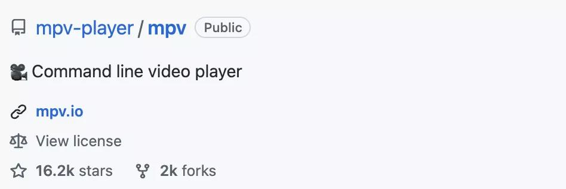
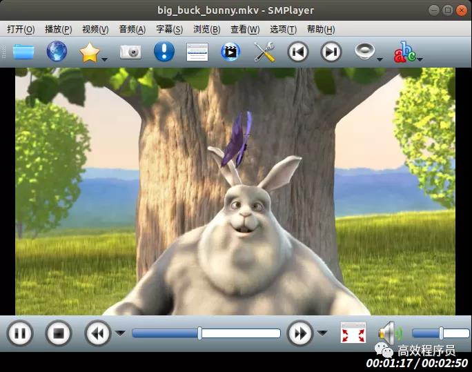
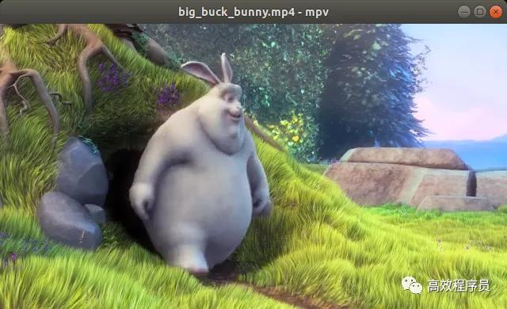
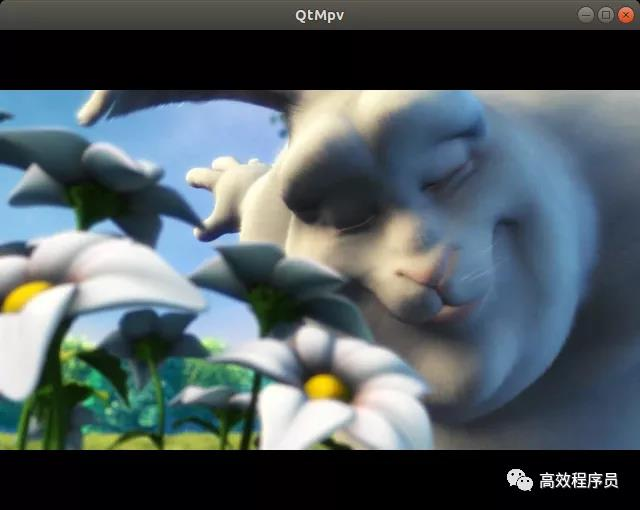

# 16k Star！一个开源的命令行视频播放器 #

mpv 是一个免费、开源、跨平台的多媒体播放器，可用于 Windows、Linux、MacOS、BSD 以及 Android 等平台。





mpv 带有极简的 GUI 界面以及丰富的命令行控制，它支持各种媒体文件格式、音频和视频编解码器以及字幕类型。


1

## mpv 介绍 ##


mpv 是由 Vincent Lang（首席开发者）在 2012 年从 mplayer2 fork 出来的，而 mplayer2 是在 2010 年从 MPlayer fork 出来的。至于 fork 的动机：主要是（通过删除不可维护的代码以及放弃对老旧系统的支持）鼓励开发者，让大家保持活跃性。


毫不意外，mpv 一经推出，便受到了很高的评价，并获得了大量的贡献。截至目前，已获得了 16K+ Star。


mpv 的几个主要网址：


- mpv 官网：https://mpv.io
- mpv GitHub：https://github.com/mpv-player/mpv
- mpv 安装：https://mpv.io/installation
- mpv 使用手册：https://mpv.io/manual/master
- mpv 维基百科：https://github.com/mpv-player/mpv/wiki
- mpv 常见问题：https://github.com/mpv-player/mpv/wiki/FAQ


其主要特性有：


**脚本处理**

强大的脚本能力几乎可以让播放器做任何事情，Wiki 上有大量用户脚本可供选择。（https://github.com/mpv-player/mpv/wiki/User-Scripts）

**屏幕控制器**

虽然 mpv 力求简约，并没有提供真正的 GUI，但它在视频顶部有一个小控制器，用于基本控制。


**高品质视频输出**

mpv 具有基于 OpenGL、Vulkan 和 D3D11 的视频输出，能够支持视频发烧友喜爱的许多功能，例如：使用流行的高质量算法进行视频缩放、色彩管理、帧时序、插值、HDR 等。


**GPU 视频解码**

mpv 可以利用所有平台上的大多数硬件解码 API，硬件解码可在运行时按需启用。


**可嵌入**

mpv 从头开始设计了一个简单的 C API，使其可以作为一个库使用，并便于和其他应用轻松集成。


**积极开发**

mpv 正在积极开发中，专注于代码重构和清理以及添加功能。想要一个功能特性？点这儿吧！（https://github.com/mpv-player/mpv/issues）


2

## 基于 mpv 的应用 ##


mpv 的用户群很广，这里有个第三方应用列表（https://github.com/mpv-player/mpv/wiki/Applications-using-mpv），简单列举几个：


项目	介绍	地址

- Baka MPlayer	免费、开源、跨平台，基于 libmpv 的多媒体播放器（Qt5）	https://github.com/u8sand/Baka-MPlayer/
- Bomi	强大易用的多媒体播放器（Qt5）	https://bomi-player.github.io/
- GNOME MPV	简单的 mpv 前端（GTK+3）	https://github.com/celluloid-player/celluloid
- SMPlayer	Qt 写的拥有额外特性的多媒体播放器（CSS 主题、YouTube 整合等）（Qt5）	https://www.smplayer.info/
- Deepin Movie	由深度开发的全功能视频播放器，支持多种视频格式的本地和流媒体播放（Qt5）	https://github.com/linuxdeepin/deepin-movie-reborn


SMPlayer 挺好用的，支持大部分的音视频文件。可进行音频轨道切换，允许亮度、对比度、色调等调节，并按照倍速、4倍速等多种速度回放，还可进行音频和字幕延迟调整以实现它们之间的同步。




和 VLC 很像，有木有！图片


3

## 安装 mpv ##


mpv 是一个常用应用，已加入到了大多数 Linux 发行版的默认仓库中。


以 Ubuntu 为例，执行以下命令便可以快速安装 mpv：


    $ sudo apt update
    $ sudo apt install mpv
    $ sudo apt install libmpv-dev


完成之后，可通过以下命令查看 mpv 的帮助信息：


    $ mpv --help


如果要查看其支持的选项，可执行以下命令：


    $ mpv --list-options


选项有很多，总共 400 多个。所以千万不要小看它，尽管 mpv 播放器只有极简的界面，但它的功能超级强大，其主要能力都来自于命令行。


4

## 使用 mvp 播放器 ##


打开 mpv 播放器，拖放一个本地媒体文件到窗口中，即可自动进行播放。


注意：界面没有任何菜单项，只能通过拖放媒体文件来操作。





可以看到，mpv 的界面很简洁，只有一个控制面板（在鼠标移动到播放窗口上才会显示），该面板上有播放/暂停、快进/快退以及全屏等功能。


若要播放在线视频，只能使用命令行模式：


    $ mpv http://clips.vorwaerts-gmbh.de/big_buck_bunny.mp4


注意：mpv 的默认大小，取决于所播放的视频画质。比如一个 240p 的视频，播放窗口会比较小，而在全高清显示器上播放 1080p 视频时，几乎会占满整个屏幕。


5

## 基于 libmvp 二次开发 ##


如果想基于 libmpv 进行二次开发 ，可以从官方提供的 demo 着手（https://github.com/mpv-player/mpv-examples），几乎各种语言版本的都有，例如：C#、Java、Qt、SDL、wxWidgets ...... 当然，也可参考上面提到的第三方应用。


下面以 Qt 为例，编写一个简单的 mpv 播放器：





源码如下：

```
#include <QApplication>
#include <QWidget>
#include <QtDebug>

#include <mpv/client.h>

static inline void checkError(int status)
{
    if (status < 0) {
        qWarning() << QString("mpv error: %1").arg(mpv_error_string(status));
        exit(1);
    }
}

int main(int argc, char* argv[])
{
    QApplication app(argc, argv);

    /*
     * QApplication 设置了 setlocale(LC_ALL, "")，
     * 但 mpv 需要将 LC_NUMERIC 设置为 "C"，所以得改回来。
    */
    std::setlocale(LC_NUMERIC, "C");

    // 创建一个 Qt 界面
    QWidget widget;
    widget.setMinimumSize(640, 480);

    // 创建 mpv 实例
    mpv_handle *mpv = mpv_create();
    if (mpv == nullptr) {
        qWarning() << "failed creating context";
        return 1;
    }

    // 设置播放句柄
    WId wid = widget.winId();
    mpv_set_property(mpv, "wid", MPV_FORMAT_INT64, &wid);

    /*
     * 启用默认的按键绑定，这样就可以与播放器交互了
     * 例如：{ 和 } 倍速播放、P/SPACE 键暂停/恢复
     * 通常使用 mpv 作为后台的播放器，会实现自己的按键绑定
    */
    mpv_set_option_string(mpv, "input-default-bindings", "yes");

    // 启用 X11 窗口的键盘输入
    mpv_set_option_string(mpv, "input-vo-keyboard", "yes");

    // 设置音量
    double volume = 60.0;
    checkError(mpv_set_property(mpv, "volume", MPV_FORMAT_DOUBLE, &volume));

    // 初始化 mpv 实例
    checkError(mpv_initialize(mpv));

    // 启用日志（级别为 Info 或更高）
    checkError(mpv_request_log_messages(mpv, "info"));

    // 播放文件
    QString fileName = "/home/waleon/video/big_buck_bunny.mkv";
    QByteArray file = fileName.toUtf8();
    const char *args[] = {"loadfile", file.constData(), Q_NULLPTR};
    mpv_command_async(mpv, 0, args);

    // 显示界面
    widget.show();

    int ret = app.exec();

    // 释放 mpv 实例
    mpv_terminate_destroy(mpv);

    return ret;
}
```

是不是很简单，只要几十行代码就搞定了！


- EOF - 

原文链接： https://mp.weixin.qq.com/s/l_Kzuqi4wf1945owRLyOgQ