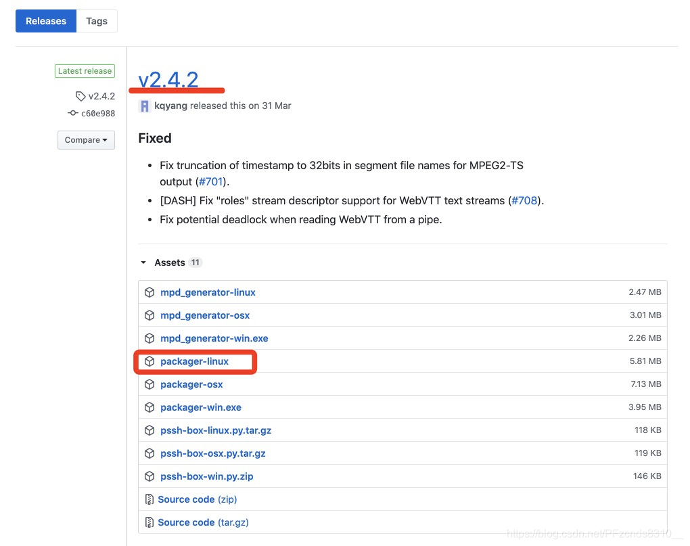
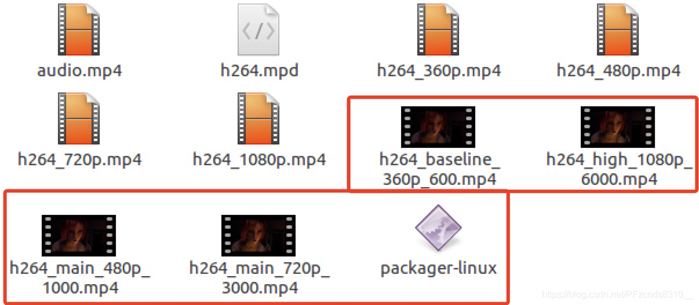
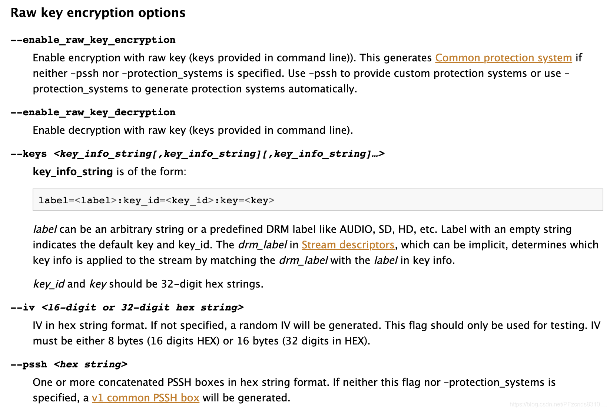
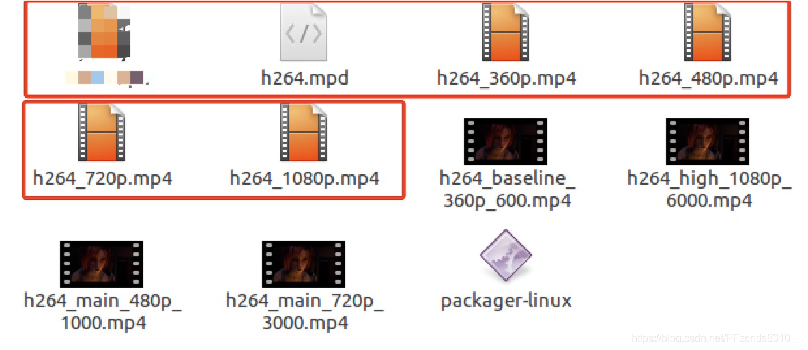

# 使用Shaka-packager进行加解密的简单实例

```
文章目录
	1.环境
	2.获取工具
	3.准备视频文件
	4.DASH加密
	5.DASH解密
	6.HLS的加解密
```

Shaka Packager是用于DASH和HLS打包和加密的工具和媒体打包SDK。 支持Widevine、DRM系统 和 本地加密等。

github地址：https://github.com/google/shaka-packager

## 1.环境 ##

演示的操作系统：Ubuntu 16.04（图形界面版）

## 2.获取工具 ##

由于是简单演示，所以我们先下载 releases 版的，点击进入。



可以看到，目前最新版本是 2.4.2，我们找到 Linux 平台的工具，点击下载。把它放到一个文件夹中，以便以之后使用。


## 3.准备视频文件 ##

一般为了适应网络的传输情况，会把片源转化为不同分辨率的视频文件。这里我们使用FFmpeg去做。随便找一个mp4视频文件，执行以下命令，分别生成360p、480p、720p和1080p的分辨率视频。（视频文件下面有链接）

360p

```
ffmpeg -i src.mp4 -c:a copy \
-vf "scale=-2:360" \
-c:v libx264 -profile:v baseline -level:v 3.0 \
-x264-params scenecut=0:open_gop=0:min-keyint=72:keyint=72 \
-minrate 600k -maxrate 600k -bufsize 600k -b:v 600k \
-y h264_baseline_360p_600.mp4
```

480p

```
ffmpeg -i src.mp4 -c:a copy \
-vf "scale=-2:480" \
-c:v libx264 -profile:v main -level:v 3.1 \
-x264-params scenecut=0:open_gop=0:min-keyint=72:keyint=72 \
-minrate 1000k -maxrate 1000k -bufsize 1000k -b:v 1000k \
-y h264_main_480p_1000.mp4
```

720p

```
ffmpeg -i src.mp4 -c:a copy \
-vf "scale=-2:720" \
-c:v libx264 -profile:v main -level:v 4.0 \
-x264-params scenecut=0:open_gop=0:min-keyint=72:keyint=72 \
-minrate 3000k -maxrate 3000k -bufsize 3000k -b:v 3000k \
-y h264_main_720p_3000.mp4
```

1080p

```
ffmpeg -i src.mp4 -c:a copy \
-vf "scale=-2:1080" \
-c:v libx264 -profile:v high -level:v 5.0 \
-x264-params scenecut=0:open_gop=0:min-keyint=72:keyint=72 \
-minrate 6000k -maxrate 6000k -bufsize 6000k -b:v 6000k \
-y h264_high_1080p_6000.mp4
```

## 4.DASH加密 ##

把下载好的shaka-packager工具文件 和 生成的视频文件 放进同一个文件夹中。



Shaka Packager支持三种不同类型的密钥提供程序：

- 原始密钥：命令行中提供了密钥
- Widevine：从Widevine密钥服务器获取密钥
- PlayReady：从PlayReady密钥服务器获取密钥

在Shaka Packager的说明文档中有提及（建议阅读）：

[Shaka Packager documentation](https://google.github.io/shaka-packager/html/index.html)

```
Encryption / decryption options
Shaka Packager supports three different types of key providers:
    Raw key: keys are provided in command line
    Widevine: fetches keys from Widevine key server
    PlayReady: fetches keys from PlayReady key server
```

为了方便演示，我们使用 Raw key 的方法，在Shaka Packager说明文档的下方有分别介绍三种加密方法的段落，而且给了命令行参数的详细说明。以 Raw key 为例：



按照 文档的说明要求，我们可以知道加密的命令的组成，如下：

DASH 加密，生成MPD文件

```
./packager-linux \
  in=h264_baseline_360p_600.mp4,stream=video,output=h264_360p.mp4,drm_label=HD \
  in=h264_main_480p_1000.mp4,stream=video,output=h264_480p.mp4,drm_label=HD \
  in=h264_main_720p_3000.mp4,stream=video,output=h264_720p.mp4,drm_label=HD \
  in=h264_high_1080p_6000.mp4,stream=video,output=h264_1080p.mp4,drm_label=HD \
  --enable_raw_key_encryption \
  --keys label=HD:key_id=64786568716c377562356a6277376f73:key=656d34736f62376e6635706767636f33 \
  --iv 6f6f7431386736677662656b63363536 \
  --pssh 000000317073736800000000EDEF8BA979D64ACEA3C827DCD51D21ED00000011220F7465737420636F6E74656E74206964 \
  --mpd_output h264.mpd
```

参数说明：

- in= 是输入文件名称；
- stream= 文件类型；
- output= 输出文件名称；
- drm_label= 指定加密的方法，该段也可以自定义。比如设置drm_label=HD，后面的参数–keys label=HD，那么该文件将采用标签为HD的密钥去加密。如果有–keys label=HDSELF，drm_label=HDSELF，那么该文件将采用标签为HDSELF的密钥加密。实例中所有的文件均使用同样的密钥、密钥ID和初始向量。

[官方详细的示例和说明](https://google.github.io/shaka-packager/html/tutorials/raw_key.html)

```
For HD Encryption:
key ID        = 0x64786568716c377562356a6277376f73
key Value     = 0x656d34736f62376e6635706767636f33
key IV      = 0x6f6f7431386736677662656b63363536
```

加密之后，文件夹里会生成5个新的文件，4个加密视频文件呢和1个mpd文件。



## 5.DASH解密 ##

把上面加密后的视频文件和shaka-packager工具文件一起移动到另外一个文件夹中，执行解密命令：

```
./packager-linux \
  in=h264_360p.mp4,stream=video,output=h264_baseline_360p_600.mp4,drm_label=HD \
  in=h264_480p.mp4,stream=video,output=h264_main_480p_1000.mp4,drm_label=HD \
  in=h264_720p.mp4,stream=video,output=h264_main_720p_3000.mp4,drm_label=HD \
  in=h264_1080p.mp4,stream=video,output=h264_high_1080p_6000.mp4,drm_label=HD \
  --enable_raw_key_decryption \
  --keys label=HD:key_id=64786568716c377562356a6277376f73:key=656d34736f62376e6635706767636f33
```

参数也和加密一个逻辑，就不再细说了。解密之后，会出现解密后的4个文件，可以使用ffplay播放看看：

```
ffplay h264_high_1080p_6000.mp4
```

## 6.HLS的加解密 ##

加密会生成两级m3u8文件 和 4个加密视频文件，参考上面的说明，逻辑相似，这里不再多说。

```
-----HLS m3u8
--加密
./packager-linux \
  in=h264_baseline_360p_600.mp4,stream=video,output=h264_360p.mp4,drm_label=HD \
  in=h264_main_480p_1000.mp4,stream=video,output=h264_480p.mp4,drm_label=HD \
  in=h264_main_720p_3000.mp4,stream=video,output=h264_720p.mp4,drm_label=HD \
  in=h264_high_1080p_6000.mp4,stream=video,output=h264_1080p.mp4,drm_label=HD \
  --enable_raw_key_encryption \
  --keys label=HD:key_id=64786568716c377562356a6277376f73:key=656d34736f62376e6635706767636f33 \
  --iv 6f6f7431386736677662656b63363536 \
  --pssh 000000317073736800000000EDEF8BA979D64ACEA3C827DCD51D21ED00000011220F7465737420636F6E74656E74206964 \
  --hls_master_playlist_output h264.m3u8

--解密
./packager-linux \
  in=h264_360p.mp4,stream=video,output=h264_baseline_360p_600.mp4,drm_label=HD \
  in=h264_480p.mp4,stream=video,output=h264_main_480p_1000.mp4,drm_label=HD \
  in=h264_720p.mp4,stream=video,output=h264_main_720p_3000.mp4,drm_label=HD \
  in=h264_1080p.mp4,stream=video,output=h264_high_1080p_6000.mp4,drm_label=HD \
  --enable_raw_key_decryption \
  --keys label=HD:key_id=64786568716c377562356a6277376f73:key=656d34736f62376e6635706767636f33

```

示例视频资源，我的资源里自取Free！


参考来源：https://blog.csdn.net/ganqiuye/article/details/103588597

————————————————

版权声明：本文为CSDN博主「野尽」的原创文章，遵循CC 4.0 BY-SA版权协议，转载请附上原文出处链接及本声明。

原文链接：https://blog.csdn.net/PFzcnds8310__/article/details/106751084
