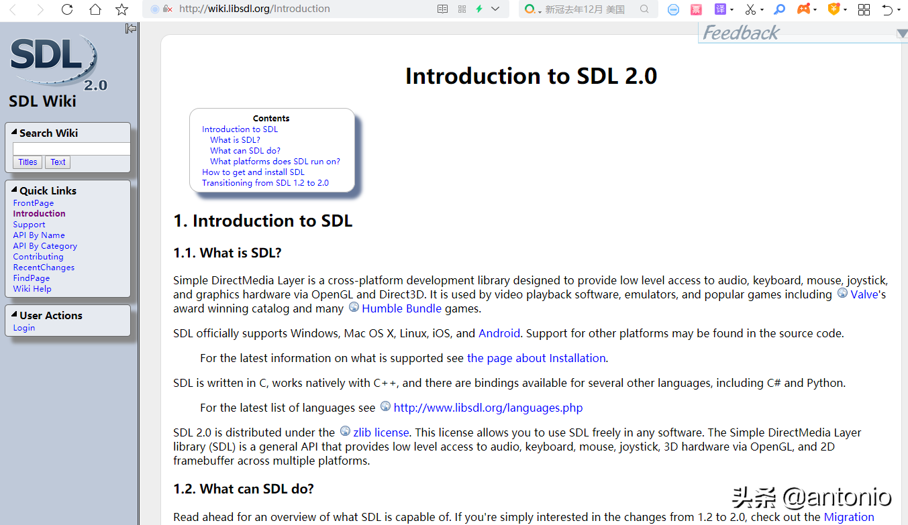
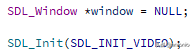

# 详解SDL常用技术实战(1) #

## 0.引言 ##

本篇文章主要讲解如何学习SDL以及SDL重要的基础知识，希望能够帮到大家。


详解SDL常用技术实战(1)

## 1.SDL简述 ##

SDL（Simple DirectMedia Layer）是一套开放源代码的跨平台多媒体开发库，使用C语言写成。SDL提供了数种控制图像、声音、输出的函数，让开发者只要用相同或是相似的代码就可以开发出跨多个平台（Linux、Windows、Mac OS X等）的应用软件，对于跨平台比较好。目前SDL多用于开发游戏、模拟器、媒体播放器等多媒体应用领域。SDL（Simple DirectMedia Layer）被广泛的用于许多著名的游戏。最著名的游戏是赢得Linux组游戏开发大奖的 文明：权利的召唤（Civilization: Call To Power）。SDL的作者是Sam Lantinga, Loki Entertainment Software的主力程序员（Lead Programmer）。

**1.1 SDL的主要框架**


详解SDL常用技术实战(1)

## 2.SDL的主要功能 ##

**(1)视频(SDL_INIT_VIDEO)**

设置8bpp或更高的任意色彩深度的视频模式。如果某个模式硬件不支持，可以选择转化为另一模式。直接写入线性的图像帧缓冲（framebuffer）。用颜色键值（colorkey）或者alpha混合属性创建surface。Surface的blit能自动的转化为目标格式。blit是优化过的，并能使用硬件加速。x86平台上有针对MMX优化过的blit。硬件加速的blit和fill（填充）操作，如果硬件支持的话。这个功能在音视频显示，开发领域显得很重要。

**(2)事件(SDL_INIT_EVENTS)**

提供以下事件：

应用程序的visibility发生改变

键盘输入

鼠标输入

用户要求的退出

每种事件都能通过SDL_EventState()关闭或者打开。

事件经由用户指定的过滤函数再被加入到内部的事件队列。

线程安全的事件队列。

这个功能在音视频显示，开发领域显得很重要。

**(3)音频(SDL_INIT_AUDIO)**

设置8位和16位的音频，单声道或者立体声，如果格式硬件不支持，可以选择转换。

由独立的线程执行音频部分，并提供用户回调（callback）机制。

设计上考虑到了客户定制的软混音器，但实际上在例程中就包含了一个完整的音频/音乐输出库。

这个功能在音视频显示，开发领域显得很重要。

**(4)CD音频**

完整的CD音频控制API

**(5)线程**

简单的线程创建API

用于同步的简单的二进制信号量（semaphores）

**(6)定时器(SDL_INIT_AUDIO_TIMER)**

读取已流逝的毫秒数。

等待指定的毫秒数。

设置一个10毫秒精度的周期性定时器。

这个功能在音视频显示，开发领域显得很重要。

**(7)字节序无关**

侦测当前系统的字节序

快速转换数据的函数

读写指定字节序的数据

**(8)摇杆(SDL_INIT_JOYSTICK)**

**(9)触摸屏(SDL_INIT_HAPTIC)**

**(10)游戏控制器(SDL_INIT_GAMECONTROLLER)**

**(11)包含上述所有选项的事件(SDL_INIT_EVERYTHING)**


## 3.SDL支持哪些系统平台 ##

**(1)Linux**

视频显示使用X11，利用XFree86 DGA扩展的优势，全屏显示使用新的w MTRR加速。声音使用OSS API。使用clone()系统调用和SysV IPC，或者glibc-2.1的pthreads实现线程。

**(2)Win32**

有两个版本，一个是适合所有基于Win32的系统的安全版本，另一个是基于DirectX的高性能版本。安全版本的视频显示采用GDI。高性能版本采用DirectDraw，并支持硬件加速。安全版本的音频回放采用waveOut API。高性能版本采用DirectSound。

**(3)BeOS**

视频显示采用BWindow。音频回放采用BSoundPlayer API。非正式的移植版本，进展中Solaris, IRIX, FreeBSD MacOS


## 4.SDL的其它描述 ##

SDL内置了调用OpenGL的函数。通过使用SDL_image、SDL_ttf、SDL_mixer、SDL_net等外部扩展库，可以轻松实现JPG、PNG、TIFF图像的加载使用，TrueType字体的使用，MP3文件的使用、网络相关的使用等。

SDL也有其他语言的包装，可以在这里查看　SDL用C语言写成，但是可以很容易在C++下面工作，并且SDL绑定了许多其它的语言，这其中就包括Ada, C#, Eiffel, Erlang, Euphoria, Guile, Haskell, Java, Lisp, Lua, ML, Objective C, Pascal, Perl, PHP, Pike, Pliant, Python, Ruby, and Smalltalk。包装得比较好的是python语言的pygame。不过仍然建议你熟悉c/c++环境下的SDL后再使用，会得心应手许多。最后，我们来了解一下SDL的版权问题，SDL在GNU LGPL 2（一个国际上的开源组织）下发布，这个版本允许你将SDL以动态链接库（dynamic link library）的形式免费地用于商业游戏软件的开发。


## 5.SDL下载和编译 ##

**5.1 下载SDL的win平台库**

(1)SDL官网地址：

https://www.libsdl.org/

界面如下:


详解SDL常用技术实战(1)

(2)SDL官网文档链接：

http://wiki.libsdl.org/Introduction


详解SDL常用技术实战(1)

(3)下载SDL的dll和lib，链接地址如下:

https://www.libsdl.org/download-2.0.php

界面如下:

也可以下载源码下来，自己编译。比如在linux环境下，自己去编译。win平台一般是直接使用，已经下载编译好的库。


详解SDL常用技术实战(1)

(4)下载的库，内容如下:


详解SDL常用技术实战(1)

(5)doc目录如下:


详解SDL常用技术实战(1)

(6)includle目录如下:


详解SDL常用技术实战(1)

(7)lib目录如下:


详解SDL常用技术实战(1)

(8)x86的库


详解SDL常用技术实战(1)

(9)x64的库


详解SDL常用技术实战(1)

SDL只是音视频用来显示和输出，所以用来关心这部分接口即可，知道怎么去用，如果项目中，有使用其它功能，可以再去研究文档和实例代码。


## 6.在linux环境下搭建SDL的开发环境 ##

(1)下载SDL源码库，如SDL2-2.0.10.tar.gz

(2)解压，然后依次执行如下命令

```
./configure
make
sudo make install
```

(3)如果出现Could not initialize SDL - No available video device(Did you set the DISPLAY variable?)错误提示，就说明系统中没有安装x11的库文件，因此编译出来的SDL库实际上不能用。需要安装如下库，命令如下:

```
sudo apt-get install libx11-dev

sudo apt-get install xorg-dev
```

## 7.SDL的win显示 ##

生成的SDL窗口。如下:


详解SDL常用技术实战(1)

(1)初始化SDL window


详解SDL常用技术实战(1)

(2)创建SDL Window，可以设置使用opengl做加速。


详解SDL常用技术实战(1)

注意：SDL_Init()和SDL_Quit()这两个函数都是必须使用。


## 8.SDL的渲染器和纹理 ##

SDL_Window: 代表了一个“窗口”。

SDL_Renderer ：代表了一个“渲染器”。

SDL_Texture：代表了一个“纹理”。

SDL_Rect：矩形结构

注意：存储RGB和存储纹理的区别如下：

如一个从左到右由红色渐变到蓝色的矩形，用存储RGB的话就需要把矩形中每个点的具体颜色值存储下来；而纹理只是一些描述信息，比如记录了矩形的大小、起始颜色、终止颜色等信息，显卡可以通过这些信息推算出矩形块的详细信息。所以相对于存储RGB而已，存储纹理占用的内存要少的多。


SDL绘制图形效果:


详解SDL常用技术实战(1)

(1)创建渲染器SDL_Renderer

一般一个窗口，对应一个渲染器render，也可以对应多个渲染器，每个渲染器可以设置不同的纹理。

基于上面所说的window去创建渲染器，源代码接口如下:

```
/**
 * \brief Set a texture as the current rendering target.
 *
 * \param renderer The renderer.
 * \param texture The targeted texture, which must be created with the SDL_TEXTUREACCESS_TARGET flag, or NULL for the default render target
 *
 * \return 0 on success, or -1 on error
 *
 *  \sa SDL_GetRenderTarget()
 */
extern DECLSPEC int SDLCALL SDL_SetRenderTarget(SDL_Renderer *renderer,
                                                SDL_Texture *texture);
```

(2)创建纹理SDL_Texture

创建纹理，也是基于上面的渲染器render去创建。源代码接口如下:

```
/**
 *  \brief Copy a portion of the texture to the current rendering target.
 *
 *  \param renderer The renderer which should copy parts of a texture.
 *  \param texture The source texture.
 *  \param srcrect   A pointer to the source rectangle, or NULL for the entire
 *                   texture.
 *  \param dstrect   A pointer to the destination rectangle, or NULL for the
 *                   entire rendering target.
 *
 *  \return 0 on success, or -1 on error
 */
extern DECLSPEC int SDLCALL SDL_RenderCopy(SDL_Renderer * renderer,
                                           SDL_Texture * texture,
                                           const SDL_Rect * srcrect,
                                           const SDL_Rect * dstrect);
```

(3)设置渲染器目标

以下操作都是在一个循环里面去执行。

设置渲染目标为纹理，如下所示:

	SDL_SetRenderTarget(renderer, texture);

源码接口如下:

```
/**
 * \brief Set a texture as the current rendering target.
 *
 * \param renderer The renderer.
 * \param texture The targeted texture, which must be created with the SDL_TEXTUREACCESS_TARGET flag, or NULL for the default render target
 *
 * \return 0 on success, or -1 on error
 *
 *  \sa SDL_GetRenderTarget()
 */
extern DECLSPEC int SDLCALL SDL_SetRenderTarget(SDL_Renderer *renderer,
                                                SDL_Texture *texture);
```

(4)设置纹理背景的颜色


	SDL_SetRenderDrawColor(renderer, 255, 0, 0, 255)

源码接口如下:

```
/**
 *  \brief Set the color used for drawing operations (Rect, Line and Clear).
 *
 *  \param renderer The renderer for which drawing color should be set.
 *  \param r The red value used to draw on the rendering target.
 *  \param g The green value used to draw on the rendering target.
 *  \param b The blue value used to draw on the rendering target.
 *  \param a The alpha value used to draw on the rendering target, usually
 *           ::SDL_ALPHA_OPAQUE (255).
 *
 *  \return 0 on success, or -1 on error
 */
extern DECLSPEC int SDLCALL SDL_SetRenderDrawColor(SDL_Renderer * renderer,
                                           Uint8 r, Uint8 g, Uint8 b,
                                           Uint8 a);

```

(5)绘制一个方形。如下所示:

	SDL_RenderDrawRect(renderer, &rect)

源码接口如下:

```
/**
 *  \brief Draw a rectangle on the current rendering target.
 *
 *  \param renderer The renderer which should draw a rectangle.
 *  \param rect A pointer to the destination rectangle, or NULL to outline the entire rendering target.
 *
 *  \return 0 on success, or -1 on error
 */
extern DECLSPEC int SDLCALL SDL_RenderDrawRect(SDL_Renderer * renderer,
                                               const SDL_Rect * rect);
```

(6)给上面绘制的方形，填充颜色，如下所示:

	SDL_SetRenderDrawColor(renderer, 0, 255, 255, 255);
	SDL_RenderFillRect(renderer, &rect);

源码接口如下:

```
/**
 *  \brief Set the color used for drawing operations (Rect, Line and Clear).
 *
 *  \param renderer The renderer for which drawing color should be set.
 *  \param r The red value used to draw on the rendering target.
 *  \param g The green value used to draw on the rendering target.
 *  \param b The blue value used to draw on the rendering target.
 *  \param a The alpha value used to draw on the rendering target, usually
 *           ::SDL_ALPHA_OPAQUE (255).
 *
 *  \return 0 on success, or -1 on error
 */
extern DECLSPEC int SDLCALL SDL_SetRenderDrawColor(SDL_Renderer * renderer,
                                           Uint8 r, Uint8 g, Uint8 b,
                                           Uint8 a);
/**
 *  \brief Fill a rectangle on the current rendering target with the drawing color.
 *
 *  \param renderer The renderer which should fill a rectangle.
 *  \param rect A pointer to the destination rectangle, or NULL for the entire
 *              rendering target.
 *
 *  \return 0 on success, or -1 on error
 */
extern DECLSPEC int SDLCALL SDL_RenderFillRect(SDL_Renderer * renderer,
                                               const SDL_Rect * rect);
```

(7)设置上面的纹理texture为渲染器目标，如下所示:

	SDL_SetRenderTarget(renderer, NULL);

源码接口如下:

```
/**
 * \brief Set a texture as the current rendering target.
 *
 * \param renderer The renderer.
 * \param texture The targeted texture, which must be created with the SDL_TEXTUREACCESS_TARGET flag, or NULL for the default render target
 *
 * \return 0 on success, or -1 on error
 *
 *  \sa SDL_GetRenderTarget()
 */
extern DECLSPEC int SDLCALL SDL_SetRenderTarget(SDL_Renderer *renderer,
                                                SDL_Texture *texture);
```

(8)拷贝纹理texture到渲染器上。如下所示:

	SDL_RenderCopy(renderer, texture, NULL, NULL);

源码接口如下:

```
/**
 *  \brief Update the screen with rendering performed.
 */
extern DECLSPEC void SDLCALL SDL_RenderPresent(SDL_Renderer * renderer);
```

(9)显示

最终是更新窗口上的纹理，如下所示:

	SDL_RenderPresent(renderer);

源码接口如下:

```
/**
 *  \brief Update the screen with rendering performed.
 */
extern DECLSPEC void SDLCALL SDL_RenderPresent(SDL_Renderer * renderer);
```

(10)SDL_UpdateTexture()：设置纹理的数据

(11)SDL_Delay()：工具函数，用于延时。

(12)SDL_Quit()：退出SDL系统

上述显示的核心代码，如下：

```
 SDL_Init(SDL_INIT_VIDEO);//初始化函数,可以确定希望激活的子系统

    window = SDL_CreateWindow("2 Window",
                              SDL_WINDOWPOS_UNDEFINED,
                              SDL_WINDOWPOS_UNDEFINED,
                              640,
                              480,
                              SDL_WINDOW_OPENGL | SDL_WINDOW_RESIZABLE);// 创建窗口

    if (!window)
    {
        return -1;
    }
    renderer = SDL_CreateRenderer(window, -1, 0);//基于窗口创建渲染器
    if (!renderer)
    {
        return -1;
    }

    texture = SDL_CreateTexture(renderer,
                                   SDL_PIXELFORMAT_RGBA8888,
                                   SDL_TEXTUREACCESS_TARGET,
                                   640,
                                   480); //创建纹理

    if (!texture)
    {
        return -1;
    }

    int show_count = 0;
    while (run)
    {
        rect.x = rand() % 600;
        rect.y = rand() % 400;

        SDL_SetRenderTarget(renderer, texture); // 设置渲染目标为纹理
        SDL_SetRenderDrawColor(renderer, 255, 0, 0, 255); // 纹理背景为黑色
        SDL_RenderClear(renderer); //清屏

        SDL_RenderDrawRect(renderer, &rect); //绘制一个长方形
        SDL_SetRenderDrawColor(renderer, 0, 255, 255, 255); //长方形的颜色可以改变
        SDL_RenderFillRect(renderer, &rect);

        SDL_SetRenderTarget(renderer, NULL); //恢复默认，渲染目标为窗口
        SDL_RenderCopy(renderer, texture, NULL, NULL); //拷贝纹理到渲染器

        SDL_RenderPresent(renderer); //输出到目标窗口上
        SDL_Delay(100);
        if(show_count++ > 60)
        {
            run = 0;        // 不跑了
        }
    }

    SDL_DestroyTexture(texture);
    SDL_DestroyRenderer(renderer);
    SDL_DestroyWindow(window); //销毁窗口
    SDL_Quit();
```

9.SDL事件响应

比较重要的两个事件接口:

(1)等待一个事件。

	SDL_WaitEvent(&event);

(2)发送一个事件。

	SDL_PushEvent(&event_q);

(3)存储事件

将硬件设备产生的事件放入事件队列，用于读取事件，在调用该函数之前，必须调用SDL_PumpEvents搜集键盘等事件。

	SDL_PumpEvents()；

(4)从事件队列提取一个事件

	SDL_PeepEvents()；

(5)代表一个事件

	SDL_Event

效果图如下：

可以看到，能够检测到鼠标和键盘的响应事件。


详解SDL常用技术实战(1)

(6)源码接口这里，支持很多事件，如鼠标，键盘等，如下图所示:

```
typedef enum
{
    SDL_FIRSTEVENT     = 0,     /**< Unused (do not remove) */

    /* Application events */
    SDL_QUIT           = 0x100, /**< User-requested quit */

    /* These application events have special meaning on iOS, see README-ios.md for details */
    SDL_APP_TERMINATING,        /**< The application is being terminated by the OS
                                     Called on iOS in applicationWillTerminate()
                                     Called on Android in onDestroy()
                                */
    SDL_APP_LOWMEMORY,          /**< The application is low on memory, free memory if possible.
                                     Called on iOS in applicationDidReceiveMemoryWarning()
                                     Called on Android in onLowMemory()
                                */
    SDL_APP_WILLENTERBACKGROUND, /**< The application is about to enter the background
                                     Called on iOS in applicationWillResignActive()
                                     Called on Android in onPause()
                                */
    SDL_APP_DIDENTERBACKGROUND, /**< The application did enter the background and may not get CPU for some time
                                     Called on iOS in applicationDidEnterBackground()
                                     Called on Android in onPause()
                                */
    SDL_APP_WILLENTERFOREGROUND, /**< The application is about to enter the foreground
                                     Called on iOS in applicationWillEnterForeground()
                                     Called on Android in onResume()
                                */
    SDL_APP_DIDENTERFOREGROUND, /**< The application is now interactive
                                     Called on iOS in applicationDidBecomeActive()
                                     Called on Android in onResume()
                                */

    /* Display events */
    SDL_DISPLAYEVENT   = 0x150,  /**< Display state change */

    /* Window events */
    SDL_WINDOWEVENT    = 0x200, /**< Window state change */
    SDL_SYSWMEVENT,             /**< System specific event */

    /* Keyboard events */
    SDL_KEYDOWN        = 0x300, /**< Key pressed */
    SDL_KEYUP,                  /**< Key released */
    SDL_TEXTEDITING,            /**< Keyboard text editing (composition) */
    SDL_TEXTINPUT,              /**< Keyboard text input */
    SDL_KEYMAPCHANGED,          /**< Keymap changed due to a system event such as an
                                     input language or keyboard layout change.
                                */

    /* Mouse events */
    SDL_MOUSEMOTION    = 0x400, /**< Mouse moved */
    SDL_MOUSEBUTTONDOWN,        /**< Mouse button pressed */
    SDL_MOUSEBUTTONUP,          /**< Mouse button released */
    SDL_MOUSEWHEEL,             /**< Mouse wheel motion */

    /* Joystick events */
    SDL_JOYAXISMOTION  = 0x600, /**< Joystick axis motion */
    SDL_JOYBALLMOTION,          /**< Joystick trackball motion */
    SDL_JOYHATMOTION,           /**< Joystick hat position change */
    SDL_JOYBUTTONDOWN,          /**< Joystick button pressed */
    SDL_JOYBUTTONUP,            /**< Joystick button released */
    SDL_JOYDEVICEADDED,         /**< A new joystick has been inserted into the system */
    SDL_JOYDEVICEREMOVED,       /**< An opened joystick has been removed */

    /* Game controller events */
    SDL_CONTROLLERAXISMOTION  = 0x650, /**< Game controller axis motion */
    SDL_CONTROLLERBUTTONDOWN,          /**< Game controller button pressed */
    SDL_CONTROLLERBUTTONUP,            /**< Game controller button released */
    SDL_CONTROLLERDEVICEADDED,         /**< A new Game controller has been inserted into the system */
    SDL_CONTROLLERDEVICEREMOVED,       /**< An opened Game controller has been removed */
    SDL_CONTROLLERDEVICEREMAPPED,      /**< The controller mapping was updated */

    /* Touch events */
    SDL_FINGERDOWN      = 0x700,
    SDL_FINGERUP,
    SDL_FINGERMOTION,

    /* Gesture events */
    SDL_DOLLARGESTURE   = 0x800,
    SDL_DOLLARRECORD,
    SDL_MULTIGESTURE,

    /* Clipboard events */
    SDL_CLIPBOARDUPDATE = 0x900, /**< The clipboard changed */

    /* Drag and drop events */
    SDL_DROPFILE        = 0x1000, /**< The system requests a file open */
    SDL_DROPTEXT,                 /**< text/plain drag-and-drop event */
    SDL_DROPBEGIN,                /**< A new set of drops is beginning (NULL filename) */
    SDL_DROPCOMPLETE,             /**< Current set of drops is now complete (NULL filename) */

    /* Audio hotplug events */
    SDL_AUDIODEVICEADDED = 0x1100, /**< A new audio device is available */
    SDL_AUDIODEVICEREMOVED,        /**< An audio device has been removed. */

    /* Sensor events */
    SDL_SENSORUPDATE = 0x1200,     /**< A sensor was updated */

    /* Render events */
    SDL_RENDER_TARGETS_RESET = 0x2000, /**< The render targets have been reset and their contents need to be updated */
    SDL_RENDER_DEVICE_RESET, /**< The device has been reset and all textures need to be recreated */

    /** Events ::SDL_USEREVENT through ::SDL_LASTEVENT are for your use,
     *  and should be allocated with SDL_RegisterEvents()
     */
    SDL_USEREVENT    = 0x8000,

    /**
     *  This last event is only for bounding internal arrays
     */
    SDL_LASTEVENT    = 0xFFFF
} SDL_EventType;
```

(7)填充event_q.type，可以支持用户自定义事件。如下所示：

	event_q.type = FF_QUIT_EVENT;

这些事件，主要是用来做播放控制。

上述事件的核心代码如下:

```
SDL_Event event;
    int b_exit = 0;
    for (;;)
    {
        SDL_WaitEvent(&event);
        switch (event.type)
        {
        case SDL_KEYDOWN:	/* 键盘事件 */
            switch (event.key.keysym.sym)
            {
            case SDLK_a:
                printf("key down a\n");
                break;
            case SDLK_s:
                printf("key down s\n");
                break;
            case SDLK_d:
                printf("key down d\n");
                break;
            case SDLK_q:
                printf("key down q and push quit event\n");
                SDL_Event event_q;
                event_q.type = FF_QUIT_EVENT;
                SDL_PushEvent(&event_q);
                break;
            default:
                printf("key down 0x%x\n", event.key.keysym.sym);
                break;
            }
            break;
        case SDL_MOUSEBUTTONDOWN:			/* 鼠标按下事件 */
            if (event.button.button == SDL_BUTTON_LEFT)
            {
                printf("mouse down left\n");
            }
            else if(event.button.button == SDL_BUTTON_RIGHT)
            {
                printf("mouse down right\n");
            }
            else
            {
                printf("mouse down %d\n", event.button.button);
            }
            break;
        case SDL_MOUSEMOTION:		/* 鼠标移动事件 */
            printf("mouse movie (%d,%d)\n", event.button.x, event.button.y);
            break;
        case FF_QUIT_EVENT:
            printf("receive quit event\n");
            b_exit = 1;
            break;
        }
        if(b_exit)
            break;
    }

    //destory renderer
    if (renderer)
        SDL_DestroyRenderer(renderer);

    // Close and destroy the window
    if (window)
        SDL_DestroyWindow(window);

    // Clean up
    SDL_Quit();
    return 0;
```

10.SDL多线程

ffplay就是使用的SDL的多线程。这样做的目的就是为了跨平台。

(1)SDL线程创建：SDL_CreateThread。如下示例:

	SDL_Thread * t = SDL_CreateThread(thread_work,"thread_work",NULL);

(2)SDL等待线程退出：SDL_WaitThread。如下示例:

	SDL_WaitThread(t, NULL);

(3)SDL条件变量(信号量)：

SDL_CreateCond/SDL_DestroyCond。如下示例:

```
s_cond = SDL_CreateCond();

SDL_DestroyCond(s_cond);
```

信号量是为了让各个线程之间，能够相互合作。能够起到一个通知的作用。

(4)SDL互斥锁创建与销毁：

SDL_CreateMutex/SDL_DestroyMutex。如下示例:

```
s_lock = SDL_CreateMutex();

SDL_DestroyMutex(s_lock);
```

(5)SDL锁定互斥：


SDL_LockMutex/SDL_UnlockMutex。如下示例:

```
SDL_LockMutex(s_lock);

SDL_UnlockMutex(s_lock);
```

(6)SDL条件变量(信号量)等待/通知：

SDL_CondWait/SDL_CondSignal。如下示例:

```
SDL_CondWait(s_cond, s_lock);

SDL_CondSignal(s_cond);
```

如下示例代码:

主线程:


详解SDL常用技术实战(1)

子线程:


详解SDL常用技术实战(1)

执行结果:


详解SDL常用技术实战(1)

创建子线程，获取到锁，先休眠10s。再等待条件变量。这时候主线程执行，运行4s后，获取锁，此时子线程还拿着锁(此时还是一个condwait状态)，此时主线程就要等待子线程释放锁。主线程获取锁后，主线程就会执行它自己的工作，执行完后，就会发送信号，唤醒等待的子线程，紧接着主线程释放锁，这两个动作都是很重要，否则会出现问题。

注意:如果主线程不发送信号，子线程是不会被唤醒。所以发送信号和释放lock，是两部必须的动作。


## 11.总结 ##

本文主要讲解了SDL的原理，框架，用示例代码说明了SDL的显示，绘制图形，事件，线程，锁等重要知识，这些都是在音视频开发有重要的运用了，但是远不止这些功能，如果要更学习其它功能，就需要根据官网提供的文档和wiki继续学习。欢迎关注，收藏，转发，分享。

后期关于项目知识，也会更新在微信公众号“记录世界 from antonio”，欢迎关注

参考链接：