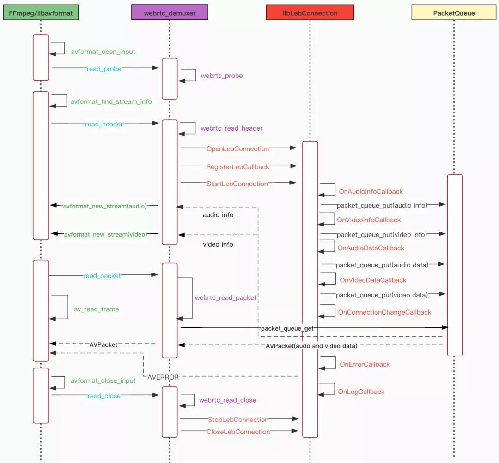

# 详解快直播传输层SDK的FFmpeg集成和编译 #

自从快直播传输层SDK发布以来，越来越多的客户通过快直播传输层SDK libLebConnection接入，其接入便捷性受到客户的肯定。libLebConnection和相应的WebRTC Demuxer实现了多个版本的迭代优化，主要有下面4点：

- 追求极致性能，提升首帧、开播成功率和卡顿等QoS指标。
- 提升SDK的易用性、稳定性和完备性。
- 打磨瘦身，SDK体积减少30%，实现ARM64打包增量不超过500K。
- 实现Android、iOS、Windows、Linux和Mac全终端平台覆盖。

前面我们已经在文章《基于ijkplayer的快直播传输层SDK应用实践》中简单介绍过如何在FFmpeg中集成libLebConnection，本文将详细展开介绍WebRTC Demuxer的实现，并给出在FFmpeg最新的4.4分支上给出配置和编译的全过程，让大家对libLebConnection使用有更加深入的理解，凭借FFmpeg强大的功能可以实现快直播的拉流、播放、媒体处理、转推等多种应用。


## 1. WebRTC Demuxer实现详解 ##


进入正题，先介绍WebRTC Demuxer的实现。通过AVInputFormat接口定义WebRTC Demuxer的接口函数webrtc_probe、webrtc_read_header、webrtc_read_packet和webrtc_read_close。如下图所示。


下图中可以很清晰的看到WebRTC Demuxer在FFmpeg/libavformat和libLebConnection之间的关系和工作流程。WebRTC Demuxer是连接FFmpeg/libavformat和快直播传输层SDK libLebConnection的桥梁，绿色是FFmpeg avformat接口、紫色是WebRTC Demuxer接口、红色是libLebConnection接口。由于libLebConnection是内部驱动的工作模式（数据通过回调的方式输出），所以需要PacketQueue来连接libLebConnection、WebRTC Demuxer和FFmpeg/libavformat，所有libLebConnection回调输出的codec信息和codec数据都存放在PacketQueue，通过webrtc_read_packet读取和处理。




下面详细介绍FFmpeg框架下libLebConnection SDK工作流程。


**第一步. avformat_open_input**

在avformat_open_input时通过url格式的解析来确定输入协议格式，这时就需要webrtc_probe通过url的形式来判定是否为WebRTC协议，有两种url形式：

- 第一种是webrtc://开头的url；
- 第二种是http(s)://xxxx/xx.sdp。


**第二步. avformat_find_stream_info**

avformat_find_stream_info就是读取码流的头信息，找到音视频codec信息，用来创建相应的音视频stream。对应的WebRTC Demuxer接口函数就是webrtc_read_header，分下面几个步骤：

1. 配置libLebConnection参数，创建LebConnection handle, 并注册回调函数。


2. 开始连接，内部走信令流程，直接建联拉流。


3. 开始拉流后，先收到的码流头信息，包括音频codec type、采样率和声道数信息


还有视频codec type和extradata（即H264的sps pps）


由于libLebConnection在回调线程中无法创建 stream，需要先把音视频头信息保存到PacketQueue里。当FFmpeg主线程在读到音视频头信息包的时候来创建音视频stream。

到此，avformat_find_stream_info结束，找音视频头信息并创建了相应的音视频stream，这就是大家熟知的stream probe过程。


**第三步. av_read_frame**

音视频stream创建好后，就可以通过av_read_frame读取音视频包了。对应的WebRTC Demuxer接口函数就是webrtc_read_packet。libLebConnection是内部驱动模式，音视频数据通过回调函数OnAudioDataCallback和OnVideoDataCallback放入PacketQueue，再由webrtc_read_packet从PacketQueue中读取AVPacket数据和并由libavformat解析，最后通过av_read_frame读取。


av_read_frame读到音视频AVPacket数据后，就是FFmpeg通用的解码和媒体处理pipline了。

**第四步. avformat_close_input**

停止和关闭LebConnection，释放掉PacketQueue。 


 
## 2. FFmpeg配置和编译 ##


下面开始讲如何将libLebConnection编译进FFmpeg，以Mac平台为例。

**第一步. 准备好FFmpeg最新代码**

```
git clone https://github.com/FFmpeg/FFmpeg.git
cd FFmpeg
git checkout release/4.4
git pull
```

**第二步. 下载libLebConnectionSDK，解压最新SDK**

目前
最新版本是v1.0.3.1

```
git clone https://github.com/tencentyun/libLebConnectionSDK

cd libLebConnectionSDK

unzip -d /mywork/libLebConnection libs/v1.0.3.1/libLebConnection_mac_v1.0.3_twebrtc082906bfc8_tffmpeg2d527017e1_2021-12-01-19-46.zip
```

**第三步. 修改FFmpeg配置文件Configure和编译**

修改配置支持--enable-libLebConnection参数，如下图:


执行配置

```
./configure --enable-libLebConnection --enable-pic --enable-gpl --enable-nonfree  --disable-doc --extra-cflags=-I/mywork/libLebConnection/include/ --extra-ldflags=-L/mywork/libLebConnection/libs/x64/ --extra-libs='-lLebConnection_a -lc++'"
```

注意：Mac平台我们SDK是采用静态库的形式，Linux我们采用是的动态库的形式，需要配置动态库链接的位置

	export LD_LIBRARY_PATH=/mywork/libLebConnection/libs/x64/:$LD_LIBRARY_PATH 

或者直接把路径添加到/etc/ld.so.conf里


执行编译 `make -j8 & make install`

**第四步. ffplay拉流播放测试**

通过下面一个简单ffplay命令就可以执行拉流播放了。

ffplay webrtc://5664.liveplay.myqcloud.com/live/5664_harchar1

通过ffplay --help | grep webrtc 可以查询到webrtc dexumer的所有option参数。

其中：

-webrtc_server_address可以指定域名和IP，在需要测试环境时经常用到。

-webrtc_dump_file开启音视频裸数据dump，用来排除问题非常方便。

-webrtc_min_delay可以指定CDN回退下发数据量，有效减少因开播回退数据多而导致的带宽峰值大和快进追帧问题。


下面验证下快直播的抗弱网性能，设置30%的丢包率，此时ping已经大概率timeout，标准直播的http flv已经无法开播，而快直播仍旧能快速起播和流畅播放。


4. 小结与展望


本文详细介绍了快直播传输层SDK libLebConnection的FFmpeg集成和编译，特别是通过WebRTC Demuxer的代码剖析详细讲解了libLebConnection的使用。用户也可以参照实现自己播放器的Demuxer。对比标准直播，快直播在延迟接近的情况下QoS指标远优于标准直播，而卡顿指标接近的情况下，延迟能低于标准直播90%以上。用户可以根据业务需求选择目标延迟，平衡卡顿和延迟，实现最佳的播放体验。所以，快直播能完全替代标准直播，提供更好的服务质量，满足更多直播场景需求。最后请大家关注github上libLebConnectionSDK项目。（https://github.com/tencentyun/libLebConnectionSDK）

一波新功能、新优化正在路上，敬请期待。

原文链接：关注微信公众号 “腾讯云音视频”


图片

腾讯云音视频在音视频领域已有超过21年的技术积累，持续支持国内90%的音视频客户实现云上创新，独家具备 RT-ONE™ 全球网络，在此基础上，构建了业界最完整的 PaaS 产品家族，并通过腾讯云视立方 RT-Cube™ 提供All in One 的终端SDK，助力客户一键获取众多腾讯云音视频能力。腾讯云音视频为全真互联时代，提供坚实的数字化助力。