# 超详细讲解IJKPlayer的播放器实战和源码分析(1) #

## 0.引言 ##

关于本篇文章的学习，一定要先学习ffplay源码，对ffplay源码的整个流程要理解，才能够理解本篇文章，那就需要参考前面的文章。文章列表如下:

详细介绍ffplay命令(1)

FFmpeg的FFplay框架分析

超详细解析FFplay之音视频同步

超详细解析FFplay之音视频控制

超详细解析FFplay之数据读取线程

FFplay超详细数据结构分析

超详细解析FFplay之音视频SEEK操作

超详细解析FFplay之音视频解码线程

超详细解析FFplay之视频输出和尺寸变换模块

超详细解析FFplay之音视频输出模块


注意:本篇文章篇幅非常长，阅读起来需要花一些时间，接下来就开始认真学习IJKPlayer吧。


## 1.ijkplayer简述 ##

本篇文章主要讲解ijkplayer重要源码分析(拉取的是最新的源码)和如何移植源码到qt的方法。ijkplayer是一个基于FFPlay源码的轻量级Android/iOS视频播放器，实现了跨平台的功能，API易于集成；编译配置可裁剪，⽅便控制安装包大小。接口和结构会直接借鉴IJKPlayer和ffplay。IJKPlayer和ffplay接口都是可以做到商用，可以使用这2种接口快速开发，如果做音视频的人很少，那可以直接基于这些接口开发。达到一个ijkplayer的效果。

ijkplayer源码地址：

https://gitee.com/mirrors/ijkplayer

界面如下:

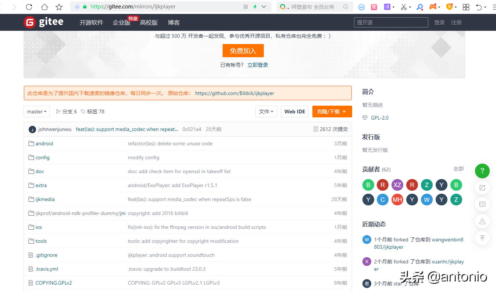
超详细讲解IJKPlayer的播放器实战和源码分析(1)

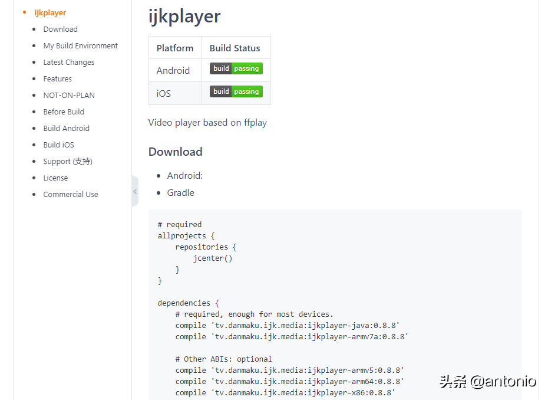
超详细讲解IJKPlayer的播放器实战和源码分析(1)

2.ijkplayer目录结构

在功能的具体实现上，iOS和Android平台的差异主要表现在视频硬件解码以及⾳视频渲染⽅⾯，两者实现的载体区别如下图所示：

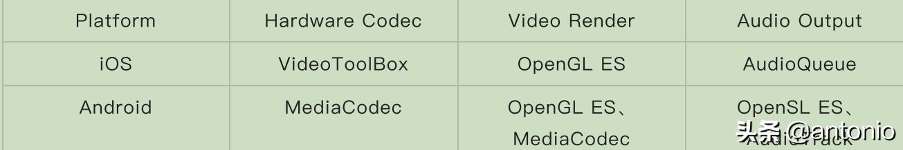
超详细讲解IJKPlayer的播放器实战和源码分析(1)

ijkplayer源码主要由andoid、config、doc、extra、ijkmedia、ijkprof、ios、tools、xxx.sh、，ijkplayer源码的目录结构如下：


超详细讲解IJKPlayer的播放器实战和源码分析(1)

(1)android目录:android平台相关的上层接口封装以及平台相关方法，里面还有各种编译脚本相关，不同指令集的源码版本，如v7和v8等，还有一些patch相关的记录。具体细节部分，可以自行下载源码，然后阅读。

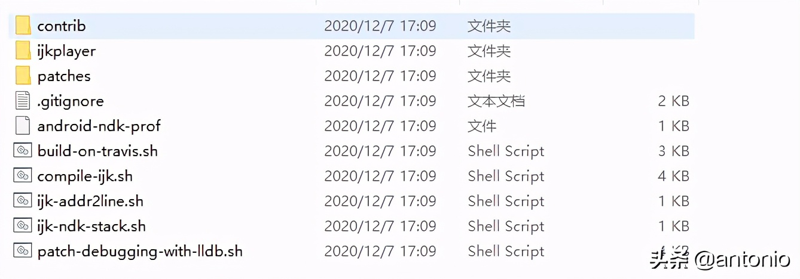
超详细讲解IJKPlayer的播放器实战和源码分析(1)

编译脚本:

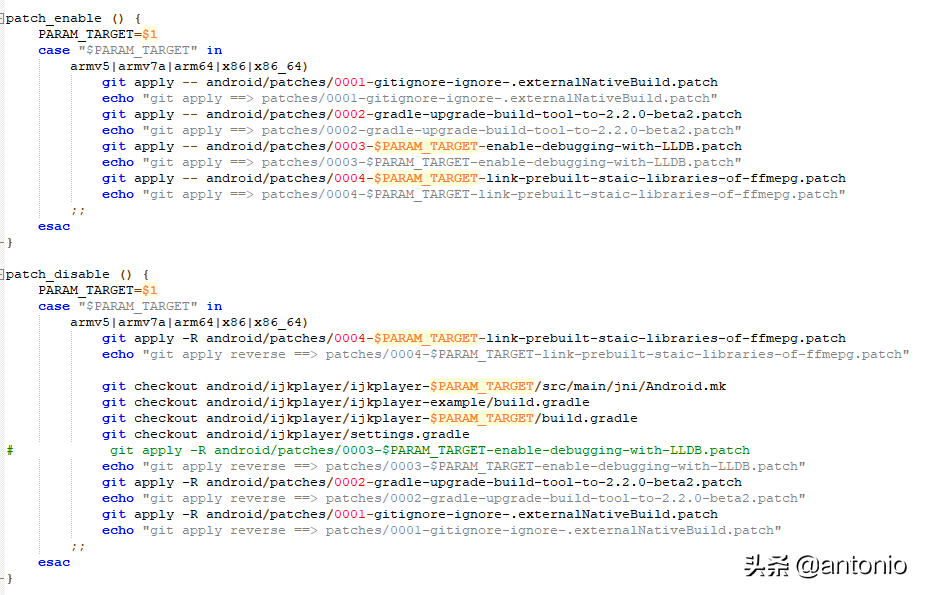
超详细讲解IJKPlayer的播放器实战和源码分析(1)

(2)config目录：主要是编译ffmpeg使用的配置文件，如编译什么模块，如何编译HEVC等。如下图:

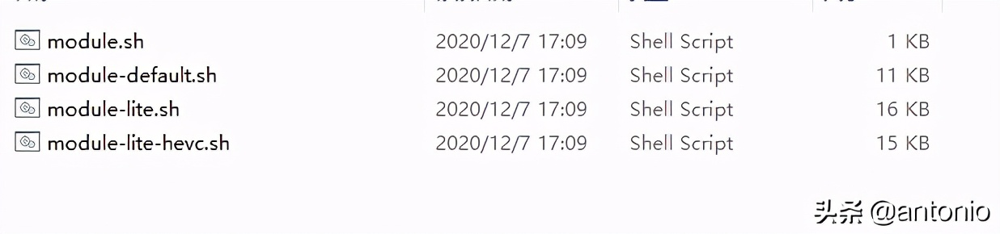
超详细讲解IJKPlayer的播放器实战和源码分析(1)

(3)extra目录：存放编译ijkplayer所需的依赖源文件，如ffmpeg、openssl、libyuv等。

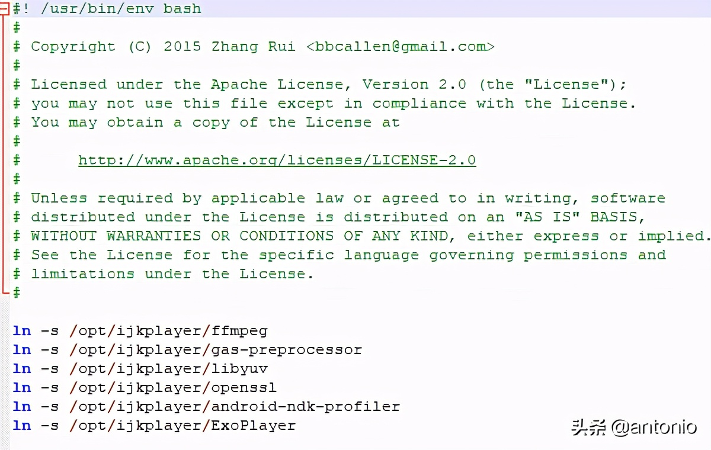
超详细讲解IJKPlayer的播放器实战和源码分析(1)

(4)ijkmedia目录：这里面就是关于底层源码，包括jni，ffplay的源码。

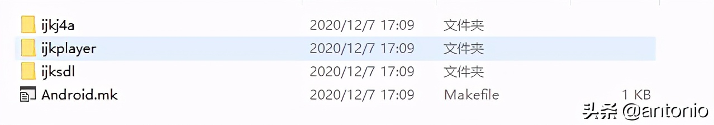
超详细讲解IJKPlayer的播放器实战和源码分析(1)

(5)ijkprof目录：这个目录里面不太重要，内容不是很多。


超详细讲解IJKPlayer的播放器实战和源码分析(1)

(6)ios目录：ios平台上的上层接口封装及平台相关方法，同时也有一些编译脚本。

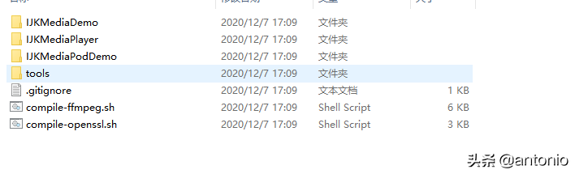
超详细讲解IJKPlayer的播放器实战和源码分析(1)

(7)tools:表示初始化项目工程脚本。

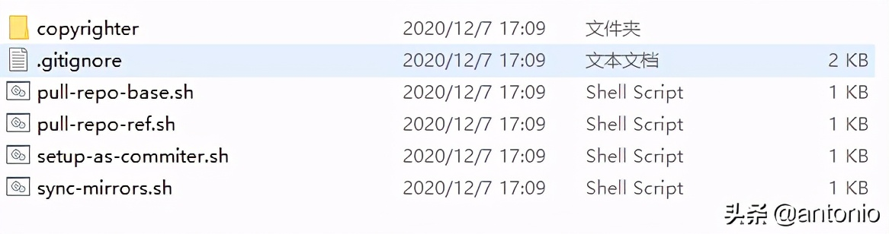
超详细讲解IJKPlayer的播放器实战和源码分析(1)

注意:上面目录的脚本也很多，每个脚本都有相应的功能，这些在做SDK时，也是值得我们参考和学习。


## 3.整体播放流程 ##

read_thread线程负责解复用，，video_thread负责视频解码，audio_thread负责音频解码，ffplay的控制和显示是在一个线程，自己设计的这个播放器，控制和显示就不在同一个线程。控制就是在UI里面的子线程，如video_refresh_thread。

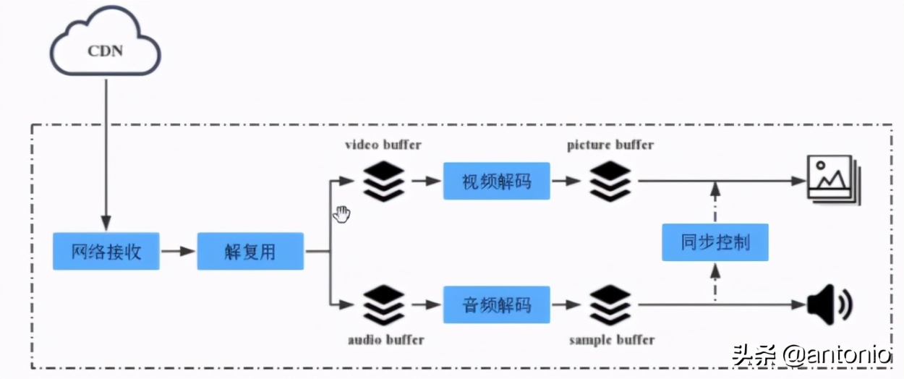
超详细讲解IJKPlayer的播放器实战和源码分析(1)

(1)把ijk的源码建立一个srcinsight的工程，可以很明显看到，ijk就是基于ffplay(特别是有些结构体，如packet队列，frame队列，都是照搬ffplay)做的优化和修改，在ff_ffplay_def.f里的结构体，下面这个FFPlayer的结构体是ijk重新又封装了，如下:

```
/* ffplayer */
struct IjkMediaMeta;
struct IJKFF_Pipeline;
typedef struct FFPlayer {
    const AVClass *av_class;

    /* ffplay context */
    VideoState *is;

    /* format/codec options */
    AVDictionary *format_opts;
    AVDictionary *codec_opts;
    AVDictionary *sws_dict;
    AVDictionary *player_opts;
    AVDictionary *swr_opts;
    AVDictionary *swr_preset_opts;

    /* ffplay options specified by the user */
#ifdef FFP_MERGE
    AVInputFormat *file_iformat;
#endif
    char *input_filename;
#ifdef FFP_MERGE
    const char *window_title;
    int fs_screen_width;
    int fs_screen_height;
    int default_width;
    int default_height;
    int screen_width;
    int screen_height;
#endif
    int audio_disable;
    int video_disable;
    int subtitle_disable;
    const char* wanted_stream_spec[AVMEDIA_TYPE_NB];
    int seek_by_bytes;
    int display_disable;
    int show_status;
    int av_sync_type;
    int64_t start_time;
    int64_t duration;
    int fast;
    int genpts;
    int lowres;
    int decoder_reorder_pts;
    int autoexit;
#ifdef FFP_MERGE
    int exit_on_keydown;
    int exit_on_mousedown;
#endif
    int loop;
    int framedrop;
    int64_t seek_at_start;
    int subtitle;
    int infinite_buffer;
    enum ShowMode show_mode;
    char *audio_codec_name;
    char *subtitle_codec_name;
    char *video_codec_name;
    double rdftspeed;
#ifdef FFP_MERGE
    int64_t cursor_last_shown;
    int cursor_hidden;
#endif
#if CONFIG_AVFILTER
    const char **vfilters_list;
    int nb_vfilters;
    char *afilters;
    char *vfilter0;
#endif
    int autorotate;
    int find_stream_info;
    unsigned sws_flags;

    /* current context */
#ifdef FFP_MERGE
    int is_full_screen;
#endif
    int64_t audio_callback_time;
#ifdef FFP_MERGE
    SDL_Surface *screen;
#endif

    /* extra fields */
    SDL_Aout *aout;
    SDL_Vout *vout;
    struct IJKFF_Pipeline *pipeline;
    struct IJKFF_Pipenode *node_vdec;
    int sar_num;
    int sar_den;

    char *video_codec_info;
    char *audio_codec_info;
    char *subtitle_codec_info;
    Uint32 overlay_format;

    int last_error;
    int prepared;
    int auto_resume;
    int error;
    int error_count;
    int start_on_prepared;
    int first_video_frame_rendered;
    int first_audio_frame_rendered;
    int sync_av_start;

    MessageQueue msg_queue;

    int64_t playable_duration_ms;

    int packet_buffering;
    int pictq_size;
    int max_fps;
    int startup_volume;

    int videotoolbox;
    int vtb_max_frame_width;
    int vtb_async;
    int vtb_wait_async;
    int vtb_handle_resolution_change;

    int mediacodec_all_videos;
    int mediacodec_avc;
    int mediacodec_hevc;
    int mediacodec_mpeg2;
    int mediacodec_mpeg4;
    int mediacodec_handle_resolution_change;
    int mediacodec_auto_rotate;

    int opensles;
    int soundtouch_enable;

    char *iformat_name;

    int no_time_adjust;
    double preset_5_1_center_mix_level;

    struct IjkMediaMeta *meta;

    SDL_SpeedSampler vfps_sampler;
    SDL_SpeedSampler vdps_sampler;

    /* filters */
    SDL_mutex  *vf_mutex;
    SDL_mutex  *af_mutex;
    int         vf_changed;
    int         af_changed;
    float       pf_playback_rate;
    int         pf_playback_rate_changed;
    float       pf_playback_volume;
    int         pf_playback_volume_changed;

    void               *inject_opaque;
    void               *ijkio_inject_opaque;
    FFStatistic         stat;
    FFDemuxCacheControl dcc;

    AVApplicationContext *app_ctx;
    IjkIOManagerContext *ijkio_manager_ctx;

    int enable_accurate_seek;
    int accurate_seek_timeout;
    int mediacodec_sync;
    int skip_calc_frame_rate;
    int get_frame_mode;
    GetImgInfo *get_img_info;
    int async_init_decoder;
    char *video_mime_type;
    char *mediacodec_default_name;
    int ijkmeta_delay_init;
    int render_wait_start;
    int is_manifest;
    LasPlayerStatistic las_player_statistic;
} FFPlayer;
```

(2)Packet队列数据结构如下。

```
typedef struct PacketQueue {
    MyAVPacketList *first_pkt, *last_pkt;
    int nb_packets;
    int size;
    int64_t duration;
    int abort_request;
    int serial;
    SDL_mutex *mutex;
    SDL_cond *cond;
    MyAVPacketList *recycle_pkt;
    int recycle_count;
    int alloc_count;

    int is_buffer_indicator;
} PacketQueue;
```

(3)Frame队列数据结构如下。

```
typedef struct FrameQueue {
    Frame queue[FRAME_QUEUE_SIZE];
    int rindex;
    int windex;
    int size;
 。。。
} FrameQueue;
```

注意：如果不懂前面ffplay的，可以看看前面的文章，这是理解ijk的基础。


(4)在ijk源码中，ff_ffplay.h是总体的一个头文件和对外提供接口的头文件。

```
//创建多个播放器
FFPlayer *ffp_create();
void      ffp_destroy(FFPlayer *ffp);
void      ffp_destroy_p(FFPlayer **pffp);
void      ffp_reset(FFPlayer *ffp);
```

(5)播放前设置参数的接口

```
/* set options before ffp_prepare_async_l() */

void     ffp_set_frame_at_time(FFPlayer *ffp, const char *path, int64_t start_time, int64_t end_time, int num, int definition);
void     *ffp_set_inject_opaque(FFPlayer *ffp, void *opaque);
void     *ffp_set_ijkio_inject_opaque(FFPlayer *ffp, void *opaque);
void      ffp_set_option(FFPlayer *ffp, int opt_category, const char *name, const char *value);
void      ffp_set_option_int(FFPlayer *ffp, int opt_category, const char *name, int64_t value);

int       ffp_get_video_codec_info(FFPlayer *ffp, char **codec_info);
int       ffp_get_audio_codec_info(FFPlayer *ffp, char **codec_info);
```

(6)播放控制

```
/* playback controll */
int       ffp_prepare_async_l(FFPlayer *ffp, const char *file_name);
int       ffp_start_from_l(FFPlayer *ffp, long msec);
int       ffp_start_l(FFPlayer *ffp);
int       ffp_pause_l(FFPlayer *ffp);
int       ffp_is_paused_l(FFPlayer *ffp);
int       ffp_stop_l(FFPlayer *ffp);
int       ffp_wait_stop_l(FFPlayer *ffp);

/* all in milliseconds */
int       ffp_seek_to_l(FFPlayer *ffp, long msec);
long      ffp_get_current_position_l(FFPlayer *ffp);
long      ffp_get_duration_l(FFPlayer *ffp);
long      ffp_get_playable_duration_l(FFPlayer *ffp);
void      ffp_set_loop(FFPlayer *ffp, int loop);
int       ffp_get_loop(FFPlayer *ffp);
```

(7)ff_ffmsg.h主要是一些回调信息，及时反馈的一些错误码信息。如下图:

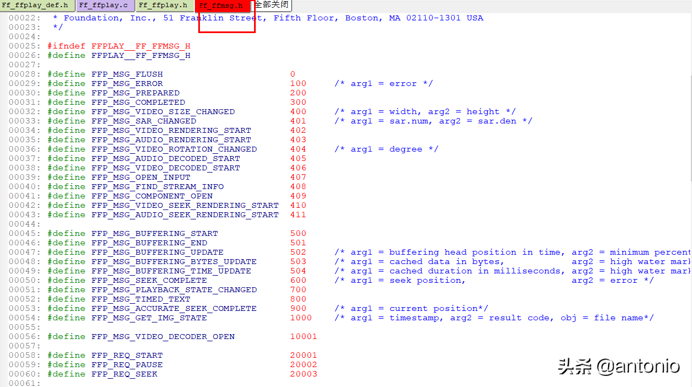
超详细讲解IJKPlayer的播放器实战和源码分析(1)

## 4.移植重要源码到QT平台 ##

添加顺序依次为

ff_ffplay_def.h

ff_fferror.h

ff_ffmsg.h

ff_ffplay.h:主要是对外提供接口。

(1)添加如下头文件

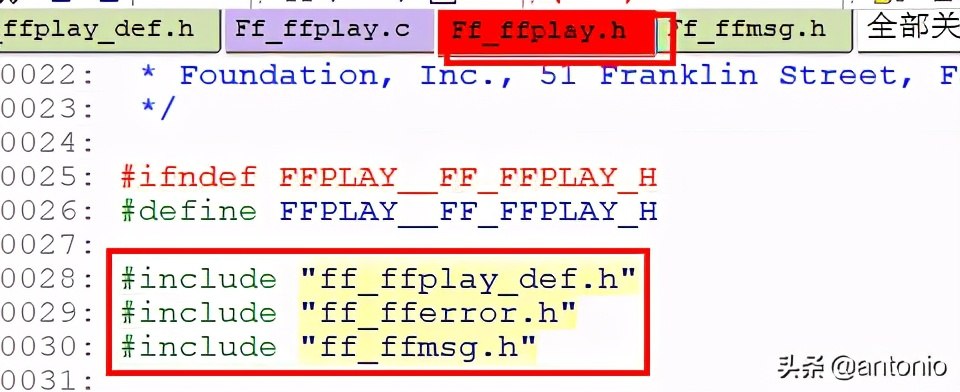
超详细讲解IJKPlayer的播放器实战和源码分析(1)

.jfif)
超详细讲解IJKPlayer的播放器实战和源码分析(1)

在qt项目下，新建头文件，

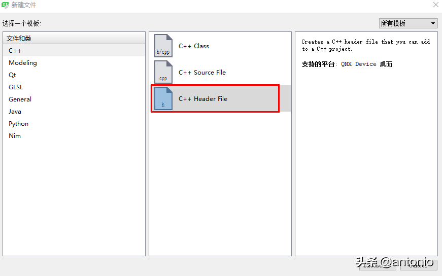
超详细讲解IJKPlayer的播放器实战和源码分析(1)

(2)创建目录在src下，名字为ff_ffplay_def.h，如下图所示:

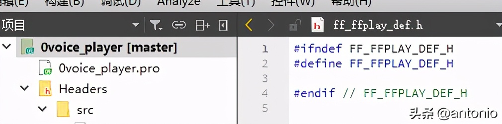
超详细讲解IJKPlayer的播放器实战和源码分析(1)

并在ff_ffplay_def.h下添加如下的头文件，这些头文件也主要是来源于ffplay.c，添加如下:

```
#include <inttypes.h>
#include <math.h>
#include <limits.h>
#include <signal.h>
#include <stdint.h>

#include "libavutil/avstring.h"
#include "libavutil/eval.h"
#include "libavutil/mathematics.h"
#include "libavutil/pixdesc.h"
#include "libavutil/imgutils.h"
#include "libavutil/dict.h"
#include "libavutil/parseutils.h"
#include "libavutil/samplefmt.h"
#include "libavutil/avassert.h"
#include "libavutil/time.h"
#include "libavformat/avformat.h"
#include "libavdevice/avdevice.h"
#include "libswscale/swscale.h"
#include "libavutil/opt.h"
#include "libavcodec/avfft.h"
#include "libswresample/swresample.h"
```

(3)添加ff_fferror.h，如下:


超详细讲解IJKPlayer的播放器实战和源码分析(1)

(4)包含头文件

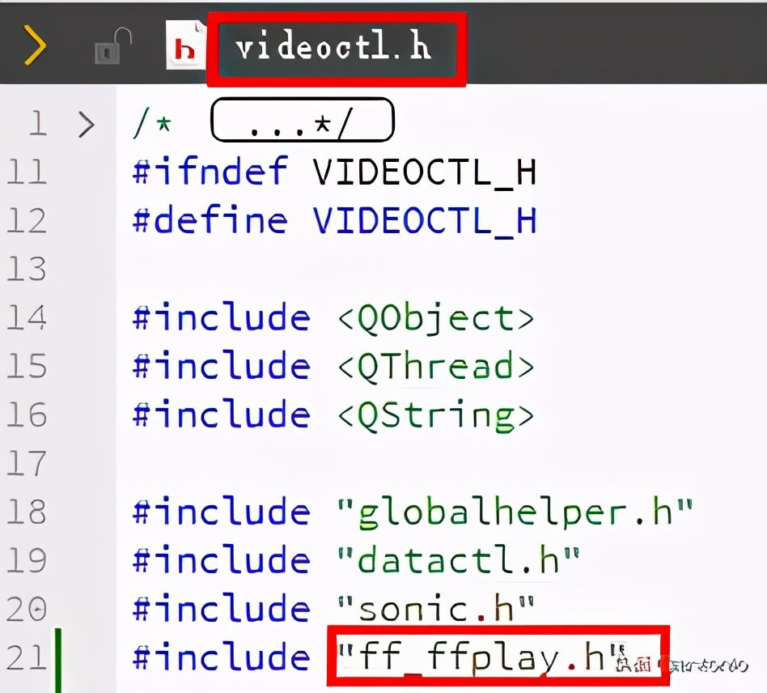
超详细讲解IJKPlayer的播放器实战和源码分析(1)

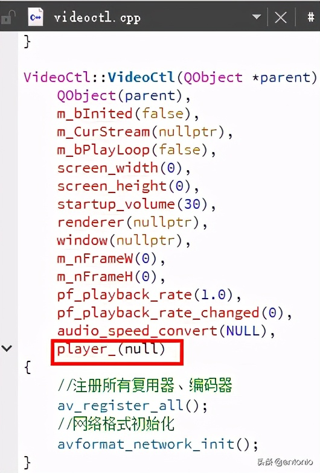
超详细讲解IJKPlayer的播放器实战和源码分析(1)

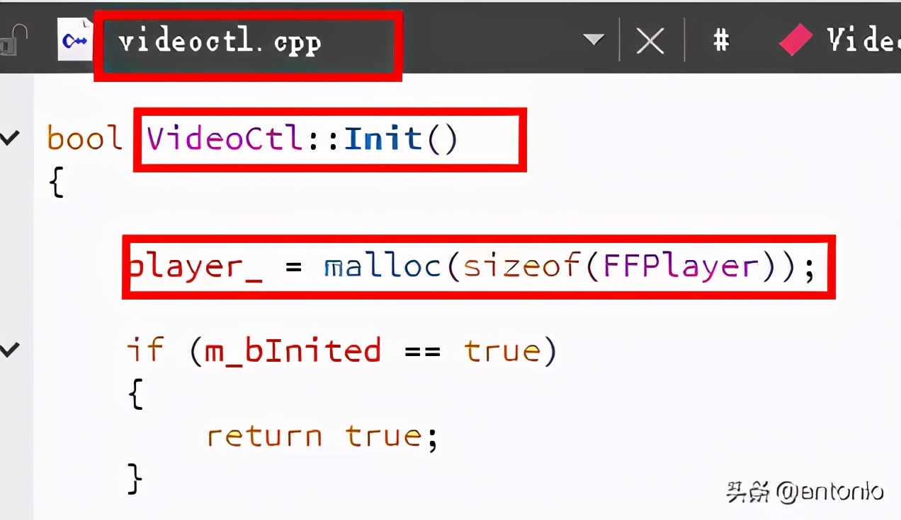
超详细讲解IJKPlayer的播放器实战和源码分析(1)

(5)结构体IjkMediaPlayer包含了FFPlayer结构体，代码如下图所示:

```
struct IjkMediaPlayer {
    volatile int ref_count;
    pthread_mutex_t mutex;
    FFPlayer *ffplayer;

    int (*msg_loop)(void*);
    SDL_Thread *msg_thread;
    SDL_Thread _msg_thread;

    int mp_state;
    char *data_source;
    void *weak_thiz;

    int restart;
    int restart_from_beginning;
    int seek_req;
    long seek_msec;
};
```

(6)ijkplayer主要在移动端的解决方案，调用层次由java(是一个控件，显示画面，暂停，播放等，主要是业务相关)->ijkplayer_jni.c(jni)->ijkplayer.c->ff_ffplay.c。


(7)创建文件，qt接口，通过信号槽去触发，面向接口去编程，保证底层的ffplay.c的实现层不变。命名为ijkplayer_qt.cpp和ijkplayer_qt.h。这边就需要添加上ijkplayer.h、ijkplayer.c、ff_ffplay.c。


创建一个类，命名为ijkplayer_qt，如下图:

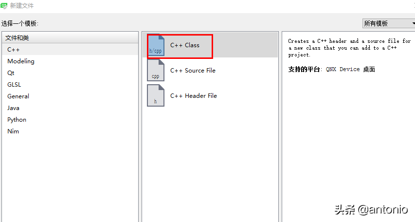
超详细讲解IJKPlayer的播放器实战和源码分析(1)

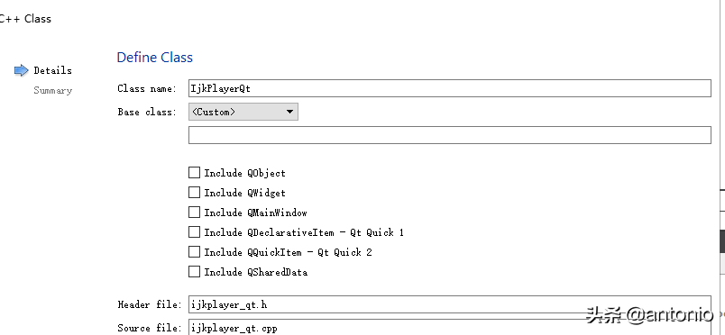
超详细讲解IJKPlayer的播放器实战和源码分析(1)

(8)在ijkplayer_qt.h添加如下源码:

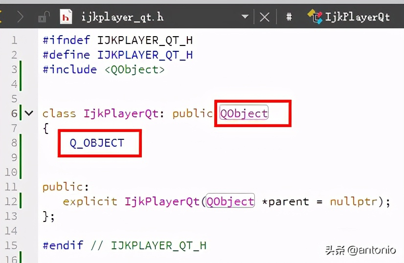
超详细讲解IJKPlayer的播放器实战和源码分析(1)

ijkplayer_qt.cpp添加如下源码:

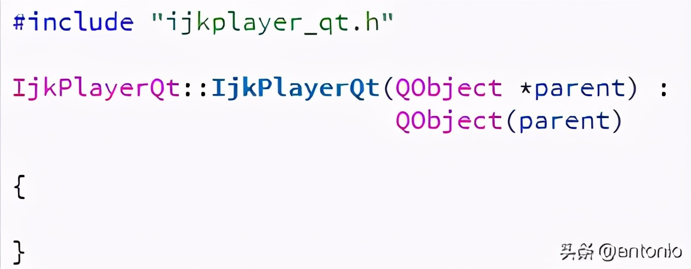
超详细讲解IJKPlayer的播放器实战和源码分析(1)

注意:现在主要是把架子搭起来。


(9)创建ijkplayer.h，如下图所示:


超详细讲解IJKPlayer的播放器实战和源码分析(1)

创建ijkplayer.cpp，如下图所示:

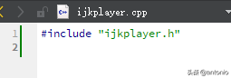
超详细讲解IJKPlayer的播放器实战和源码分析(1)

(10)创建ff_ffplay.c，如下图所示:


超详细讲解IJKPlayer的播放器实战和源码分析(1)

先实现一些初始化相关的工作，如下图所示：

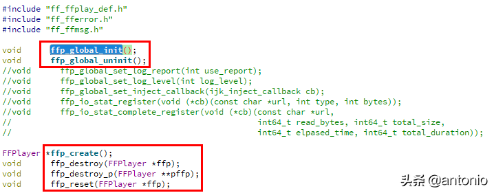
超详细讲解IJKPlayer的播放器实战和源码分析(1)

在ff_ffplay.c里做的一些工作，如下图所示:

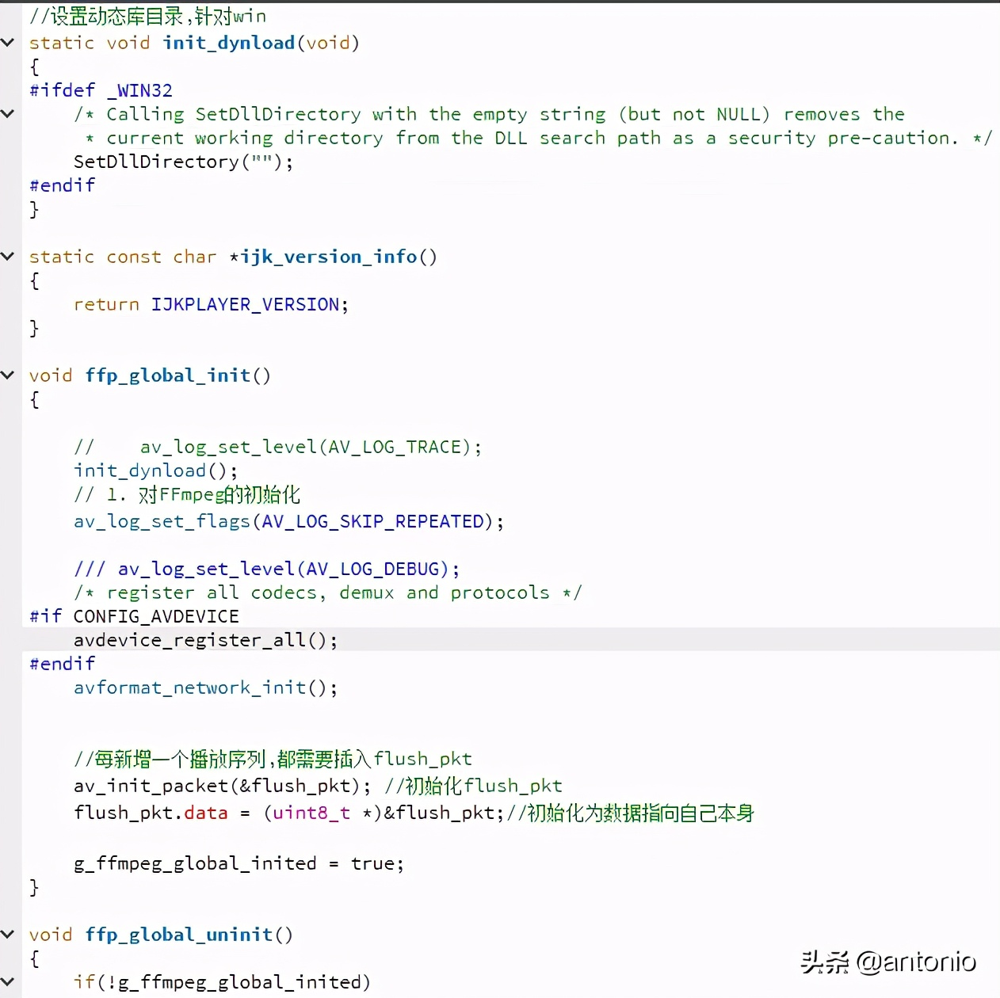
超详细讲解IJKPlayer的播放器实战和源码分析(1)

(11)添加消息队列接口ff_ffmsg.h，如下:


超详细讲解IJKPlayer的播放器实战和源码分析(1)

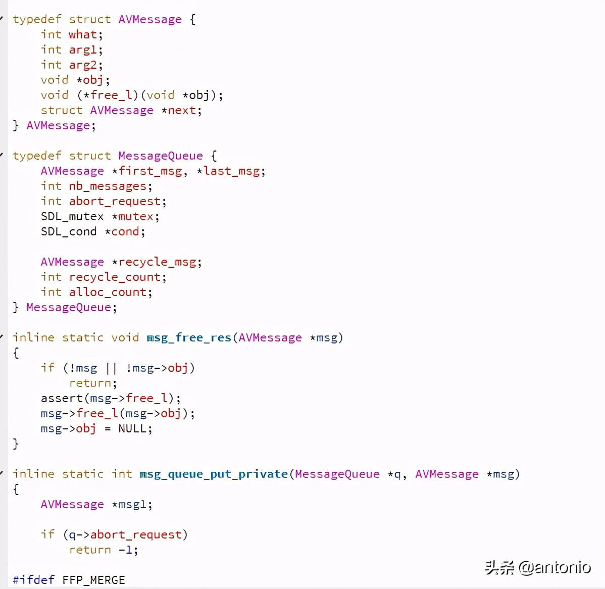
超详细讲解IJKPlayer的播放器实战和源码分析(1)

(12)添加config文件，如下:

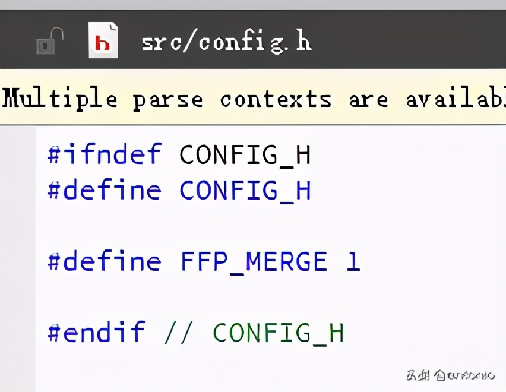
超详细讲解IJKPlayer的播放器实战和源码分析(1)

(13)添加ff_ffinc.h文件，如下:

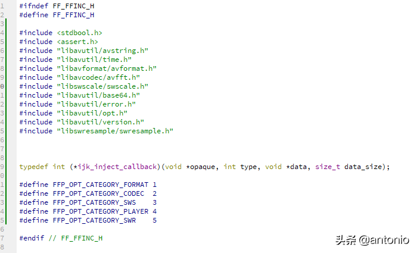
超详细讲解IJKPlayer的播放器实战和源码分析(1)

(14)消息队列的设计

qt播放按钮->IjkPlayerQt->IjkPlayer.cpp->ff_ffplay.c

创建一个结构体IjkMediaPlayer，这个结构体到时候要放在IjkPlayerQt使用。该结构体里面会包含FFPlayer，这样一种关联关系。同样要像IJK源码一样，实现一个loop的效果。

消息队列

初始化Init函数，创建player

信号槽

开启队列

设置资源

创建文件ijkplayer_internal.h。如下界面:


超详细讲解IJKPlayer的播放器实战和源码分析(1)

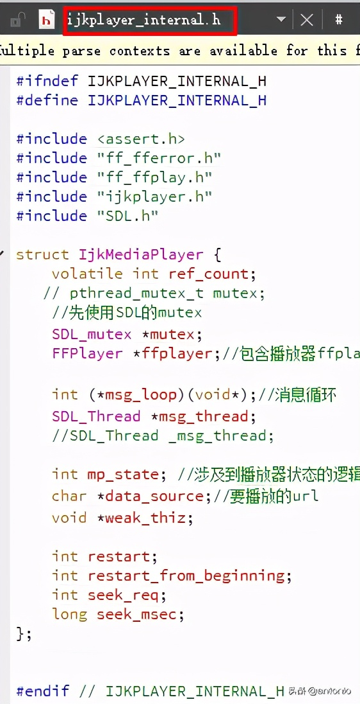
超详细讲解IJKPlayer的播放器实战和源码分析(1)

第二版编译完成。暂时没有报错。


## 5.Android初始化流程 ##

播放的步骤:

设置播放源:ijkmp_set_data_source

启动播放:ijkmp_prepare_async

(1)创建播放器对象。函数

IjkMediaPlayer_native_setup(JNIEnv *env, jobject thiz, jobject weak_this)调用ijkmp_android_create(message_loop)，message_loop作为回调函数被传入。代码如下图所示:

```
/**
 *  \brief Copy a portion of the texture to the current rendering target.
 *
 *  \param renderer The renderer which should copy parts of a texture.
 *  \param texture The source texture.
 *  \param srcrect   A pointer to the source rectangle, or NULL for the entire
 *                   texture.
 *  \param dstrect   A pointer to the destination rectangle, or NULL for the
 *                   entire rendering target.
 *
 *  \return 0 on success, or -1 on error
 */
extern DECLSPEC int SDLCALL SDL_RenderCopy(SDL_Renderer * renderer,
                                           SDL_Texture * texture,
                                           const SDL_Rect * srcrect,
                                           const SDL_Rect * dstrect);

```

(2)函数static int message_loop(void *arg)调用函数message_loop_n(env, mp)，代码如下图所示:

```
static int message_loop(void *arg)
{
    MPTRACE("%s\n", __func__);

    JNIEnv *env = NULL;
    if (JNI_OK != SDL_JNI_SetupThreadEnv(&env)) {
        ALOGE("%s: SetupThreadEnv failed\n", __func__);
        return -1;
    }

    IjkMediaPlayer *mp = (IjkMediaPlayer*) arg;
    JNI_CHECK_GOTO(mp, env, NULL, "mpjni: native_message_loop: null mp", LABEL_RETURN);

    message_loop_n(env, mp);

LABEL_RETURN:
    ijkmp_dec_ref_p(&mp);

    MPTRACE("message_loop exit");
    return 0;
}
```

(3)ijkplayer_jni.c(jni)在这里有个循环控制入口，由这个函数进去。代码如下图所示:

	SDL_SetRenderDrawColor(renderer, 255, 0, 0, 255)

(4)函数message_loop_n(JNIEnv *env, IjkMediaPlayer *mp)调用这个函数ijkmp_get_msg(mp, &msg, 1)(涉及到消息队列这块)是非常重要。


## 6.播放流程 ##

函数ijkmp_set_data_source从IDLE到INTIALIZED只是设置一个播放的url。函数ijkmp_prepare_async，从INTIALIZED到ASYNC_PREPING，是一个异步操作，做一些播放器的初始化工作。然后就到PREPARED状态，这时候表示初始化工作完成，然后调用ijkmp_start，到STARTED状态。播放流程的状态机如下图所示:

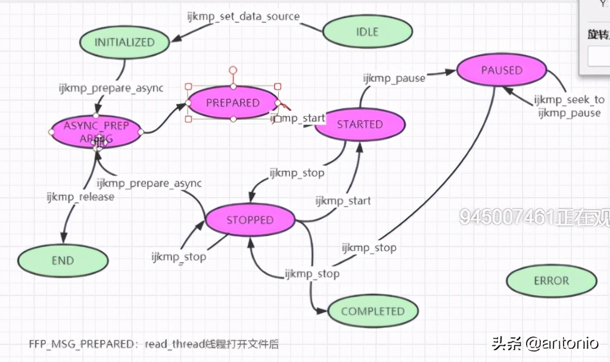
超详细讲解IJKPlayer的播放器实战和源码分析(1)

(1)播放开始流程，

```
IjkMediaPlayer_prepareAsync(JNIEnv *env, jobject thiz)->ijkmp_prepare_async(mp)->ijkmp_prepare_async_l(mp)->ffp_prepare_async_l(mp->ffplayer, mp->data_source)
```

	SDL_SetRenderTarget(renderer, NULL);

(2)播放接口

```
/**
 * \brief Set a texture as the current rendering target.
 *
 * \param renderer The renderer.
 * \param texture The targeted texture, which must be created with the SDL_TEXTUREACCESS_TARGET flag, or NULL for the default render target
 *
 * \return 0 on success, or -1 on error
 *
 *  \sa SDL_GetRenderTarget()
 */
extern DECLSPEC int SDLCALL SDL_SetRenderTarget(SDL_Renderer *renderer,
                                                SDL_Texture *texture);
```

(3)播放正真对接ffplay

```
static int ijkmp_prepare_async_l(IjkMediaPlayer *mp)
{
    assert(mp);

    MPST_RET_IF_EQ(mp->mp_state, MP_STATE_IDLE);
 
    MPST_RET_IF_EQ(mp->mp_state, MP_STATE_ASYNC_PREPARING);
    MPST_RET_IF_EQ(mp->mp_state, MP_STATE_PREPARED);
    MPST_RET_IF_EQ(mp->mp_state, MP_STATE_STARTED);
    MPST_RET_IF_EQ(mp->mp_state, MP_STATE_PAUSED);
    MPST_RET_IF_EQ(mp->mp_state, MP_STATE_COMPLETED);
    
    MPST_RET_IF_EQ(mp->mp_state, MP_STATE_ERROR);
    MPST_RET_IF_EQ(mp->mp_state, MP_STATE_END);

  

    ijkmp_change_state_l(mp, MP_STATE_ASYNC_PREPARING);

    msg_queue_start(&mp->ffplayer->msg_queue);

    // released in msg_loop
    ijkmp_inc_ref(mp);
  //创建线程，回调之前用户创造的循环函数
    mp->msg_thread = SDL_CreateThreadEx(&mp->_msg_thread, ijkmp_msg_loop, mp, "ff_msg_loop");
    // msg_thread is detached inside msg_loop
    // TODO: 9 release weak_thiz if pthread_create() failed;

    int retval = ffp_prepare_async_l(mp->ffplayer, mp->data_source);
    if (retval < 0) {
        ijkmp_change_state_l(mp, MP_STATE_ERROR);
        return retval;
    }

    return 0;
}
```

(4)通过这个接口，可以找到ffplay的函数了。

	SDL_RenderCopy(renderer, texture, NULL, NULL);


7.暂停流程

(1)函数IjkMediaPlayer_pause(JNIEnv *env, jobject thiz)->调用ijkmp_pause(mp)->ijkmp_pause_l(mp)->回调ffp_notify_msg1(mp->ffplayer, FFP_REQ_PAUSE)->msg_queue_put_simple3(&ffp->msg_queue, what, 0, 0)->msg_queue_put(q, &msg)->msg_queue_put_private(q, msg)->


```
/**
 *  \brief Update the screen with rendering performed.
 */
extern DECLSPEC void SDLCALL SDL_RenderPresent(SDL_Renderer * renderer);
```

(2)

	SDL_RenderPresent(renderer);

(3)

```
/**
 *  \brief Update the screen with rendering performed.
 */
extern DECLSPEC void SDLCALL SDL_RenderPresent(SDL_Renderer * renderer);
```

(4)如这个暂停状态来说，函数ffp_pause_l(mp->ffplayer)->toggle_pause(ffp, 1)，就到了FFplaye的源码，就会去调用这些关系。

```
int ffp_pause_l(FFPlayer *ffp)
{
    assert(ffp);
    VideoState *is = ffp->is;
    if (!is)
        return EIJK_NULL_IS_PTR;

    toggle_pause(ffp, 1);
    return 0;
}
```

(5)函数toggle_pause在ff_ffplay.c，源码如下。

```
static void toggle_pause(FFPlayer *ffp, int pause_on)
{
    SDL_LockMutex(ffp->is->play_mutex);
    toggle_pause_l(ffp, pause_on);
    SDL_UnlockMutex(ffp->is->play_mutex);
}
```

(6)


```
static void toggle_pause_l(FFPlayer *ffp, int pause_on)
{
    VideoState *is = ffp->is;
    if (is->pause_req && !pause_on) {
        set_clock(&is->vidclk, get_clock(&is->vidclk), is->vidclk.serial);
        set_clock(&is->audclk, get_clock(&is->audclk), is->audclk.serial);
    }
    is->pause_req = pause_on;
    ffp->auto_resume = !pause_on;
    stream_update_pause_l(ffp);
    is->step = 0;
}
```

暂停成功后，就会去调用函数ijkmp_change_state_l(mp, MP_STATE_PAUSED)，去修改暂停状态。这个时候如果需要在java层去显示，那就需要反馈给java层去显示或通知用户。


## 8.消息通知 ##

(1)使用消息通知的方式，做出相应的操作。

	SDL_WaitEvent(&event);

(2)将消息放到消息队列里面去。

	SDL_PushEvent(&event_q);

(3)

```
inline static int msg_queue_put(MessageQueue *q, AVMessage *msg)
{
    int ret;

    SDL_LockMutex(q->mutex);
    ret = msg_queue_put_private(q, msg);
    SDL_UnlockMutex(q->mutex);

    return ret;
}
```

(4)使用链表把消息串起来，并使用信号量SDL_CondSignal(q->cond)来通知其它线程去读取消息。

	SDL_PumpEvents()；


(5)由这个函数ijkmp_get_msg(IjkMediaPlayer *mp, AVMessage *msg, int block)去读取消息队列的消息(如暂停的消息)，这个函数在前面也已经分析过了，即可以送到java层，也可以送到ffplay层，源码如下:

	SDL_PeepEvents()；


9.播放流程测试

在bin目录下，这个目录有这个日志文件:

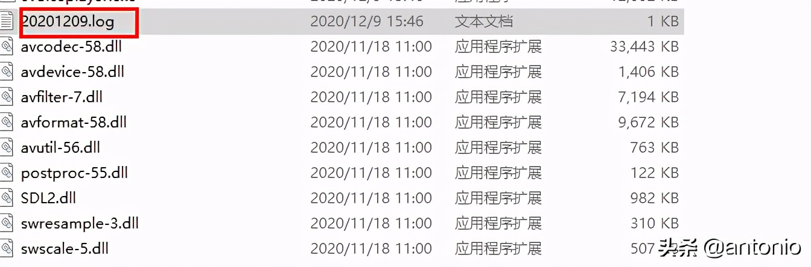
超详细讲解IJKPlayer的播放器实战和源码分析(1)

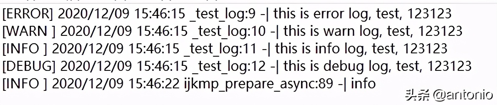
超详细讲解IJKPlayer的播放器实战和源码分析(1)

10.IJK播放器时序

下面继续讲讲，如何从java层一直到ffplay的函数调用和分析。java层到ffplay的时序图如下:

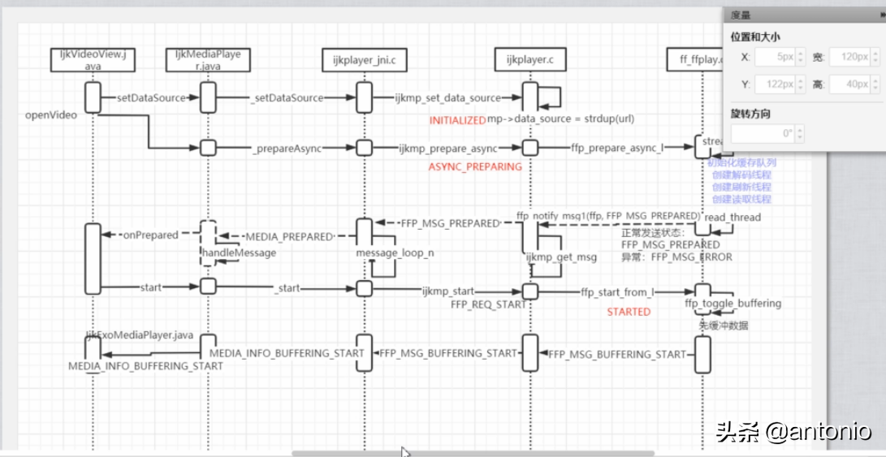
超详细讲解IJKPlayer的播放器实战和源码分析(1)

(1)

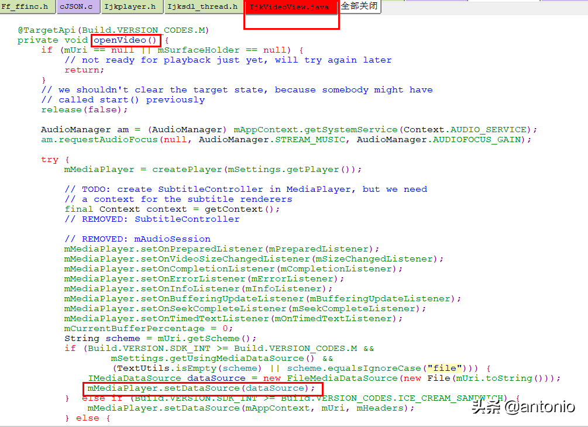
超详细讲解IJKPlayer的播放器实战和源码分析(1)

(2)

ijkMediaPlayer.java

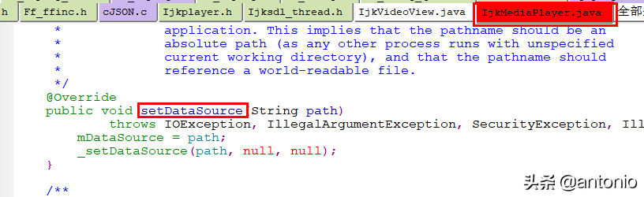
超详细讲解IJKPlayer的播放器实战和源码分析(1)

(3)进入底层

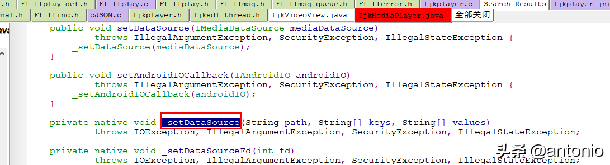
超详细讲解IJKPlayer的播放器实战和源码分析(1)

(4)对接native层的文件，这是一种静态注册的方法。

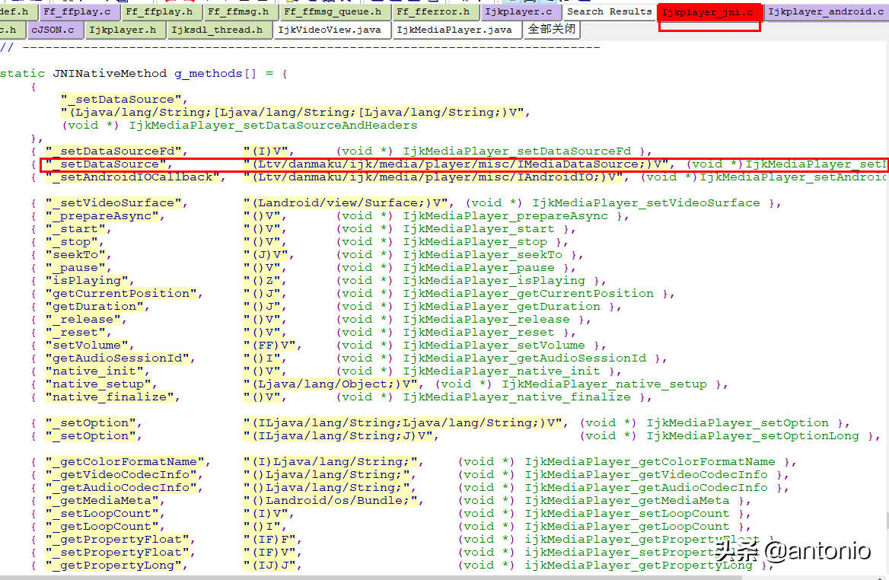
超详细讲解IJKPlayer的播放器实战和源码分析(1)

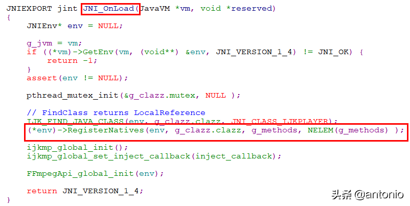
超详细讲解IJKPlayer的播放器实战和源码分析(1)

(5)对接的就是ijkplayer_jni.c(这一层全是对接的java的native方法)的函数static void
IjkMediaPlayer_setDataSourceCallback(JNIEnv *env, jobject thiz, jobject callback)

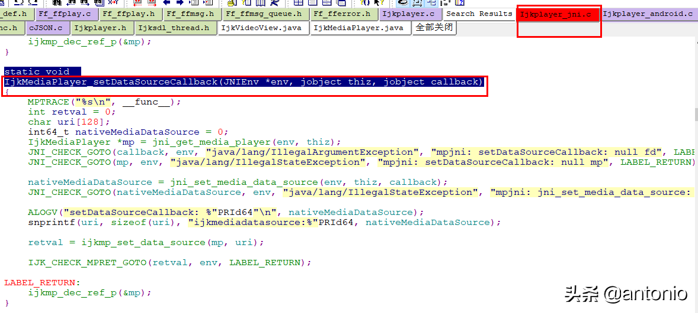
超详细讲解IJKPlayer的播放器实战和源码分析(1)

(6)再到了ijkplayer.c，调用这个函数int ijkmp_set_data_source(IjkMediaPlayer *mp, const char *url)。

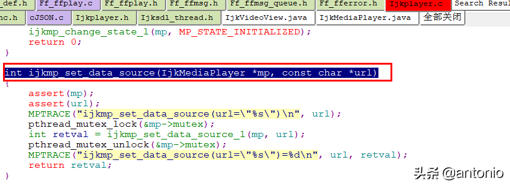
超详细讲解IJKPlayer的播放器实战和源码分析(1)

(7)在ijkplayer.c文件中，代码风格是这样的，如ijkmp_set_data_source，主要是负责加锁，避免多线程的问题。那真正干活的就是ijkmp_set_data_source_I。保存地址，更改播放器状态。如下:

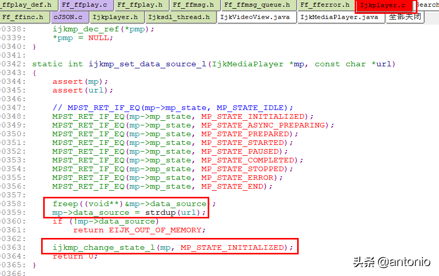
超详细讲解IJKPlayer的播放器实战和源码分析(1)

## 11.播放流程 ##

(1)在文件IjkMediaPlayer.java中，函数prepareAsync()中，调用如下函数:

异步准备调用:

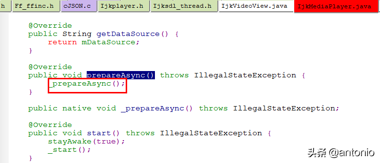
超详细讲解IJKPlayer的播放器实战和源码分析(1)

(2)在前面已经讲了设置好url的流程，就准备开始播了。如下调用关系:

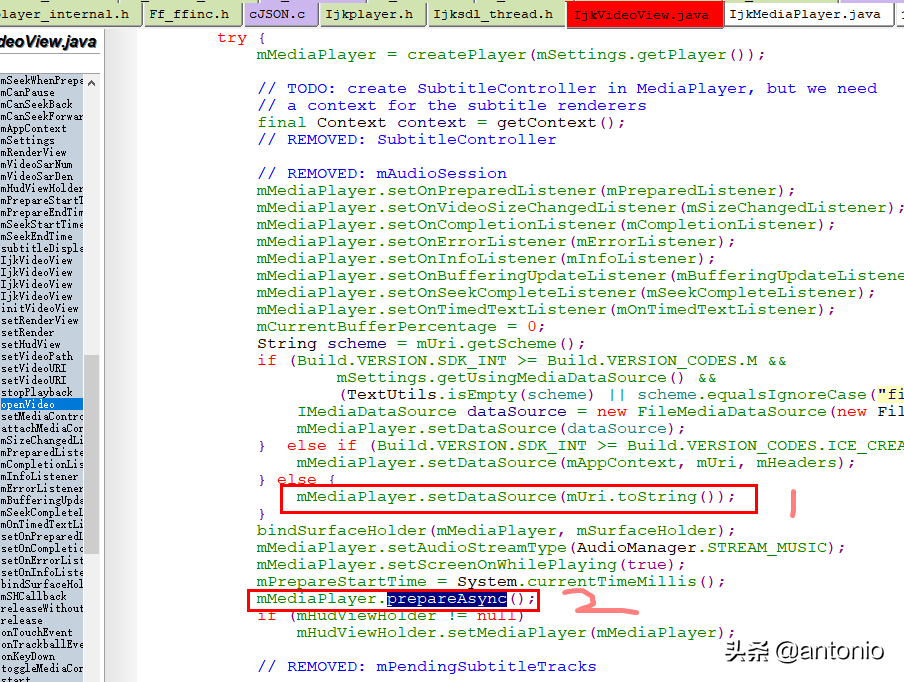
超详细讲解IJKPlayer的播放器实战和源码分析(1)

(3)会调到文件Ijkplayer_jni.c的函数
IjkMediaPlayer_prepareAsync，函数如下:

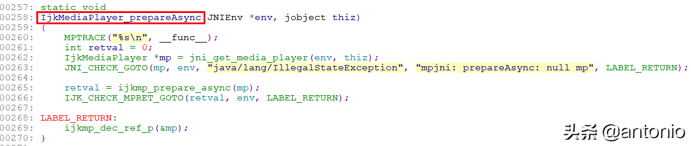
超详细讲解IJKPlayer的播放器实战和源码分析(1)

(4)在文件ijkplayer.c，函数
IjkMediaPlayer_prepareAsync会调用ijkmp_prepare_async(IjkMediaPlayer *mp)，函数如下:

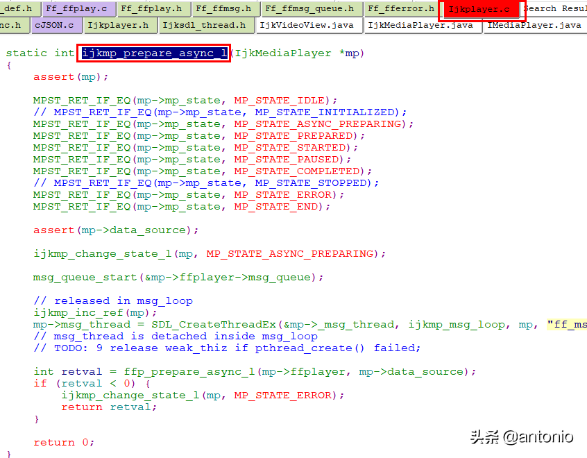
超详细讲解IJKPlayer的播放器实战和源码分析(1)

(5)往java层和ffplay.c都是同一个队列。使用ijkmp_get_msg(xxx)往ff_ffplay.c里去处理。使用post_event是往java层去处理。是往一边发，还是两边发，使用标志continue_wait_next_msg。如果jni用不到，那这个消息就直接在消息队列中，被释放掉了。

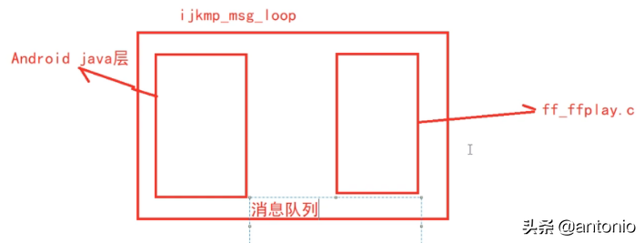
超详细讲解IJKPlayer的播放器实战和源码分析(1)

(6)在文件ff_ffplay.c(这里面就是ffplay的那一套了)，函数ijkmp_prepare_async_l会调用ffp_prepare_async_l(FFPlayer *ffp, const char *file_name)，在该函数里面，最重要的就是调用stream_open(ffp, file_name, NULL)，函数如下:

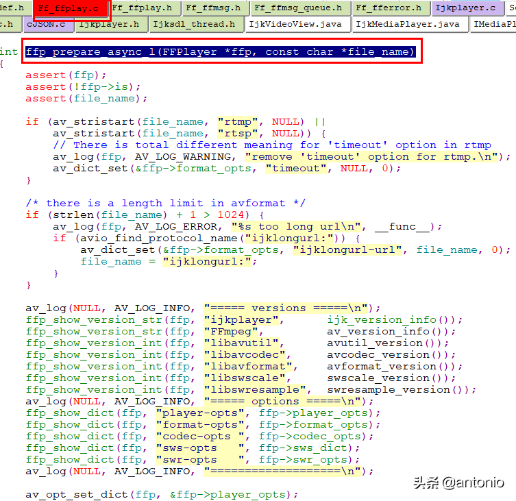
超详细讲解IJKPlayer的播放器实战和源码分析(1)

(7)ffp->is = is;这里保存了VideoState *is = stream_open(ffp, file_name, NULL)的参数，结构体也是一个接着一个管理，每个模块对接的都是只有一个总管。

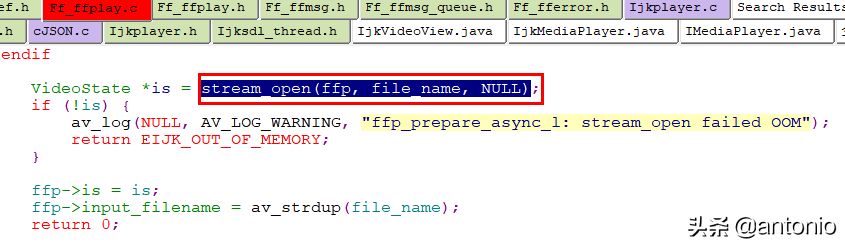
超详细讲解IJKPlayer的播放器实战和源码分析(1)

(8)在函数stream_open(FFPlayer *ffp, const char *filename, AVInputFormat *iformat)，就是各种初始化，如frame的队列初始化，packet队列初始化，时钟，音量，线程等初始化。这里还添加了支持，硬解的操作。

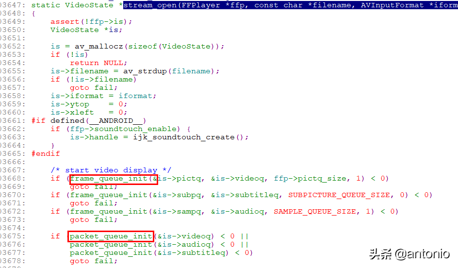
超详细讲解IJKPlayer的播放器实战和源码分析(1)

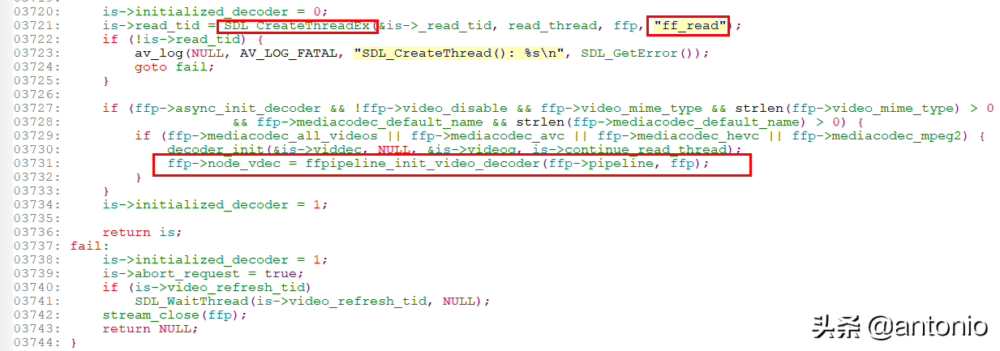
超详细讲解IJKPlayer的播放器实战和源码分析(1)

(9)在文件ff_ffplay.c，创建的读线程read_thread(void *arg)，这里就可以去打开文件了。与前面分析的ffplay源码的文章如出一辙。传递的参数是FFPlayer *ffp(这个是后面自定义封装的)。

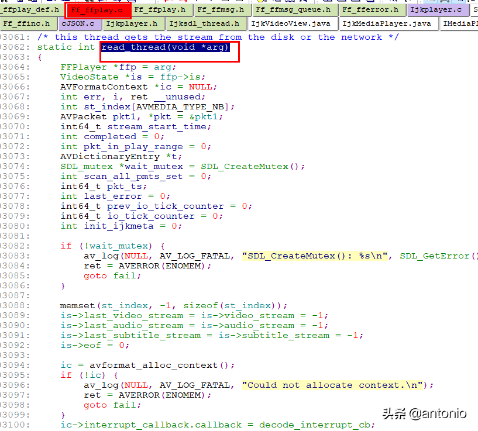
超详细讲解IJKPlayer的播放器实战和源码分析(1)

(10)在read_thread线程里，并把消息及时放到消息队列ffp_notify_msg1(ffp, FFP_MSG_OPEN_INPUT)，发送给java层;在read_thread线程，正真打开码流的函数是stream_component_open(ffp, st_index[AVMEDIA_TYPE_SUBTITLE])，如下图:

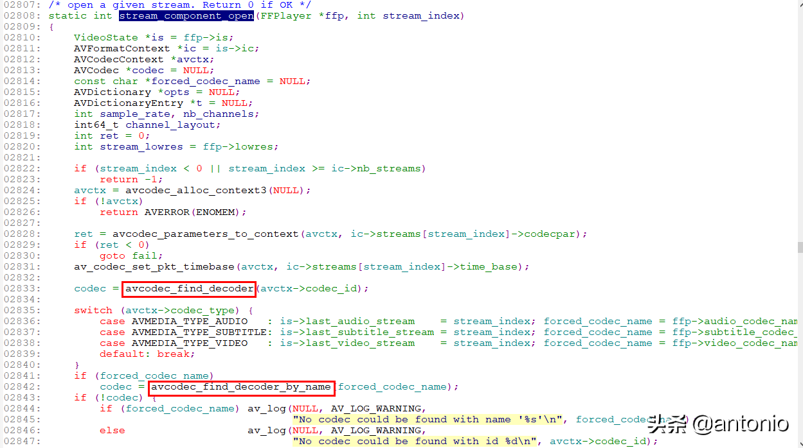
超详细讲解IJKPlayer的播放器实战和源码分析(1)

(11)在该函数下初始化音视频，字幕的解码线程，如下:

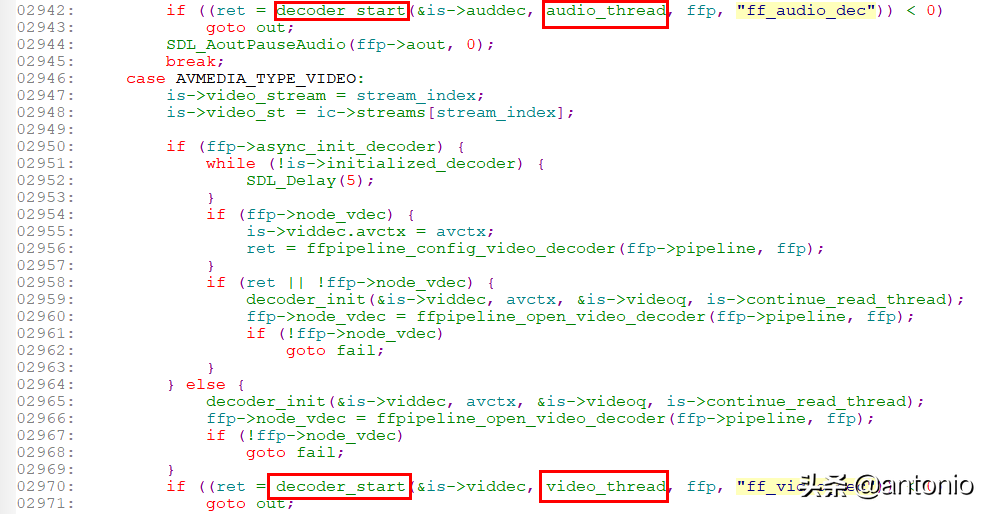
超详细讲解IJKPlayer的播放器实战和源码分析(1)

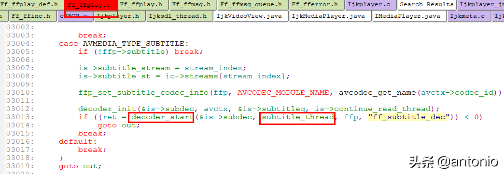
超详细讲解IJKPlayer的播放器实战和源码分析(1)

注意:个人认为，虽然ffplay功能齐全，也比较稳定，但是这个框架，设计的不是很合理。

这段代码是调用硬件，ffp->node_vdec =
ffpipeline_open_video_decoder(ffp->pipeline, ffp);实际上硬解就是回调mediacode。在read_thread里，实际ijk后面还添加了码率统计。如有这样一行代码，如下:

ffp->stat.bit_rate = ic->bit_rate;


## 12.创建ffplayer对象 ##

(1)创建ffplayer对象，是在文件ijkplayer.c的函数ijkmp_create(int (*msg_loop)(void*))。如下:

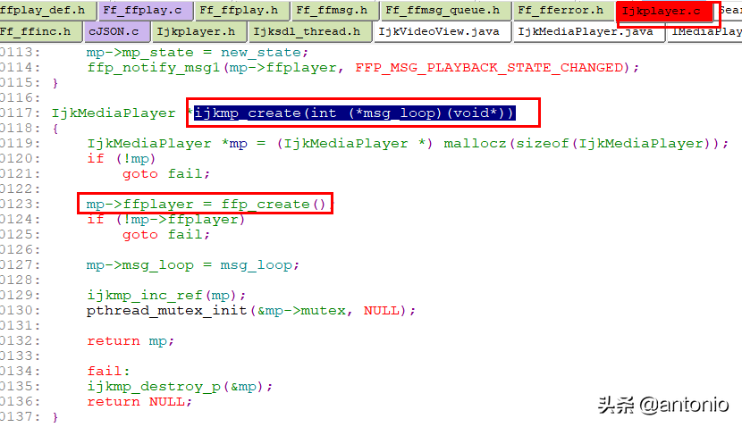

超详细讲解IJKPlayer的播放器实战和源码分析(1)

(2)真正创建是在ff_ffplay.c中，函数ffp_create()，如下调用:

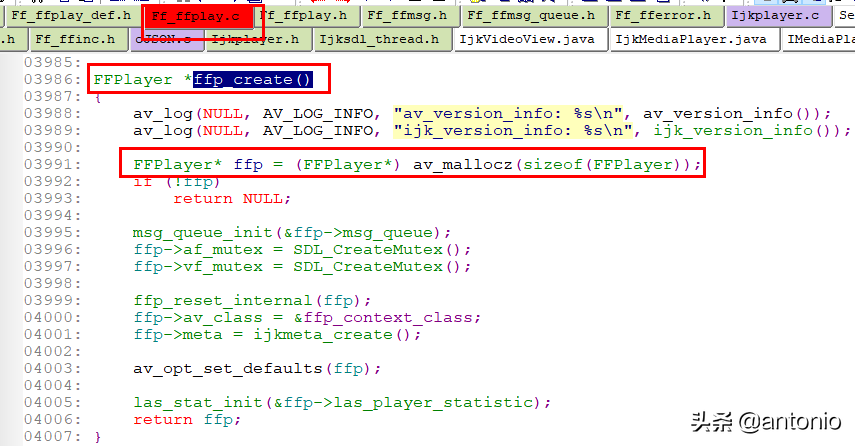
超详细讲解IJKPlayer的播放器实战和源码分析(1)

(3)使用ffp_toggle_buffering(ffp, 1)先缓存，缓存够了，才播放。

	SDL_Event

(4)

```
void ffp_toggle_buffering(FFPlayer *ffp, int start_buffering)
{
    SDL_LockMutex(ffp->is->play_mutex);
    ffp_toggle_buffering_l(ffp, start_buffering);
    SDL_UnlockMutex(ffp->is->play_mutex);
}
```

(5)

```
void ffp_toggle_buffering_l(FFPlayer *ffp, int buffering_on)
{
    if (!ffp->packet_buffering)
        return;

    VideoState *is = ffp->is;
    if (buffering_on && !is->buffering_on) {
        av_log(ffp, AV_LOG_DEBUG, "ffp_toggle_buffering_l: start\n");
        is->buffering_on = 1;
        stream_update_pause_l(ffp);
        if (is->seek_req) {
            is->seek_buffering = 1;
            ffp_notify_msg2(ffp, FFP_MSG_BUFFERING_START, 1);
        } else {
            ffp_notify_msg2(ffp, FFP_MSG_BUFFERING_START, 0);
        }
    } else if (!buffering_on && is->buffering_on){
        av_log(ffp, AV_LOG_DEBUG, "ffp_toggle_buffering_l: end\n");
        is->buffering_on = 0;
        stream_update_pause_l(ffp);
        if (is->seek_buffering) {
            is->seek_buffering = 0;
            ffp_notify_msg2(ffp, FFP_MSG_BUFFERING_END, 1);
        } else {
            ffp_notify_msg2(ffp, FFP_MSG_BUFFERING_END, 0);
        }
    }
}
```

(6)在read_thread线程函数，隔一段时间，会一直检测缓存是否有准备好。

	event_q.type = FF_QUIT_EVENT;


13.总结

本篇文章通过大量的篇幅，理清了ijkPlayer从java层到ffplay的一个播放过程，对于基于ijkplayer的项目应用，具有十分重要的意义。除了理清整个播放过程，还把重要源码移植到qt平台，让qt能够吊起来，这也是具有十分好的实战学习。由于网上关于ijkplayer非常详细的文章，非常少，所以这篇文章也是花了很多心血总结，所以也是非常值得推荐给大家。欢迎关注，收藏，转发，分享。


后期关于项目知识，也会更新在微信公众号“记录世界 from antonio”，欢迎关注

转载记得注明出处，不要随意复制，黏贴，创作不易，支持原创

原文链接： https://www.toutiao.com/a6904554217579643404/?log_from=5c0903122e9bb_1638153269638